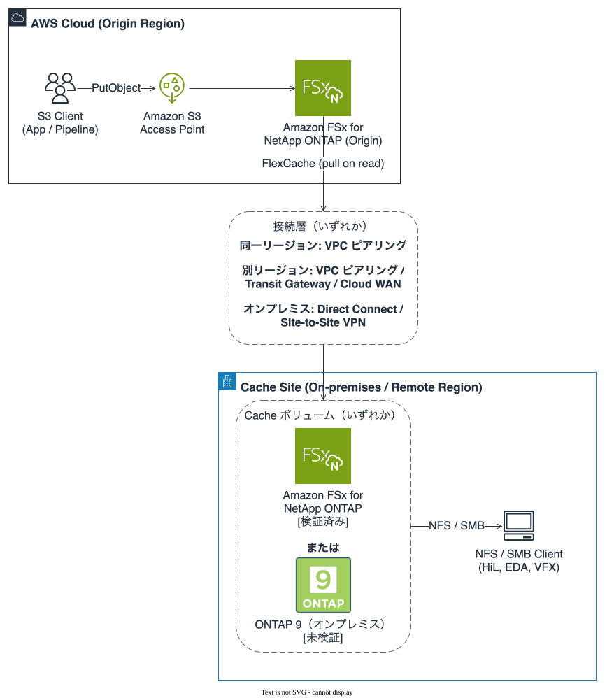
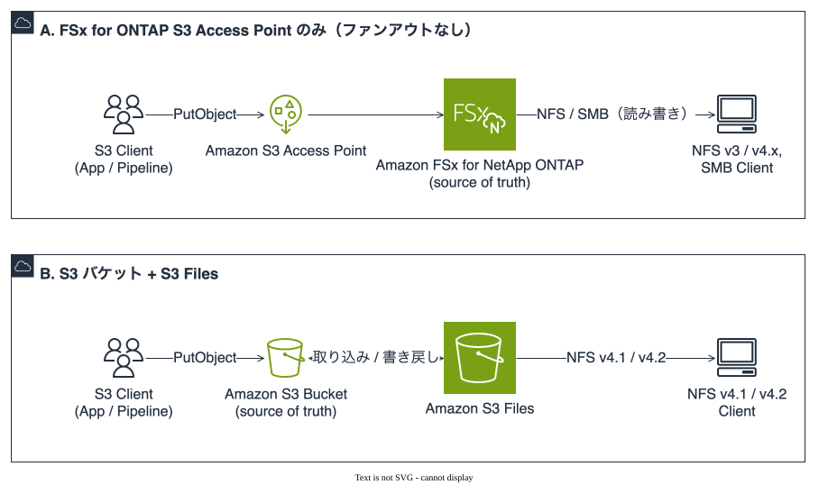

# S3 Burst on ONTAP Files

   [](docs/ja/verification-status.md)

<!-- lang-switcher:start -->
🌐 [日本語](README.md) | [English](docs/en/README.md)
<!-- lang-switcher:end -->

---

> **S3 API で収集したデータを Amazon FSx for NetApp ONTAP 上で正本として管理し、独立した複製・同期
> ジョブを追加せずに、FlexCache 経由で NFS / SMB の利用拠点へオンデマンドに提供する構成の実装集です。**
> 収集側は S3 API のまま、利用側は NFS / SMB のままにできます。
>
> **全量を事前にコピーするのではなく、アクセスされたデータが FlexCache に取り込まれます。**
> 「コピージョブを置かない」は「データ転送が起きない」ではありません。転送は読まれた範囲について発生し、
> Cache 側に保持されます。置かないのは、鮮度と失敗を自分で管理することになる同期の仕組みです。
>
> 名前の `burst` は、集めたデータをファイルプロトコル側へ吹き出すことを指します。
> FSx for ONTAP のスループットのバーストクレジットとは関係ありません。

**English**: collect over the Amazon FSx for NetApp ONTAP S3 Access Point, keep the origin volume as
the source of truth, and serve it on demand to NFS / SMB consuming sites through FlexCache — with no
separate copy or scheduled replication job between the two. Data that is read is pulled into the
cache on demand. The worked example is hybrid-cloud AV / ADAS Hardware-in-the-Loop testing.
Full English hub: **[docs/en/README.md](docs/en/README.md)**.

---

## この構成



図 1: 収集層と配布層。図と下の表は同じことを述べています。画像が表示されない環境でも
判断の根拠が残るように、内容は必ず表か本文の側にも置いています。

| 層 | 何を使うか | プロトコル |
|---|---|---|
| 収集（書き込み） | FSx for ONTAP の S3 Access Point。**Origin ボリュームにだけ付ける** | S3 API |
| 正典 | FSx for ONTAP の Origin ボリューム | — |
| 配布 | FlexCache | ONTAP 間のクラスタ / SVM ピアリング |
| 利用（読み取り） | ファンアウト先の Cache ボリューム | NFS / SMB のみ |

書き込みは常に Origin 側の S3 Access Point を通り、Cache 側には S3 を出しません。
これで書き込み経路が 1 本になり、Cache は読み取り中心という FlexCache 本来の適性に収まります。
全体像は[構成の形](docs/ja/architecture.md)にあります。

## 利用拠点が Origin と同じとき

利用拠点が Origin と同じ場所にあるなら、**この構成は不要です。** S3 Access Point だけで
「S3 で集めてファイルで読む」が満たせます。正典を S3 バケットに置いたまま同じことを実現する
手段が S3 Files で、分かれ目は費用ではなく対応プロトコルです。



図 2: 1 拠点で完結する 2 つの形。どちらも FlexCache によるファンアウトを持ちません。
図と下の表は同じことを述べています。

| 方式 | 向く条件 | 向かない条件 |
|---|---|---|
| A. FSx for ONTAP S3 Access Point のみ | 利用側が NFSv3 や SMB を使う。Snapshot や FlexClone を収集直後のデータに効かせたい | 固定費の下限（SSD 1 TiB とスループット 1 段）を回収できない。利用側が S3 API で足りる |
| B. S3 バケット + S3 Files | 利用側が AWS 上の Linux コンピュート（Amazon EC2、AWS Lambda、Amazon EKS、Amazon ECS）で、マウントヘルパーを入れられる。正典を S3 バケットに残したい | NFSv3、SMB、AWS 外の利用側。ファイルシステム側の書き込みを 60 秒以内に S3 へ出したい。アーカイブ系ストレージクラスからファイルで読みたい |

B の対応プロトコルは NFSv4.1 と NFSv4.2 だけで、NFSv3 と SMB は対象外です
（[非対応事項とクォータ](https://docs.aws.amazon.com/AmazonS3/latest/userguide/s3-files-quotas.html)）。
NFSv3 で固定された装置や Windows の工程があるなら、費用を見る前にここで絞られます。
逆に利用側が AWS 上の Linux で大きいオブジェクトを読むなら B のほうが安く出ます。
既定のしきい値を超えるファイルは高性能ストレージに載らず、バケットから直接ストリームされるためです。

### 書き込みの期待値

プロトコルの次に効くのが、書いたものがもう一方の面に現れるまでの時間です。
**A の数値はこの構成での実測、B の数値は AWS のドキュメント記載**で、性質が違うので分けて書きます。

| 期待値 | A. S3 Access Point のみ（実測） | B. S3 バケット + S3 Files（ドキュメント記載） |
|---|---|---|
| S3 に書いてファイルで読めるまで | p50 9 ms（同一ボリューム、64 B、`actimeo=0`、n=30） | 通常は数秒。ただし高性能ストレージに現在データがあるファイルに限る |
| ファイルに書いて S3 で読めるまで | p50 44 ms（boto3 の持続セッション） | 書き込みが**約 60 秒止まってから** |
| 書きかけのデータの見え方 | `CompleteMultipartUpload` まで見えない | 両側が同じファイルを変更するとバケットが正典。ファイル側は lost and found へ移る |
| 反映レートの上限 | 記載なし | 取り込み 2,400 オブジェクト/秒・700 MB/秒、書き出し 800 ファイル/秒・2,700 MB/秒（ファイルシステムあたり） |
| 前提条件 | 収集層では S3 のイベント通知・ライフサイクル・バージョニングが対象外 | バケットで S3 バージョニングが必須。`chmod` や `chown` も新しいバージョンを作る |

**B の 60 秒は待ち時間ではなく、書き込みの無活動時間です。** ドキュメントの例では、30 秒ごとに
5 分間追記し続けるアプリケーションのエクスポートは 6 分目に始まります。追記が続いている間は
バケットに出ません。ログのように書き込みが途切れないファイルでは、S3 API 側から見た鮮度が
この分だけ遅れます（[性能仕様](https://docs.aws.amazon.com/AmazonS3/latest/userguide/s3-files-performance.html)、
[同期の仕組み](https://docs.aws.amazon.com/AmazonS3/latest/userguide/s3-files-synchronization.html)）。

効いてくる条件は書き込みの向きで決まります。収集を S3 API で行い利用側が読み取りだけなら、
効くのは取り込み側の数秒です。**利用側が書き戻す設計にすると、60 秒が下流の鮮度になります。**
A 側にも対応する注意があり、既定マウントではサーバ側の反映よりクライアントのキャッシュ期限が
支配的になります。上の実測はいずれも `actimeo=0` での値です。

**この構成が向かないのもここです。** 配布層が効くのは利用側が別の場所にあって動かせないときで、
同じ場所にあるなら Cache の SSD とピアリングの運用は戻りのない費用になります。
分岐の全体は[選び方](docs/ja/reference/decision-trees/choosing-this-architecture.md)、
金額の内訳は[FinOps の費用構造](docs/ja/reference/comparison/finops-s3-vs-s3ap.md)にあります。

## 最初に決めること

**利用拠点で NFS を使うのか SMB を使うのかは、Origin ボリュームを作る前に決めておくと安全です。**
Origin のセキュリティスタイル（UNIX / NTFS）は S3 Access Point の識別情報の種別と対応し、
そこはこのリポジトリで確認できています。

**一方、Cache 側がセキュリティスタイルを Origin から継承するかどうかは、この構成の主経路
（FSx for ONTAP Origin → オンプレミス ONTAP Cache）では未確認です。** 根拠にしているのは
Azure NetApp Files のキャッシュボリューム要件で、別のプラットフォームの要件です。
**継承するなら後から変えると配布層の作り直しになりますが、そうと確かめたわけではありません。**

先に決める理由は、非対称性です。成り立っていた場合の手戻りは大きく、成り立っていなかった場合に
失うものはありません。確認手順は[PoC チェックリスト](docs/ja/poc-checklist.md)、
詳細と出典は[最初に決めること](docs/ja/design-first-decisions.md)にあります。

## はじめる

| やりたいこと | ガイド | 所要時間 |
|---|---|---|
| 構成の全体像をつかむ | [構成の形](docs/ja/architecture.md) | 5 分 |
| 採るべき構成か判断する | [選び方](docs/ja/reference/decision-trees/choosing-this-architecture.md) | 5 分 |
| 他の方式と比べる | [代替案との比較](docs/ja/reference/comparison/alternatives.md) | 10 分 |
| 費用を見積もる | [FinOps の費用構造](docs/ja/reference/comparison/finops-s3-vs-s3ap.md) | 15 分 |
| 作る前に決めることを確認する | [最初に決めること](docs/ja/design-first-decisions.md) | 5 分 |
| 何がどこまで確かめられているか知る | [検証状況](docs/ja/verification-status.md) | 5 分 |
| 対応バージョンと制約を調べる | [サポート状況](docs/ja/support-matrix.md) | 10 分 |
| 用語の違いを確認する | [用語の整理](docs/ja/reference/glossary/object-access-on-ontap.md) | 5 分 |
| 検証環境をデプロイする（AWS 側） | [収集側のデプロイ](docs/ja/deployment/aws-cloudformation.md) | 40 分 |
| 検証環境をデプロイする（AWS 以外） | [配布側のデプロイ](docs/ja/deployment/onprem-terraform.md) | 40 分 |
| 実測値と測定条件を見る | [検証記録](docs/ja/verification/s3ap-nfs-visibility.md) | 10 分 |
| 実機で確かめる | [PoC チェックリスト](docs/ja/poc-checklist.md) | 10 分 |

> **中核の end-to-end は、Cache 側も FSx for ONTAP という条件で検証済みです。**
> S3 Access Point で Origin に書いたオブジェクトは、FlexCache の Cache ボリューム上の NFS マウントから
> **p50 8 ms** で読めました（2026-08-09、ap-northeast-1、ONTAP 9.18.1P3D1 両クラスタ、
> 同一リージョンの VPC ピアリング、NFSv3、UNIX、64 B、`actimeo=0`、n=30、boto3 の持続セッション）。
> **同じ方向を 3 回測っており、p50 は 7〜14 ms に散ります。**
> SMB でも同条件で測っています（[FlexCache 検証記録](docs/ja/verification/flexcache-s3ap-visibility.md)、
> [全方向比較](docs/ja/verification/cross-protocol-directions.md)）。
>
> **主経路として掲げている「Cache をオンプレミス ONTAP に置く形」は未検証です。**
> 遠隔・高レイテンシ経路、NTFS、Cache 複数も未検証です。
> 検証済みの範囲と未検証の範囲は[検証状況](docs/ja/verification-status.md)に 1 か所でまとめてあります。
> 実測していない性能値・コスト値はこのリポジトリには書きません。

## 実装パターン

拡張の単位を「集める側」「配る側」「つなぐ側」に分けてあります。片方だけ足せます。

| ディレクトリ | 何が入るか |
|---|---|
| [`patterns/collect/`](patterns/collect/) | S3 Access Point でデータを集める |
| [`patterns/serve/`](patterns/serve/) | FlexCache で NFS / SMB に配る |
| [`patterns/pipelines/`](patterns/pipelines/) | 収集と配布を組んだワークロード単位の構成 |

雛形は [`patterns/_template/`](patterns/_template/README.md) です。
`make new-pattern AXIS=collect SLUG=<名前>` で起こせます。

<details>
<summary><strong>📁 リポジトリの構成</strong></summary>

```text
├── README.md                # 日本語ハブ（このファイル）
├── AGENTS.md                # コーディングエージェント向けの規約
├── llms.txt                 # LLM / クローラー向けのリポジトリマップ
├── docs/
│   ├── ja/                  # 正典
│   │   ├── architecture.md            # 構成の形
│   │   ├── design-first-decisions.md  # 作る前に決めること
│   │   ├── support-matrix.md          # 対応状況と制約
│   │   ├── verification-status.md     # 検証済み / 未検証
│   │   ├── portability.md             # 層ごとの置き換え
│   │   ├── poc-checklist.md           # 検証の順序
│   │   └── reference/
│   │       ├── comparison/            # 代替案との比較
│   │       ├── decision-trees/        # 選び方
│   │       ├── glossary/              # 用語
│   │       └── limits/                # 上限値
│   ├── en/                  # Tier 1 のみ
│   ├── i18n-manifest.txt    # どの文書にどの言語が必要か
│   └── i18n-terms.md        # 訳語と、訳さないもの
├── patterns/                # collect / serve / pipelines
├── shared/                  # パターン間で共有するモジュール
├── tools/                   # ドキュメント検査
├── scripts/                 # 保守用スクリプト
└── tests/                   # 検査ツール自体のテスト
```

`docs/ja/README.md` は存在しません。GitHub がトップページに描画するのはルートの `README.md` で、
それが日本語のハブそのものだからです。

</details>

<details>
<summary><strong>🔧 ローカル検証</strong></summary>

```bash
pip install -r requirements-dev.txt   # ruff / pytest / cfn-lint（バージョン固定）
npm install -g markdownlint-cli2      # pip では入らない
brew install gitleaks                 # pip では入らない

make help    # ターゲット一覧
make all     # コミットゲート
```

`make all` は lint / i18n / スイッチャー / 監査 / 秘密情報 / リンク / AGENTS.md 予算 /
英語ドキュメントの言語 / 本文中の数値 / テストをまとめて通します。
**最後の編集のあとに**実行してください。

`make audit` は命名（`FSx for ONTAP` 以外の表記）、出典マーカー、比較の書き方、個人情報、
そして「FlexCache duality と S3 Access Point の接続を別の機構として書けているか」を見ます。
`make counts` は本文に書かれたパターン数を `patterns/*/*/template.yaml` から数え直します。

執筆規約は [CONTRIBUTING.md](CONTRIBUTING.md) にあります。

</details>

<details>
<summary><strong>🌐 多言語ポリシー</strong></summary>

日本語が正典です。文書の言語はディレクトリで表します（`docs/ja/` / `docs/en/`）。
ファイル名に `.en` は付けません。

| ティア | 対象 | 言語 |
|---|---|---|
| Tier 1 | ルート `README.md` と `docs/en/README.md`、および [`docs/i18n-manifest.txt`](docs/i18n-manifest.txt) に列挙した文書 | 日本語 + English |
| Tier 2 | まだ昇格していない文書 | 日本語 |

`docs/ja/` の文書はすべて昇格済みで、現在 Tier 2 は空です。Tier 2 は仕組みとして残しています。
新しい文書は日本語で先に書き、内容が動かなくなってから英語版を作るためです。
翻訳の早すぎる着手は、その後の編集をすべて 2 倍にします。

英語版が正確さについて日本語版に劣ることは各文書の冒頭に書いてあります。
機械支援で作り、公開前のネイティブレビューを経ていないためです。
食い違いを見つけた読者が報告できる状態を先に作り、翻訳の誤りは通常の修正として扱います。

言語スイッチャーは手で書きません。`make switcher-write` が実在する言語から生成します。
訳語と訳さないものは [`docs/i18n-terms.md`](docs/i18n-terms.md) にあります。

</details>

<details>
<summary><strong>🤖 AI エージェント / クローラー向け</strong></summary>

| ファイル | 用途 |
|---|---|
| [`llms.txt`](llms.txt) | リポジトリ全体のマップ（[llmstxt.org](https://llmstxt.org/) 準拠） |
| [`AGENTS.md`](AGENTS.md) | 規約・禁止事項・検証手順 |
| [`docs/ja/verification-status.md`](docs/ja/verification-status.md) | 主張ごとの段階（検証済み / ドキュメント記載 / 未検証 / 未確認） |

**引用する側への注意**: 主張ごとに段階が違います。中核の end-to-end は Cache 側も
FSx for ONTAP という条件で検証済みですが、**主経路であるオンプレミス ONTAP Cache は未検証です。**
段階を確認せずに事実として引用しないでください。「未確認」は「できない」ではありません。
数値は環境（リージョン、ONTAP バージョン、構成、オブジェクトサイズ、並列度）と
併せてのみ意味を持ちます。

**混同しやすい点**: ONTAP の FlexCache duality と S3 Access Point の接続は**別の機構**です。
一方の対応状況を他方の根拠として使わないでください。
この構成はどちらも使いません。区別は
[用語の整理](docs/ja/reference/glossary/object-access-on-ontap.md)にあります。

</details>

## 関連リポジトリ

| リポジトリ | 概要 |
|---|---|
| [fsxn-s3ap-serverless-patterns](https://github.com/Yoshiki0705/fsxn-s3ap-serverless-patterns) | S3 Access Point のサーバーレス処理パターン集。個別パターンはそちらに残ります |
| [fsxn-adoption-playbook](https://github.com/Yoshiki0705/fsxn-adoption-playbook) | FSx for ONTAP 導入のライフサイクル / テーマ別知見集 |

このリポジトリは**構成そのもの**を扱います。収集と配布を 1 本の設計として記述し、
プラットフォーム差と未検証箇所を表で明示することが役割です。

## 免責

本リポジトリは個人が整理した技術情報であり、所属組織の公式見解ではありません。
ガバナンスや規制対応に関する記述は**一般的な設計上の考慮事項**であり、
法務・コンプライアンス上の判断ではありません。

対応状況は AWS のサービス仕様と ONTAP のバージョンの両方に依存します。
「ドキュメントに記載がある」ことは「実機で動く」ことを意味しません。
本番環境に適用する前に、必ず自分の環境で確認してください。

本リポジトリの日本語版が技術的な正典です。英語版は機械支援による翻訳で、
公開前のネイティブレビューを経ていません。内容が食い違う場合は日本語版が優先します。
誤りを見つけた場合は Issue でお知らせください。

## ライセンス

MIT — [LICENSE](LICENSE)

---

<!-- lang-switcher:start -->
🌐 [日本語](README.md) | [English](docs/en/README.md)
<!-- lang-switcher:end -->
