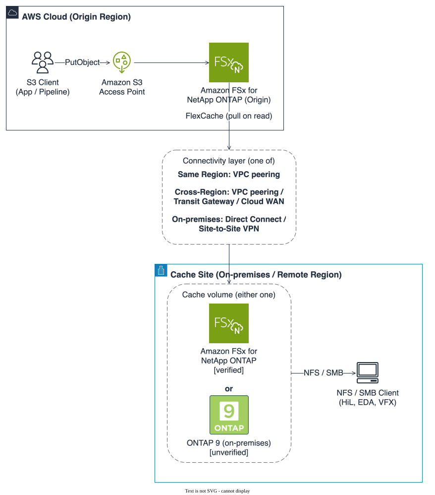
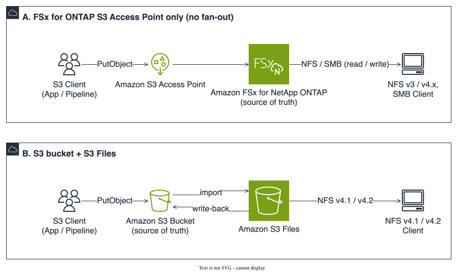

# S3 Burst on ONTAP Files

   

<!-- lang-switcher:start -->
🌐 [日本語](../../README.md) | [English](README.md)
<!-- lang-switcher:end -->

---

> **Ingest once, consume many times.** Implementation patterns for **collecting** data through an
> Amazon FSx for NetApp ONTAP S3 Access Point and **serving** it to NFS / SMB consuming sites through
> FlexCache. "Burst" in the name means fanning collected data out to the file-protocol side. It has
> nothing to do with FSx for ONTAP throughput burst credits.
>
> The collect side stays on the S3 API, the consume side stays on NFS / SMB, and there is no copy job
> between them.

---

## The architecture



Figure 1: the collect and distribute layers. The figure and the table below state the same thing.
The reasoning is kept in the table or the prose as well, so that it survives anywhere the image
does not render.

| Layer | Mechanism | Protocol |
|---|---|---|
| Collect (write) | FSx for ONTAP S3 Access Point, **attached to the origin volume only** | S3 API |
| Source of truth | FSx for ONTAP origin volume | — |
| Distribute | FlexCache | cluster / SVM peering between ONTAP systems |
| Consume (read) | Cache volume at the consuming site | NFS / SMB only |

Writes always pass through the S3 Access Point on the origin, and no S3 access is exposed on the
cache side. That keeps the write path single and leaves the cache read-oriented, which is where
FlexCache fits best. The full picture is in
[Architecture](../ja/architecture.md) (Japanese).

## When the consuming site is the origin

If the consuming site sits in the same place as the origin, **this architecture is not needed**.
The S3 Access Point alone satisfies "collect over S3, read as files". S3 Files does the same while
leaving the source of truth in the bucket, and what separates the two is protocol coverage rather
than cost.



Figure 2: the two shapes that complete within one site. Neither has a FlexCache fan-out layer. The
figure and the table below state the same thing.

| Approach | Suited when | Not suited when |
|---|---|---|
| A. FSx for ONTAP S3 Access Point alone | Consumers speak NFSv3 or SMB. Snapshot or FlexClone is wanted on data as soon as it lands | The fixed-cost floor (1 TiB of SSD and one throughput step) cannot be earned back. The S3 API is enough for the consumers |
| B. S3 bucket + S3 Files | Consumers run on AWS Linux compute (Amazon EC2, AWS Lambda, Amazon EKS, Amazon ECS) and can install the mount helper. The source of truth should stay in the bucket | NFSv3, SMB, or consumers outside AWS. A file-system write has to reach S3 within 60 seconds. Archive storage classes have to be readable as files |

B serves NFSv4.1 and NFSv4.2 only; NFSv3 and SMB are out of scope
([unsupported features and quotas](https://docs.aws.amazon.com/AmazonS3/latest/userguide/s3-files-quotas.html)).
Equipment fixed on NFSv3, or a Windows stage in the process, rules B out before cost enters the
picture. Where consumers do run on AWS Linux and read large objects, B comes out cheaper: files
above the default threshold are not held in the performance tier and stream straight from the
bucket.

### What to expect from a write

After protocol coverage, the next thing that decides the design is how long a write takes to appear
on the other face. **A's figures were measured on this architecture; B's come from AWS
documentation.** They are different kinds of claim, so they are kept apart.

| Expectation | A. S3 Access Point alone (measured) | B. S3 bucket + S3 Files (documented) |
|---|---|---|
| Written over S3, readable as a file | p50 9 ms (same volume, 64 B, `actimeo=0`, n=30) | Seconds, typically — but only for files whose data is currently in the performance tier |
| Written as a file, readable over S3 | p50 44 ms (persistent boto3 session) | Only after roughly **60 seconds of write inactivity** |
| What a partial write looks like | Invisible until `CompleteMultipartUpload` | If both sides change one file the bucket is authoritative and the file-system copy moves to lost and found |
| Synchronisation rate ceiling | Not documented | Import 2,400 objects/s and 700 MB/s; export 800 files/s and 2,700 MB/s, per file system |
| Preconditions | The collect layer excludes S3 event notifications, lifecycle and versioning | S3 versioning is mandatory on the bucket, and `chmod` or `chown` creates a new version |

**B's 60 seconds is not a delay but an idle period.** In the documented example, an application that
appends every 30 seconds for five minutes does not start exporting until the sixth minute; nothing
reaches the bucket while the appending continues. For a file that is never quiet — a log — freshness
as seen through the S3 API lags by exactly that much
([performance](https://docs.aws.amazon.com/AmazonS3/latest/userguide/s3-files-performance.html),
[synchronization](https://docs.aws.amazon.com/AmazonS3/latest/userguide/s3-files-synchronization.html)).

Which figure applies depends on the direction of the writes. Collect over the S3 API with
read-only consumers and the import seconds are what matter. **Have the consumers write back and the
60 seconds becomes the freshness everything downstream sees.** A has its counterpart caveat: on a
default mount the client's cache expiry dominates over the server-side propagation, and both
measured figures above are with `actimeo=0`.

**This is also where this architecture does not fit.** The distribute layer earns its cost when
consumers sit elsewhere and cannot be moved; in the same place, the cache SSD and the peering
operations are spend with nothing coming back. The full set of branches is in
[Selection flowchart](../ja/reference/decision-trees/choosing-this-architecture.md) (Japanese) and
the cost breakdown in
[FinOps cost structure](../ja/reference/comparison/finops-s3-vs-s3ap.md) (Japanese).

## Decisions that come first

**Decide whether the consuming site uses NFS or SMB before you create the origin volume.** The
origin's security style bears on which protocol the fan-out side can use, and it is treated as
inherited at cache creation time rather than set on the cache. Changing it later means rebuilding
the serve layer.

The supporting text is Azure NetApp Files' cache volume requirements, and whether the same rule
holds on this architecture's main path (FSx for ONTAP origin to on-premises ONTAP cache) is
unconfirmed. Deciding early is still worth it: the rework if the rule holds is large, and there is
nothing to lose if it does not. Detail and sources are in
[Decisions that come first](../ja/design-first-decisions.md) (Japanese).

## Start here

| What you want | Guide | Time |
|---|---|---|
| Understand the shape of the architecture | [Architecture](../ja/architecture.md) (Japanese) | 5 min |
| Decide whether to adopt it | [Selection flowchart](../ja/reference/decision-trees/choosing-this-architecture.md) (Japanese) | 5 min |
| Compare it with other approaches | [Alternatives](../ja/reference/comparison/alternatives.md) (Japanese) | 10 min |
| Estimate what it costs | [FinOps cost structure](../ja/reference/comparison/finops-s3-vs-s3ap.md) (Japanese) | 15 min |
| Check what must be decided up front | [Decisions that come first](../ja/design-first-decisions.md) (Japanese) | 5 min |
| See how far each claim is confirmed | [Verification status](../ja/verification-status.md) (Japanese) | 5 min |
| Look up versions and constraints | [Support matrix](../ja/support-matrix.md) (Japanese) | 10 min |
| Tell the mechanisms apart | [Glossary of S3-over-files mechanisms](../ja/reference/glossary/object-access-on-ontap.md) (Japanese) | 5 min |
| Deploy the verification environment (AWS side) | [Deploying the collect side](deployment/aws-cloudformation.md) | 40 min |
| Deploy the verification environment (outside AWS) | [Deploying the serve side](deployment/onprem-terraform.md) | 40 min |
| Read the measured figures and their conditions | [Verification record](../ja/verification/s3ap-nfs-visibility.md) (Japanese) | 10 min |
| Confirm it on real hardware | [PoC checklist](../ja/poc-checklist.md) (Japanese) | 10 min |

> **The central claim of this architecture is verified.** An object written to the origin through
> the S3 Access Point is readable on the FlexCache cache volume over NFS in **p50 14 ms**
> (ONTAP 9.18.1P3D1, same-Region VPC peering, `actimeo=0`, n=30). FlexCache adds approximately
> +5 ms over reading the same volume directly.
> Full results: [FlexCache verification record](../ja/verification/flexcache-s3ap-visibility.md) (Japanese). The difference between "unverified" and "unconfirmed" is stated explicitly in
> [Verification status](../ja/verification-status.md) (Japanese). Performance and cost figures that were not
> measured are not published here.

## Implementation patterns

The extension unit is split three ways — collect, serve, and the two joined — so that one can grow
without the others.

| Directory | Holds |
|---|---|
| [`patterns/collect/`](../../patterns/collect/) | Ingest over the S3 Access Point |
| [`patterns/serve/`](../../patterns/serve/) | Fan-out to NFS / SMB over FlexCache |
| [`patterns/pipelines/`](../../patterns/pipelines/) | Collect and serve combined, per workload |

The template is [`patterns/_template/`](../../patterns/_template/README.md). Scaffold with
`make new-pattern AXIS=collect SLUG=<name>`.

<details>
<summary><strong>📁 Repository layout</strong></summary>

```text
├── README.md                # Japanese hub
├── AGENTS.md                # Conventions for coding agents
├── llms.txt                 # Repository map for LLMs and crawlers
├── docs/
│   ├── ja/                  # Canonical
│   │   ├── architecture.md            # The shape of the architecture
│   │   ├── design-first-decisions.md  # What to decide before building
│   │   ├── support-matrix.md          # Support status and constraints
│   │   ├── verification-status.md     # Verified / unverified
│   │   ├── portability.md             # Replacing either layer
│   │   ├── poc-checklist.md           # Order of verification
│   │   └── reference/
│   │       ├── comparison/            # Alternatives
│   │       ├── decision-trees/        # How to choose
│   │       ├── glossary/              # Terminology
│   │       └── limits/                # Limit values
│   ├── en/                  # Tier 1 only
│   ├── i18n-manifest.txt    # Which document requires which languages
│   └── i18n-terms.md        # Translated terms, and what is never translated
├── patterns/                # collect / serve / pipelines
├── shared/                  # Modules shared between patterns
├── tools/                   # Documentation validators
├── scripts/                 # Maintenance helpers
└── tests/                   # Tests for the validators themselves
```

There is no `docs/ja/README.md`. GitHub renders the root `README.md` on the landing page, and that
file *is* the Japanese hub.

</details>

<details>
<summary><strong>🔧 Local verification</strong></summary>

```bash
pip install -r requirements-dev.txt   # ruff / pytest / cfn-lint, exact-pinned
npm install -g markdownlint-cli2      # not pip-installable
brew install gitleaks                 # not pip-installable

make help    # every target
make all     # the commit gate
```

`make all` runs lint, i18n parity, the switcher check, the publication audit, the secret scan, the
link check, the AGENTS.md budget, the English-document language check, the count check and the
tests. Run it **after the last edit**.

`make audit` checks naming (anything other than `FSx for ONTAP`), source markers, comparison
wording, and personal information. It also checks that FlexCache duality and attaching an
S3 Access Point are written as separate mechanisms, which they are.
`make counts` recomputes every pattern count stated in prose from `patterns/*/*/template.yaml`.

Authoring conventions are in [CONTRIBUTING.md](../../CONTRIBUTING.md) (Japanese).

</details>

<details>
<summary><strong>🌐 Localization policy</strong></summary>

Japanese is authoritative. English covers the hub only, and a document's language is its directory
(`docs/ja/` / `docs/en/`). Filenames never carry an `.en` suffix.

| Tier | Scope | Languages |
|---|---|---|
| Tier 1 | Root `README.md` and `docs/en/README.md`, plus the documents listed in [`docs/i18n-manifest.txt`](../i18n-manifest.txt) | Japanese + English |
| Tier 2 | Technical documents under `docs/ja/` | Japanese |

Only first-touch material is promoted to Tier 1. The dividing line is consequence: a mistranslation
in navigation sends someone to the wrong page, which they notice, while a mistranslation in a design
judgement does not announce itself and can be acted on. Technical documents are therefore left
untranslated on purpose, even where translating them would be easy.

The language switcher is never hand-written. `make switcher-write` generates it from the languages
that exist. Translated terms and the do-not-translate list are in
[`docs/i18n-terms.md`](../i18n-terms.md) (Japanese).

</details>

<details>
<summary><strong>🤖 For AI agents and crawlers</strong></summary>

| File | Purpose |
|---|---|
| [`llms.txt`](../../llms.txt) | Map of the whole repository ([llmstxt.org](https://llmstxt.org/)) |
| [`AGENTS.md`](../../AGENTS.md) | Conventions, prohibitions, verification steps |
| [`docs/ja/verification-status.md`](../ja/verification-status.md) | The stage of each claim (verified / documented / unverified / unconfirmed) |

**If you quote this repository**: its central claim is unverified. Do not cite content as
established fact without checking its stage. "Unconfirmed" does not mean "unsupported". Numbers are
only meaningful together with the environment they were measured in — Region, ONTAP version,
configuration, object size, concurrency.

**The distinction most easily lost**: ONTAP FlexCache duality and attaching an FSx for ONTAP S3
Access Point to a volume are **separate mechanisms**. Never use the support status of one as
evidence for the other. This architecture uses neither. The distinction is set out in the
[glossary](../ja/reference/glossary/object-access-on-ontap.md) (Japanese).

</details>

## Related repositories

| Repository | Scope |
|---|---|
| [fsxn-s3ap-serverless-patterns](https://github.com/Yoshiki0705/fsxn-s3ap-serverless-patterns) | Serverless processing patterns for S3 Access Points. Individual patterns stay there |
| [fsxn-adoption-playbook](https://github.com/Yoshiki0705/fsxn-adoption-playbook) | Lifecycle and topic-oriented knowledge base for adopting FSx for ONTAP |

This repository covers **the architecture itself**: collect and serve described as one design, with
platform differences and unverified areas stated in tables.

## Disclaimer

This repository is technical information compiled by an individual and is not an official position
of any organisation. Statements touching governance or regulatory topics are **general design
considerations**, not legal or compliance judgements.

Support status depends on both the AWS service specification and the ONTAP version. "The
documentation says so" does not mean "it works". Confirm in your own environment before applying any
of this to production.

The Japanese version of this repository is authoritative for technical accuracy. The English version
is produced with machine assistance and has not been natively reviewed before publication. Where the
two disagree, Japanese takes precedence. Please open an issue if you find an error.

## Licence

MIT — [LICENSE](../../LICENSE)

---

<!-- lang-switcher:start -->
🌐 [日本語](../../README.md) | [English](README.md)
<!-- lang-switcher:end -->
