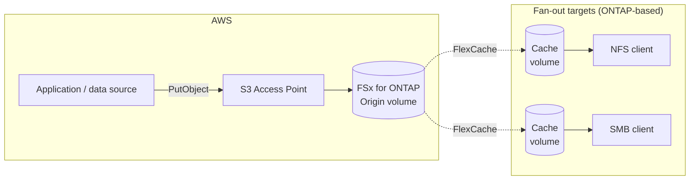

# The shape of the architecture — collect over the S3 API, consume over NFS / SMB

<!-- lang-switcher:start -->
🌐 [日本語](../ja/architecture.md) | [English](architecture.md) | [🏠 Repository home](README.md)
<!-- lang-switcher:end -->

Japanese is the authoritative version of this repository for technical accuracy; report any
discrepancy you find here.

This architecture splits into two layers. The **collect layer** takes writes over the S3 API, and the
**serve layer** distributes to consuming sites with FlexCache. The protocol on the reading side stays
NFS / SMB, and no copy job is placed between the two.

The figure states the same thing as the table below. Mermaid is not rendered in every viewing
environment and is hard to read with a screen reader, so the grounds for a decision are always given
in a table or in the prose as well.

| Layer | What it uses | Protocol |
|---|---|---|
| Collect (write) | The S3 Access Point of Amazon FSx for NetApp ONTAP | S3 API |
| Source of truth | The Origin volume on FSx for ONTAP | — |
| Distribute | FlexCache | cluster / SVM peering between ONTAP systems |
| Consume (read) | The Cache volume at the fan-out target | NFS / SMB only |

## The S3 Access Point is attached on the Origin side only

This one point simplifies the design considerably. The Cache side offers no S3; it is used over
NFS / SMB.

- **The write path becomes a single path.** The source of truth is the Origin, and writes always go
  through the AWS-side S3 Access Point. Design decisions about writing back from the Cache side
  (write-back / write-around) drop out of the subject, and the Cache settles into what FlexCache is
  suited to, which is read-centric use
  ([FlexCache suits read-oriented workflows](https://docs.aws.amazon.com/fsx/latest/ONTAPGuide/using-flexcache.html)).
- **No S3 implementation differences are carried into the fan-out targets.** The feature that
  "presents files over S3" is implemented separately on each platform
  ([Glossary](reference/glossary/object-access-on-ontap.md)), and this architecture uses that feature in
  exactly one place, on the Origin side. All that is asked of the Cache side is FlexCache and
  NFS / SMB.
- As a result, a constraint such as "buckets for object access cannot be created on a cache volume on
  a given platform" does not affect this design, because object access is not used on the Cache side.

## The mechanisms that expose S3 on the Cache side are not used

ONTAP FlexCache duality permits ONTAP's own S3 access on a Cache volume, and it and attaching an FSx for ONTAP S3 Access Point to a volume are **separate mechanisms**.
The support status of one is not used as evidence for the other. This architecture uses neither.

Why the distinction is needed is set out in [Glossary](reference/glossary/object-access-on-ontap.md).
The support status as it currently stands is in [Support matrix](support-matrix.md), and what has been
checked and what has not is in [Verification status](verification-status.md).

## What to decide before creating the Origin volume

The Origin's security style governs which protocols can be used at the fan-out target. It is an item
inherited when the Cache is created, and it cannot be set on the Cache side.
**Whether the site uses NFS or SMB has to be decided before the Origin volume is created.**

The detail and the sources are collected in
[Decisions that come first](design-first-decisions.md). This is the only point worth reading before
Get Started, so it is kept apart from the other design decisions.

## What this architecture solves

- Collection is taken over the S3 API while the consuming side stays on NFS / SMB, with no copy job
  between the two
- The write path can be consolidated onto the S3 Access Point on the origin. **Authorization,
  however, is not a single layer.** A request passes two independent layers in order and has to clear
  both. Layer 1 (the AWS side) evaluates the calling principal and the `s3:` action, and what
  restricts it there is an **explicit Deny**: within one account the identity policy and the access
  point policy are combined, so narrowing the `Allow` is not a restriction. Layer 2 (the file system
  side) evaluates the file permissions — mode bits or ACLs — held by the one identity fixed on the
  access point. **Neither layer subtracts from the other**
  ([dual-layer authorization](https://docs.aws.amazon.com/fsx/latest/ONTAPGuide/s3-ap-manage-access-fsxn.html),
  and both layers measured in
  [Access point authorization layers](https://github.com/Yoshiki0705/FSx-for-ONTAP-Adoption-Playbook/blob/main/docs/en/domains/security-governance/notes/access-point-authorization-layers.md))
- Localized reads. Only the range that is needed is brought to the consuming site
- Replacing the collect layer with another platform does not change the design of the serve layer
  ([Portability](portability.md))

## What this architecture does not solve

"S3-compatible" is not "identical to S3". Being able to tell early which workloads do not apply
accounts for half the value of considering this architecture.

| Expectation | Reality |
|---|---|
| Every S3 feature is available | It is not. The FSx for ONTAP S3 Access Point supports a limited set of operations, and event notifications, lifecycle and versioning are out of scope |
| Any object name can be used | It cannot. An S3 name is up to 1024 bytes and a file / directory name up to 255 characters. `part1/part2` and `part1/part2/part3` cannot exist at the same time on NAS ([NAS data requirements](https://docs.netapp.com/us-en/ontap/s3-multiprotocol/nas-data-requirements-client-access-reference.html)) |
| A flat namespace can be handled the way an object store handles it | It cannot. Every name without a slash collects in the root directory, and in quantity that becomes a performance problem. The source above states explicitly that an object store is the more suitable choice for applications that make heavy use of names that are not NAS-friendly |
| Reads over S3 work on the Cache side as well | Not in this architecture. As above, FlexCache duality and attaching an S3 Access Point are separate mechanisms, and the support status of the former is not evidence for the latter |
| Writing to the Cache side is faster | This architecture treats the Cache as read-oriented. Writes are consolidated on the Origin-side S3 Access Point |
| Billing follows the S3 pricing model | It does not. Charges follow capacity and throughput on the file storage side |
| The procedure is the same on any platform | It is not. Supported configurations and minimum versions differ ([Portability](portability.md)) |

## Representative use cases

"Collect with the cloud's S3 API, consume with the site's NFS / SMB" — workloads with this structure
exist in every industry.

| Industry | Collect side | Consume side | Reference |
|---|---|---|---|
| Automotive (AV/ADAS) | Aggregate driving logs and sensor data into S3 | Replay over NFS on a HiL test bench | [Hybrid Cloud HiL](https://aws.amazon.com/blogs/industries/accelerating-hil-testing-for-av-adas-with-a-hybrid-cloud-approach-aws-and-netapp/) |
| Semiconductor (EDA) | Stage design job input and output in S3 | Run on a toolchain over NFS | [EDA Scale with FSx for ONTAP](https://aws.amazon.com/cn/blogs/industries/eda-scale-with-fsx-for-netapp-ontap-and-ibm-lsf/) |
| Media and VFX | Aggregate rendering assets in S3 | Production workstations mount over SMB/NFS | — |
| Oil and gas | Upload seismic survey data to S3 | Mount over NFS on interpretation workstations | [VDI for Subsurface O&G](https://docs.aws.amazon.com/solutions/deploying-vdi-for-subsurface-oil-and-gas-on-aws/index.html) |
| Life sciences | Store genome sequencer output in S3 | HPC processes it over NFS | — |
| Manufacturing and quality inspection | Collect inspection camera images in S3 | Line terminals read over NFS | — |
| Remote work | Update central data through S3 | Remote WorkSpaces access it with FlexCache | [FlexCache in WorkSpaces](https://community.netapp.com/t5/Tech-ONTAP-Blogs/Accelerating-Remote-Work-Harnessing-FlexCache-in-AWS-WorkSpaces-for-Data/ba-p/451852) |
| IoT and edge | Stream sensor data to S3 | On-site analysis equipment reads over NFS | — |

The structure they share: few write sites (often one), many read sites. Writes are bursty, and reads
take only the range that is needed.

### Mapping to HiL testing (detail)

In AV / ADAS development, driving logs and sensor data recorded in a real vehicle are replayed on a
test bench that has the actual ECU built into it, and verified there. An effort on hybrid cloud by
AWS and NetApp is published
([Accelerating HiL Testing for AV/ADAS with a Hybrid Cloud Approach](https://aws.amazon.com/blogs/industries/accelerating-hil-testing-for-av-adas-with-a-hybrid-cloud-approach-aws-and-netapp/)).

The mapping below is this repository's own arrangement, not a claim made by that article.

| The circumstances on the HiL side | How this architecture takes them |
|---|---|
| The test bench contains the actual ECU, so it is physically on-premises. It cannot be relocated | Place a Cache volume on the bench side and mount it over NFS / SMB |
| Collection, pre-processing and cataloguing are to run on the cloud side | `PutObject` to the S3 Access Point. The collect-side toolchain can stay as it is, written for S3 |
| Replay uses the part needed for that test, not the whole data set | FlexCache is a sparse cache that pulls in only what is needed; it does not replicate everything |
| The same data set is used on several benches and at several sites | Fan out from one Origin to several Cache volumes |
| Nothing is written back during replay (results are produced elsewhere) | The Cache is read-centric, which matches what FlexCache is suited to |
| The data volume is large, and transferring all of it to each site is not realistic | Only the range actually read is transferred |

Workloads with the same structure are not limited to HiL. Collecting measurement data and
distributing it to on-site analysis equipment, collecting rendering assets and distributing them to
production sites, collecting inspection images and distributing them to reading terminals — the shape
of "collect in the cloud, consume over the site's file protocol" is common to all of them.

## Related documents

| Document | Contents |
|---|---|
| [Decisions that come first](design-first-decisions.md) | Items that have to be settled before the Origin is created |
| [Glossary](reference/glossary/object-access-on-ontap.md) | The names given to the "present files over S3" feature, and the differences in what implements it |
| [S3 AP design guide](reference/limits/s3ap-design-guide.md) | Supported operations, concurrency design, directory design, volume design, and the discovery strategy on the NFS side |
| [Support matrix](support-matrix.md) | Support status and minimum versions for the collect and serve layers |
| [Verification status](verification-status.md) | The line between verified and unverified |
| [Portability](portability.md) | Replacing the collect layer or the serve layer per platform |
| [Comparison with alternatives](reference/comparison/alternatives.md) | The conditions other approaches suit and do not suit |
| [FinOps cost structure](reference/comparison/finops-s3-vs-s3ap.md) | Differences in the billing dimensions, estimates per configuration, and the effect on surrounding workloads |
| [How to choose](reference/decision-trees/choosing-this-architecture.md) | Deciding whether to adopt this architecture |
| [PoC checklist](poc-checklist.md) | What to confirm, and in what order |

---

<!-- lang-switcher:start -->
🌐 [日本語](../ja/architecture.md) | [English](architecture.md) | [🏠 Repository home](README.md)
<!-- lang-switcher:end -->
