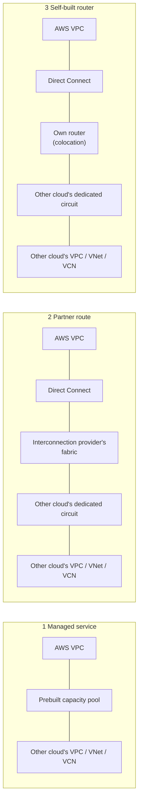
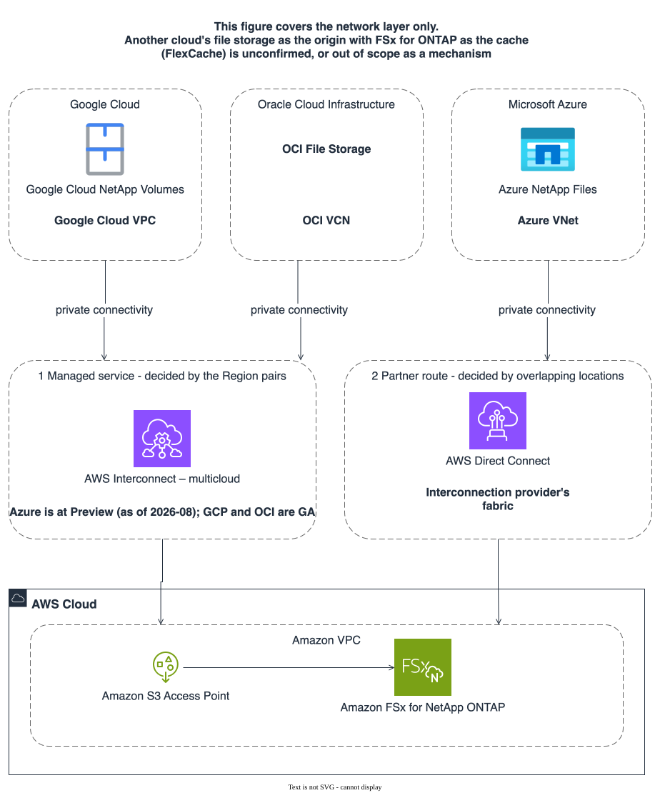
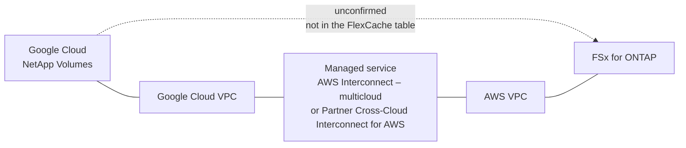
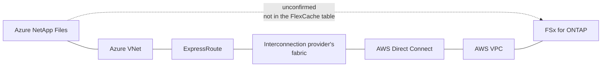
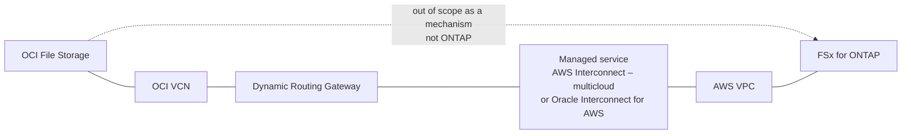

# Cross-cloud connectivity

<!-- lang-switcher:start -->
🌐 [日本語](../ja/multi-cloud-connectivity.md) | [English](multi-cloud-connectivity.md) | [🏠 Repository home](README.md)
<!-- lang-switcher:end -->

Japanese is the authoritative version of this repository for technical accuracy; report any
discrepancy you find here.

This document covers **the network layer only**. It sets out the options for connecting AWS
privately to Google Cloud, Microsoft Azure and Oracle Cloud Infrastructure (OCI), and which Regions
each option covers.

**The architecture itself is unchanged.** Collection goes through the S3 Access Point attached to the
origin volume, and consumption is NFS / SMB on the cache volume ([architecture](architecture.md)).
What this document adds is **the path underneath**, for the case where the two ends sit in different
clouds.

## What this document does not claim

**It does not say that another cloud's file storage can be the origin with FSx for ONTAP as the
cache.** AWS states exactly three supported FlexCache configurations
([portability](portability.md)), and that direction is not among them. The stage is **unconfirmed**.
That does not mean "cannot be done"; it means no statement was found in public documentation
([verification status](verification-status.md)).

Where a mechanism does not apply, the reason can be given in full. FlexCache requires ONTAP cluster
and SVM peering, so **file storage that is not ONTAP can be neither a FlexCache origin nor a
cache.** The right-hand column below is that distinction.

| Platform storage | ONTAP? | Can it be in scope for FlexCache? |
|---|---|---|
| Google Cloud NetApp Volumes | Has an ONTAP mode | Not in the supported configuration table. **unconfirmed** |
| Azure NetApp Files | ONTAP-based | Not in the supported configuration table. **unconfirmed**. ANF's own cache volumes do not list FSx for ONTAP as an origin |
| Google Cloud Filestore | Not ONTAP | Out of scope as a mechanism |
| Azure Managed Lustre | Not ONTAP | Out of scope as a mechanism |
| Azure Blob NFS | Not ONTAP | Out of scope as a mechanism |
| OCI File Storage | Not ONTAP | Out of scope as a mechanism |

**Do not write "unconfirmed" and "out of scope as a mechanism" with the same word.** The first can
have its stage raised by looking; the second rests on a different premise. What is planned for
verification is [at the end of this document](#what-is-to-be-verified).

## Three ways of building it

Every path produces the same result — a private connection. What differs is **who owns the physical
layer, and what the customer configures**. The per-cloud sections below map onto these three.

| Way | Already in place | What the customer owns | What decides whether it can be used |
|---|---|---|---|
| 1 Managed service | Circuit capacity between the AWS and the other CSP's routers. Cabling, capacity growth and support are owned by both CSPs | Selecting the target CSP, its Region and the bandwidth in the console or CLI. One attachment is issued | **The Region pairs published by the service provider** |
| 2 Partner route | The interconnection provider's physical presence at both clouds' connection locations | The AWS-side hosted connection and its virtual interface, the other cloud's dedicated circuit, the cross-connect inside the provider, and BGP on both sides | **Direct Connect locations, the other cloud's connection locations, and the provider's footprint** |
| 3 Self-built router | Nothing | Racks and routers at both locations, the cabling, and BGP on both sides | Whether equipment can be placed at the same locations |

**The three right-hand cells are different measures.** The first is decided by whether the pair is in
a table; the second and third by whether physical presence overlaps. **They cannot be compared in one
table, so this document keeps the comparisons apart** (way 1 in
[comparing the managed services](#comparing-the-managed-services), ways 2 and 3 in
[partner route and self-built router](#partner-route-and-self-built-router)).

**Changing which way you build does not change way 1's Region pairs.** Taking a partner route does
not add Regions to a managed service. It switches to a different construction.

### The same picture with the actual services

Putting real service names into the classification above gives the following. **The arrows in the
figure stop at the AWS VPC.** What lies beyond it — another cloud's file storage as the origin with
FSx for ONTAP as the cache — is the part this document does not claim.

The same content as a table.

| Cloud | Storage | Own-cloud side | Way available today | Connectivity service |
|---|---|---|---|---|
| Google Cloud | Google Cloud NetApp Volumes | Google Cloud VPC | 1 Managed service | AWS Interconnect – multicloud (GA, eight pairs) or Partner Cross-Cloud Interconnect for AWS |
| OCI | OCI File Storage | OCI VCN | 1 Managed service | AWS Interconnect – multicloud (GA, one pair) or Oracle Interconnect for AWS |
| Azure | Azure NetApp Files | Azure VNet | 2 Partner route only | ExpressRoute and Direct Connect joined inside an interconnection provider's fabric |

**"Way available today" says whether way 1 can be used for that cloud.** Google Cloud and OCI can
also be built with way 2. Azure, conversely, is outside way 1, so it is way 2 or 3 regardless of
Region.

On the icons in the figure. Azure NetApp Files uses Microsoft's
[Azure architecture icons](https://learn.microsoft.com/azure/architecture/icons/), following that
page's instruction to keep the product name close to the icon. **Google Cloud NetApp Volumes has no
icon of its own.** Google's product icon system gives unique icons to core products and represents
everything else with a category icon plus the product name, and Google's guide places NetApp Volumes
under Storage ([Google Cloud icons](https://cloud.google.com/icons)). It is therefore shown with the
Storage category icon and the product name. OCI is named without an icon, because this repository has
no icon for it.

## AWS Interconnect – multicloud

A managed service that provides private Layer 3 connectivity between an Amazon VPC and another CSP's
environment. It **became generally available in 2026-04**
([GA announcement](https://aws.amazon.com/about-aws/whats-new/2026/04/aws-announces-ga-AWS-interconnect-multicloud/),
[product page](https://aws.amazon.com/interconnect/multicloud/)).

| Item | Content | Source |
|---|---|---|
| How it is created | Specify three things: the target CSP, its Region, and the bandwidth required. On completion, one attachment representing the capacity is issued | [Product page](https://aws.amazon.com/interconnect/multicloud/) |
| Changing bandwidth | Increased or decreased by modifying the attribute, without recreating the connection | Same |
| Resiliency | Four-way resiliency is built in | Same |
| Encryption | **The physical connections** between the AWS router and the other CSP's router are encrypted. This is AWS's wording; no standard is named | Same |
| Which AWS network services it reaches | Amazon VPC, AWS Transit Gateway, AWS Cloud WAN | Same |
| Transit Gateway / virtual private gateway constraint | Both are Regional services, and **can be used only with a multicloud Interconnect provisioned at the interconnection point serving that Region** | [Getting started](https://docs.aws.amazon.com/interconnect/latest/userguide/getting-started.html) |
| How Cloud WAN differs | A global service, and can reach an Interconnect in any Region | Same |
| API specification | Published in a form other CSPs and partners can adopt | [Product page](https://aws.amazon.com/interconnect/multicloud/) |

**That difference bears on the design.** Where the other cloud's site and the AWS Region in use are
far apart, Transit Gateway does not reach and Cloud WAN is required.

### Supported Region pairs

The pairs AWS publishes are as follows
([Regional Availability](https://docs.aws.amazon.com/interconnect/latest/userguide/region-availability.html)).
**A pair that is not here cannot be built with this managed service.**

| AWS Region | Target CSP and Region |
|---|---|
| us-east-1 (N. Virginia) | Google Cloud us-east4 (N. Virginia) |
| us-west-1 (N. California) | Google Cloud us-west2 (Los Angeles) |
| us-west-2 (Oregon) | Google Cloud us-west1 (Oregon) |
| eu-west-2 (London) | Google Cloud europe-west2 (London) |
| eu-central-1 (Frankfurt) | Google Cloud europe-west3 (Frankfurt) |
| eu-north-1 (Stockholm) | Google Cloud europe-north2 (Stockholm) |
| ap-southeast-1 (Singapore) | Google Cloud asia-southeast1 (Singapore) |
| ap-southeast-2 (Sydney) | Google Cloud australia-southeast1 (Sydney) |
| us-east-1 (N. Virginia) | OCI us-ashburn-1 (Ashburn) |

**Neither Tokyo nor Osaka is included.** The situation for starting from Japan is set out in
[the state of the Japanese Regions](#the-state-of-the-japanese-regions).

## Google Cloud

### Storage services

| Service | Usable as the collect layer? | Source |
|---|---|---|
| Google Cloud NetApp Volumes | Yes, over S3 multiprotocol. **ONTAP mode only**. Stage is documented | [Support matrix](support-matrix.md) |
| Google Cloud Filestore | Not ONTAP, so this architecture's mechanisms do not apply | — |

The names and the implementers differ; see
[glossary](reference/glossary/object-access-on-ontap.md).

### Connectivity options

There are **two managed services** to Google Cloud, one created from the AWS side and one from the
Google side. Both take the same shape: use capacity that is already built.

#### From the AWS side — AWS Interconnect – multicloud

GA as above, with Google Cloud as the first supported CSP. Eight Region pairs.

#### From the Google side — Partner Cross-Cloud Interconnect for AWS

A managed service Google Cloud offers towards AWS, building a region-to-region transport on an
underlay engineered jointly with AWS
([overview](https://docs.cloud.google.com/network-connectivity/docs/interconnect/concepts/partner-cci-for-aws-overview)).

| Item | Content |
|---|---|
| SLA | Google and the other CSP each hold an SLA for their own portion, managed and abstracted on both sides |
| Bandwidth | Pre-approved increments from 1 Gbps to 100 Gbps, sized up and down on demand |
| Provisioning time | Minutes |
| Direction of ordering | Can be initiated from either Google Cloud or AWS |
| Resiliency | Built into the product, rather than configured per connection |
| Attaching to a VPC | VPC Network Peering or Network Connectivity Center (NCC) |
| Quota | By default one transport resource per project per region |

The differences from Cross-Cloud Interconnect are in a comparison table on the same page: physical
provisioning is no longer needed, the connection increment changes from 10 / 100 Gbps to 1 Gbps, and
the lead time changes from 1-4 weeks to minutes. **Not having to configure redundancy is the main
operational difference.**

### The shape of the path

| Segment | Mechanism | Stage |
|---|---|---|
| Google Cloud NetApp Volumes to Google Cloud VPC | GCNV's mount path | Documented by Google Cloud / NetApp |
| Google Cloud VPC to AWS VPC | AWS Interconnect – multicloud or Partner Cross-Cloud Interconnect for AWS | **GA**. Eight pairs, none in Japan |
| AWS VPC to FSx for ONTAP | A volume and an S3 Access Point in the same Region and account | [verified](verification-status.md) |
| Google Cloud NetApp Volumes to a FlexCache with FSx for ONTAP as cache | — | **unconfirmed**. The dashed edge above |

**The dashed segment does not follow from the solid ones.** Network reachability and presence in the
supported FlexCache configurations are different claims.

## Microsoft Azure

### Storage services

| Service | Usable as the collect layer? | Source |
|---|---|---|
| Azure NetApp Files | Yes, over the object REST API. **A volume with existing data is required** (an empty volume will not do). **Not supported on cache volumes** | [Support matrix](support-matrix.md), [portability](portability.md) |
| Azure Managed Lustre | Not ONTAP, so this architecture's mechanisms do not apply | — |
| Azure Blob NFS | Same | — |

### Connectivity options

**Azure is not among the CSPs supported by AWS Interconnect – multicloud.** AWS's wording is
"Microsoft Azure coming later in 2026", which is **neither GA nor Preview**
([product page](https://aws.amazon.com/interconnect/multicloud/)).

| Way | Option | Status |
|---|---|---|
| 1 Managed service | AWS Interconnect – multicloud | **Planned** (AWS's wording is "coming later in 2026"). Timing, Region pairs, pricing and feature differences are all unpublished |
| 2 Partner route | ExpressRoute and Direct Connect joined inside an interconnection provider's fabric | Each service is documented. **This repository has not measured the combination.** Availability is decided by [overlapping locations](#partner-route-and-self-built-router) |

**Way 2 is not a substitute for way 1.** The division of operational responsibility changes and the
list of things to confirm grows. Which to take is in [how to choose](#how-to-choose).

**Do not rewrite "planned" as "Preview".** Preview announcements exist for Google Cloud (2025-11) and
OCI (2026-05); none was found for Azure.

### The shape of the path

| Segment | Mechanism | Who configures it | Stage |
|---|---|---|---|
| Azure NetApp Files to Azure VNet | ANF's mount path | Customer | Documented by Microsoft |
| Azure VNet to ExpressRoute | An ExpressRoute circuit and its connection | Customer | Documented |
| ExpressRoute to Direct Connect | The cross-connect inside the interconnection provider's fabric | Customer and provider | Differs by provider. **unconfirmed in this repository** |
| Direct Connect to AWS VPC | A virtual interface and a virtual private gateway / Transit Gateway | Customer | Documented |
| Azure NetApp Files to a FlexCache with FSx for ONTAP as cache | — | — | **unconfirmed**. The dashed edge above |

## Oracle Cloud Infrastructure (OCI)

### Storage services

| Service | Relationship to this architecture |
|---|---|
| OCI File Storage | NFS file storage. Not ONTAP, so this architecture's mechanisms do not apply |
| OCI Object Storage | Object storage. If a collecting application writes there, that is a separate path from this architecture's S3 Access Point |

### Connectivity options

For OCI there are **two managed services, and both cover only the single pair us-east-1 to
us-ashburn-1**.

| Option | Stage | Regions covered | Encryption |
|---|---|---|---|
| AWS Interconnect – multicloud | **GA** ([preview 2026-05](https://aws.amazon.com/about-aws/whats-new/2026/05/aws-announces-AWS-interconnect-multicloud-oci-preview/) to [GA 2026-07](https://aws.amazon.com/about-aws/whats-new/2026/07/aws-announces-AWS-interconnect-multicloud-OCI-GA/)) | us-east-1 to us-ashburn-1 | Encryption of the physical connection (AWS names no standard) |
| Oracle Interconnect for AWS | Documented | us-ashburn-1 to us-east-1 | **MACsec (IEEE 802.1AE), stated explicitly** ([Oracle](https://docs.oracle.com/iaas/Content/multicloud/interconnect-aws.htm)) |

Oracle Interconnect for AWS is a managed service built on FastConnect, with OCI and AWS configuring
and managing BGP route exchange, load balancing, encryption, redundancy and network isolation. Each
virtual circuit maps to redundant FastConnect devices across two separate FastConnect locations, and
traffic is load balanced with ECMP (same source).

**The traffic that cannot transit is stated explicitly.** Traffic from an on-premises network through
OCI to the VPC, or from on-premises through AWS to OCI, does not flow over this connection (same
source). That bears on any design that includes an on-premises site.

### The shape of the path

| Segment | Mechanism | Stage |
|---|---|---|
| OCI File Storage to OCI VCN | File Storage's mount path | Documented by Oracle |
| OCI VCN to Dynamic Routing Gateway | The virtual circuit's DRG attachment. DRG route tables and import route distributions control which CIDRs are advertised to AWS | Documented |
| OCI to AWS VPC | AWS Interconnect – multicloud or Oracle Interconnect for AWS | **GA**. us-east-1 to us-ashburn-1 only |
| OCI File Storage to a FlexCache with FSx for ONTAP as cache | — | **Out of scope as a mechanism**. The dashed edge above |

## Comparing the managed services

**This section compares way 1 only.** Ways 2 and 3 have neither a lifecycle stage nor Region pairs,
so they are not in this table ([partner route and self-built router](#partner-route-and-self-built-router)).
Direct Connect and ExpressRoute / Cloud Interconnect / FastConnect are the parts ways 2 and 3 are
assembled from, which is a different thing from the cloud-to-cloud managed services compared here.

**Lifecycle stages are shown separately. They are not mixed.** What is shown here is the lifecycle
each provider publishes (GA / Preview / planned), which is a different axis from the four stages this
repository uses for confidence in a claim ([verification status](verification-status.md)).

### Generally Available

| Cloud | Connectivity service | Region pairs | Where it suits |
|---|---|---|---|
| Google Cloud | AWS Interconnect – multicloud | Eight pairs (three US, three Europe, two Asia Pacific). None in Japan | Within those pairs, where you do not want to own physical infrastructure or redundancy |
| Google Cloud | Partner Cross-Cloud Interconnect for AWS | Per Google Cloud's paired locations | Where 1 Gbps increments are needed, or where ordering from the Google Cloud side is preferred |
| OCI | AWS Interconnect – multicloud | us-east-1 to us-ashburn-1 | Where the design closes within that pair |
| OCI | Oracle Interconnect for AWS | us-ashburn-1 to us-east-1 | The same pair. Where an explicit MACsec statement is wanted as the basis |

### Preview

No AWS-to-other-CSP connectivity service was found to be at Preview at present. Google Cloud
(preview announced 2025-11) and OCI (preview announced 2026-05) have both moved to GA.

### Planned

| Cloud | Connectivity service | Published wording | What is not published |
|---|---|---|---|
| Azure | AWS Interconnect – multicloud | "Microsoft Azure coming later in 2026" ([product page](https://aws.amazon.com/interconnect/multicloud/)) | Timing, Region pairs, pricing, feature differences |

## Partner route and self-built router

Ways 2 and 3 are **a different construction** from a managed service, and have no notion of Region
pairs. They cannot be set beside the table above, which is why they have their own section. What
follows centres on way 2: what to provide, and what to confirm.

### What to provide

| Where | What to provide | Who configures it |
|---|---|---|
| AWS side | A Direct Connect hosted connection procured from the interconnection provider, and a virtual interface on it | Customer (the provider issues it) |
| Other cloud side | An ExpressRoute circuit / Cloud Interconnect / FastConnect procured from the same provider | Customer |
| Inside the provider | The cross-connect joining those two | Customer, in the provider's portal |
| Both sides | BGP peering and route advertisement | Customer |

The difference from a managed service is that **the customer owns the path and the routing.** With a
managed service both CSPs own them.

### What decides whether it can be used

**The Region-pair table is not used here.** What decides it is the overlap of three things.

| Element | Where to check |
|---|---|
| Direct Connect locations | [AWS Direct Connect locations](https://aws.amazon.com/directconnect/locations). The Osaka location was [added in 2024-12](https://aws.amazon.com/about-aws/whats-new/2024/12/aws-direct-connect-location-osaka-japan/) |
| The other cloud's connection locations | ExpressRoute peering locations for Azure, Cloud Interconnect colocation facilities for Google Cloud, the FastConnect location list for OCI |
| The interconnection provider's footprint | The provider's location list. It has to be present at both of the above |

### What to confirm

**This repository has not measured this path.** The following are to be confirmed against primary
sources before design starts.

| Item | Where to check |
|---|---|
| Whether to use MACsec | [MAC Security in Direct Connect](https://docs.aws.amazon.com/directconnect/latest/UserGuide/MACsec.html). 10 Gbps and 100 Gbps **dedicated connections**, and **only at selected points of presence** ([prerequisites](https://docs.aws.amazon.com/directconnect/latest/UserGuide/direct-connect-mac-sec-getting-started.html)). Extended to supported partner interconnects in 2025-07 |
| MTU consistency | Every segment on the path. **A mismatch stalls large reads** ([PoC checklist](poc-checklist.md)) |
| Bandwidth and pricing | The provider's and each cloud's price lists. **This repository has not measured cost, so it does not state figures** ([verification status](verification-status.md)) |

## The state of the Japanese Regions

**Neither Tokyo nor Osaka is among AWS Interconnect – multicloud's supported pairs**
([Regional Availability](https://docs.aws.amazon.com/interconnect/latest/userguide/region-availability.html)).
Oracle Interconnect for AWS is likewise us-ashburn-1 to us-east-1 only
([Oracle](https://docs.oracle.com/iaas/Content/multicloud/interconnect-aws.htm)).
**That is a fact about way 1.**

Connecting AWS privately to another cloud from the Japanese Regions means way 2 or way 3, and
whether that is possible is decided by
[the overlap of three locations](#what-decides-whether-it-can-be-used). Azure is outside way 1
regardless of Region ([Microsoft Azure](#microsoft-azure)).

## How to choose

**The decision has two stages, in a fixed order.** Settle which way first, then compare within it.

1. **Check whether way 1 is available, in the Region-pair table.** It is decided by nothing more than
   whether the target cloud and the AWS Region you want are in that table. If they are, use way 1.
   Both CSPs own the physical layer, the capacity, the redundancy and the support.
2. **If not, consider way 2 or 3. This is a different construction, not a means of widening way 1's
   pairs.** Availability is decided not by the table above but by Direct Connect locations, the other
   cloud's connection locations and the provider's footprint. The customer owns the path and the
   routing.
3. **Where way 1 is available, compare within it.** Google Cloud has two managed services, differing
   in bandwidth increments and in which side can order. OCI has two, differing in how explicit the
   encryption statement is.
4. **Azure is outside way 1 at present.** It is way 2 or 3 regardless of Region. Designing around
   waiting for the managed service takes as its premise that the timing is unpublished.

**This architecture's own exclusion conditions belong here at the same granularity.** Even with
connectivity in place, another cloud's file storage as the origin with FSx for ONTAP as the cache is
unconfirmed. Choosing a network does not resolve that.

## Encryption — separating the layers

**Encrypting the physical link and encrypting FlexCache traffic are different layers.** The first
does not remove the need for the second.

| Layer | Mechanism | What it covers | Stage |
|---|---|---|---|
| Physical link | MACsec (IEEE 802.1AE) | Between OCI FastConnect devices and AWS network devices on Oracle Interconnect for AWS ([Oracle](https://docs.oracle.com/iaas/Content/multicloud/interconnect-aws.htm)) | Documented |
| Physical link | MACsec | Direct Connect 10 / 100 Gbps dedicated connections, at supported points of presence only ([AWS](https://docs.aws.amazon.com/directconnect/latest/UserGuide/MACsec.html)) | Documented |
| Physical link | "Encryption of the physical connection" | AWS Interconnect – multicloud. **AWS's wording names no standard** ([product page](https://aws.amazon.com/interconnect/multicloud/)) | Documented |
| ONTAP traffic | Cluster peering encryption. ONTAP 9.6 or later, TLS 1.2 AES-256 GCM, pre-shared key (PSK) | **SnapMirror, SnapVault, FlexCache** ([NetApp](https://docs.netapp.com/us-en/ontap-technical-reports/ontap-security-hardening/data-replication-encryption.html)) | Documented |
| ONTAP traffic | IPsec. ONTAP 9.8 or later | IP traffic generally, between a client and an SVM. **NetApp recommends TLS over IPsec for SnapMirror and cluster peering** ([NetApp](https://docs.netapp.com/us-en/ontap/networking/ipsec-prepare.html)) | Documented |

**No statement was found that ONTAP itself offers MACsec on an intercluster LIF.** The stage is
unconfirmed. The two places MACsec does appear in an ONTAP context both cover something else: a
Cisco-switch-side setting on MetroCluster IP WAN ISLs (optional), and the method used between Google
Cloud NetApp Volumes' Performance service type and Google Cloud
([NetApp](https://docs.netapp.com/us-en/netapp-solutions/ehc/ncvs/ncvs-gc-data-encryption-in-transit.html)),
**which is not something a customer configures.**

### MTU

MACsec carries its own headers, so **the MTU has to be consistent along the whole path.** An MTU
mismatch does not present as a failure to connect: small reads succeed and large reads stall. This
check is in the [PoC checklist](poc-checklist.md).

### Isolating a fault, and packet capture

**MACsec encrypts at Layer 2, so a capture on the link does not show the contents.** Isolate at the
two ends, outside the encryption, rather than part-way along. On the ONTAP side cluster peering
encryption applies separately, so **removing the link encryption does not make FlexCache traffic
clear.**

**No performance effect is stated.** No source was found
([verification status](verification-status.md)).

## FlexCache and SnapMirror — replication against caching

**Not every cache architecture requires replication.** This architecture uses FlexCache alone.

| Aspect | SnapMirror (replication) | FlexCache (cache) |
|---|---|---|
| What moves | Actively pushed to the destination | **Only the range that is read** |
| Capacity at the destination | Capacity matching the source is required | Sparse. It does not hold everything |
| What triggers it | A schedule, or manual | A read on the consuming side |
| Position in this architecture | Not used. Raised as an alternative where the consuming side writes heavily ([alternatives](reference/comparison/alternatives.md), [selection flowchart](reference/decision-trees/choosing-this-architecture.md)) | The serve layer's mechanism |

**What they share**: both require ONTAP cluster and SVM peering. So **neither is available unless the
far side is ONTAP.** [The table at the top of this document](#what-this-document-does-not-claim) is
that distinction.

The peering path is prepared outside this repository. The creation and deletion order is in
[deploying the serve side](deployment/onprem-terraform.md).

## Where the data sits

**What a cache architecture reduces is the volume that moves, not the movement itself.**

| What can be claimed | What cannot |
|---|---|
| FlexCache takes in only the range that is read, so less moves than with full replication | It cannot be said that data does not move. What is read crosses the path |
| Which data is read from which site can be settled in the design | Choosing a connectivity option does not settle where the data sits |
| Keeping US data in US Regions and Japanese data in Japanese Regions is expressible through where the origin and the caches are placed | Whether such a placement satisfies a particular regulation is not judged in this document |

**This is a design-level account, not a legal or compliance judgement.** Whether data crosses a
border depends on which data is read over which path. That only the range read moves makes the volume
smaller, but **it is not a guarantee that nothing crosses.**

## What is to be verified

Verification on each cloud is planned. **The stages originate in
[verification status](verification-status.md); the table below is an extract.** Where they disagree,
the verification status document is correct. Raising a stage follows that document's rules, with the
environment and the procedure stated alongside.

| Item | Current stage | What would raise the stage |
|---|---|---|
| A FlexCache with Google Cloud NetApp Volumes as origin and FSx for ONTAP as cache | unconfirmed | A primary source, or the outcome of cluster peering and cache creation on real equipment |
| A FlexCache with Azure NetApp Files as origin and FSx for ONTAP as cache | unconfirmed | The same, including whether ANF exposes cluster peering externally |
| A FlexCache with FSx for ONTAP as origin and Google Cloud NetApp Volumes / Azure NetApp Files as cache | unconfirmed (already in [verification status](verification-status.md)) | The same |
| Cluster peering over a partner route (Direct Connect, the provider's fabric, the other cloud's circuit) | unconfirmed | Reachability on real equipment, and a FlexCache read with the MTU aligned |
| Time to visibility over a remote or high-latency path | unverified (already in [verification status](verification-status.md)) | A measurement with the environment stated |
| Cost per unit of bandwidth on each path | not measured | An account that separates a sample run from a production estimate |

## Related documents

| Document | Contents |
|---|---|
| [Architecture](architecture.md) | The two layers, and why the S3 Access Point goes on the origin only |
| [Portability](portability.md) | Replacing either layer, and the verdict per platform |
| [Support matrix](support-matrix.md) | Collect-layer and serve-layer support, and the constraints |
| [Verification status](verification-status.md) | The four stages, and the current stage of each claim |
| [PoC checklist](poc-checklist.md) | The order in which to fill the gaps. Includes the MTU check |
| [Deploying the serve side](deployment/onprem-terraform.md) | Why this repository does not create the peering, and the deletion order |
| [Glossary](reference/glossary/object-access-on-ontap.md) | The names of the "read files as objects" mechanisms and who implements them |

<!-- lang-switcher:start -->
🌐 [日本語](../ja/multi-cloud-connectivity.md) | [English](multi-cloud-connectivity.md) | [🏠 Repository home](README.md)
<!-- lang-switcher:end -->
