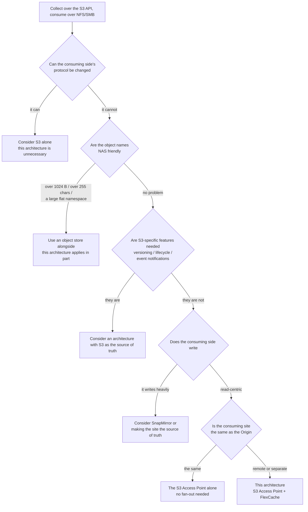

# Choosing — whether to adopt this architecture

<!-- lang-switcher:start -->
🌐 [日本語](../../../ja/reference/decision-trees/choosing-this-architecture.md) | [English](choosing-this-architecture.md) | [🏠 Repository home](../../README.md)
<!-- lang-switcher:end -->

Japanese is the authoritative version of this repository for technical accuracy; report any
discrepancy you find here.

There are five decision points. The flowchart and the table below state the same thing.
Mermaid does not render in every environment, so the basis for the decision is kept in the table too.

## The decision points as a table

| # | Question | If yes | If no |
|---|---|---|---|
| 1 | Can the consuming side's protocol be changed | Consider S3 alone. This architecture is unnecessary | Go to 2 |
| 2 | Are the object names NAS friendly (S3 name within 1024 bytes, file name within 255 characters, a hierarchy containing slashes) | Go to 3 | Use an object store alongside. This architecture applies in part |
| 3 | Are S3-specific features needed (versioning, lifecycle, event notifications) | Consider an architecture with S3 as the source of truth | Go to 4 |
| 4 | Does the consuming side write heavily | Consider SnapMirror or making the site the source of truth | Go to 5 |
| 5 | Is the consuming site the same as the Origin | The S3 Access Point alone is enough. No fan-out needed | This is the situation this architecture is for |

## What is left to decide once you reach 5

Having decided to adopt this architecture, one thing still remains.

**Whether the consuming site uses NFS or SMB.** This has to be decided before the Origin volume is
created. The detail and the sources are in
[decisions that come first](../../design-first-decisions.md).

## What can be deferred and what cannot

| Can be deferred | Cannot be deferred |
|---|---|
| How many fan-out targets | The consuming side's protocol (NFS or SMB) |
| The size of the Cache | The Origin's security style |
| Whether to extend across Regions | The S3 Access Point's identity (UNIX or Windows) |
| Whether to replace the collect layer with another platform | The S3 Access Point's `NetworkOrigin` |

Everything in the right column means a rebuild if it is changed afterwards.

## Related documents

| Document | Contents |
|---|---|
| [Alternatives](../comparison/alternatives.md) | Each approach's suited and unsuited conditions, and its costs |
| [FinOps cost structure](../comparison/finops-s3-vs-s3ap.md) | The cost side of the decision. The fixed-cost floor and the request unit price difference |
| [Decisions that come first](../../design-first-decisions.md) | The judgements that cannot be deferred |
| [Architecture](../../architecture.md) | What this architecture solves and does not solve |
| [Support matrix](../../support-matrix.md) | The support status and minimum versions it presupposes |

---

<!-- lang-switcher:start -->
🌐 [日本語](../../../ja/reference/decision-trees/choosing-this-architecture.md) | [English](choosing-this-architecture.md) | [🏠 Repository home](../../README.md)
<!-- lang-switcher:end -->
