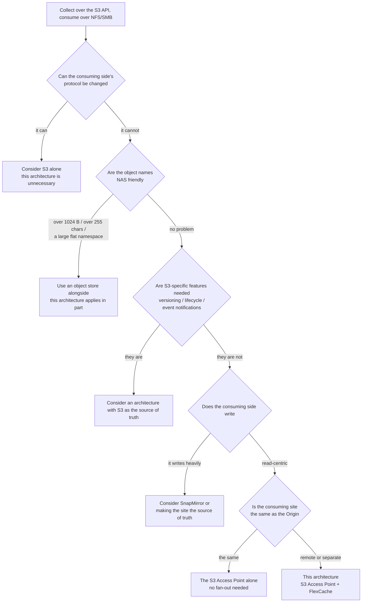

# Choosing — whether to adopt this architecture

<!-- lang-switcher:start -->
🌐 [日本語](../../../ja/reference/decision-trees/choosing-this-architecture.md) | [English](choosing-this-architecture.md) | [🏠 Repository home](../../README.md)
<!-- lang-switcher:end -->

Japanese is the authoritative version of this repository for technical accuracy; report any
discrepancy you find here.

There are five decision points. The flowchart and the table below state the same thing.
Mermaid does not render in every environment, so the basis for the decision is kept in the table too.

```mermaid
flowchart TD
    A[Collect over the S3 API, consume over NFS/SMB] --> B{Can the consuming side's<br/>protocol be changed}
    B -->|it can| C[Consider S3 alone<br/>this architecture is unnecessary]
    B -->|it cannot| D{Are the object names<br/>NAS friendly}
    D -->|over 1024 B / over 255 chars /<br/>a large flat namespace| E[Use an object store alongside<br/>this architecture applies in part]
    D -->|no problem| F{Are S3-specific features needed<br/>versioning / lifecycle /<br/>event notifications}
    F -->|they are| G[Consider an architecture with S3 as the source of truth]
    F -->|they are not| H{Does the consuming side write}
    H -->|it writes heavily| I[Consider SnapMirror or<br/>making the site the source of truth]
    H -->|read-centric| J{Is the consuming site<br/>the same as the Origin}
    J -->|the same| K[The S3 Access Point alone<br/>no fan-out needed]
    J -->|remote or separate| L[This architecture<br/>S3 Access Point + FlexCache]
```

## The decision points as a table

| # | Question | If yes | If no |
|---|---|---|---|
| **0** | **Does the consuming side need iSCSI or NVMe/TCP** (a LUN / namespace served as a block device) | **This architecture is out of scope.** FlexCache serves volumes; it does not serve LUNs or namespaces. Block measurements are [elsewhere](../../../ja/verification/perf-matrix-results.md#f-1-iscsi-の実測) (Japanese), but those are **values from a client attached directly to the same file system**, not values for serving a site. **Where cost is the question, see below** | Go to 1 |

> **For a reader who is out of scope at decision point 0, this repository has nothing further.** A
> cost comparison for holding data on block storage is in the sibling repository —
> [VMware-Migration-EC2-ONTAP's TCO comparison](https://github.com/Yoshiki0705/VMware-Migration-EC2-ONTAP/blob/main/docs/en/tco-comparison.md).
> It checks unit prices with the ap-northeast-1 Price List API, lines them up against every EBS
> volume type, and concludes that **choosing FSx for ONTAP on capacity price alone does not hold up
> for block storage.** **This repository does not carry that same comparison and has not checked the
> arithmetic itself.** The one thing pulled from it here is that single caution, not the figures
> themselves.
>
> **The cost table for the same fork is in [Alternatives](../comparison/alternatives.md#block-protocols-iscsi--nvmetcp).**
> An article covering how the figures were measured (`iorate=max` saturation points, response time,
> a 2.64x swing across environments on the same configuration) is
> [What moves the numbers for block protocols](https://dev.to/aws-builders/why-amazon-fsx-for-netapp-ontap-block-performance-differed-by-about-2x-on-the-same-specified-35pi).
| 1 | Can the consuming side's protocol be changed | Consider S3 alone. This architecture is unnecessary | Go to 2 |
| 2 | Are the object names NAS friendly (S3 name within 1024 bytes, file name within 255 characters, a hierarchy containing slashes) | Go to 3 | Use an object store alongside. This architecture applies in part |
| 3 | Are S3-specific features needed (versioning, lifecycle, event notifications) | Consider an architecture with S3 as the source of truth | Go to 4 |
| 4 | Does the consuming side write heavily | Consider SnapMirror or making the site the source of truth | Go to 5 |
| 5 | Is the consuming site the same as the Origin | The S3 Access Point alone is enough. No fan-out needed | This is the situation this architecture is for |

## What is left to decide once you reach 5

Having decided to adopt this architecture, one thing still remains.

**Whether the consuming site uses NFS or SMB.** This has to be decided before the Origin volume is
created. The detail and the sources are in
[decisions that come first](../../design-first-decisions.md).

## What can be deferred and what cannot

| Can be deferred | Cannot be deferred |
|---|---|
| How many fan-out targets | The consuming side's protocol (NFS or SMB) |
| The size of the Cache | The Origin's security style |
| Whether to extend across Regions | The S3 Access Point's identity (UNIX or Windows) |
| Whether to replace the collect layer with another platform | The S3 Access Point's `NetworkOrigin` |

Everything in the right column means a rebuild if it is changed afterwards. **The evidence behind
each differs, though.** For `NetworkOrigin` and the S3 Access Point's identity, the absence of an
update API is confirmed in AWS documentation. **For the origin's security style, whether the cache
inherits it is unconfirmed on this architecture's main path, and so is the rebuild that follows from
it** ([decisions that come first](../../design-first-decisions.md)).

## Related documents

| Document | Contents |
|---|---|
| [Alternatives](../comparison/alternatives.md) | Each approach's suited and unsuited conditions, and its costs |
| [FinOps cost structure](../comparison/finops-s3-vs-s3ap.md) | The cost side of the decision. The fixed-cost floor and the request unit price difference |
| [Decisions that come first](../../design-first-decisions.md) | The judgements that cannot be deferred |
| [Architecture](../../architecture.md) | What this architecture solves and does not solve |
| [Support matrix](../../support-matrix.md) | The support status and minimum versions it presupposes |

---

<!-- lang-switcher:start -->
🌐 [日本語](../../../ja/reference/decision-trees/choosing-this-architecture.md) | [English](choosing-this-architecture.md) | [🏠 Repository home](../../README.md)
<!-- lang-switcher:end -->
