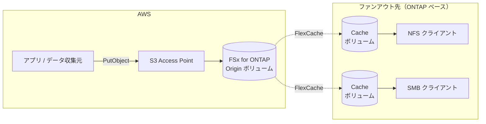

# 構成の形 — 収集は S3 API、利用は NFS / SMB

<!-- lang-switcher:start -->
🌐 [日本語](architecture.md) | [English](../en/architecture.md) | [🏠 リポジトリトップ](../../README.md)
<!-- lang-switcher:end -->

この構成は 2 つの層に分かれる。**収集層**が S3 API で書き込みを受け、**配布層**が FlexCache で
利用拠点へ配る。読む側のプロトコルは NFS / SMB のままで、両者の間にコピージョブを置かない。

図は下の表と同じことを述べている。Mermaid はすべての閲覧環境で描画されるわけではなく、
スクリーンリーダーからも読み取りにくいので、判断の根拠は必ず表か本文の側にも置く。

| 層 | 何を使うか | プロトコル |
|---|---|---|
| 収集（書き込み） | Amazon FSx for NetApp ONTAP の S3 Access Point | S3 API |
| 正典 | FSx for ONTAP の Origin ボリューム | — |
| 配布 | FlexCache | ONTAP 間のクラスタ / SVM ピアリング |
| 利用（読み取り） | ファンアウト先の Cache ボリューム | NFS / SMB のみ |

## S3 Access Point は Origin 側にだけ付ける

この 1 点が設計を大きく単純にする。Cache 側は S3 を提供せず、NFS / SMB で使う。

- **書き込み経路が 1 本になる。** 正典は Origin であり、書き込みは常に AWS 側の S3 Access Point を
  通る。Cache 側からの書き戻し（write-back / write-around）の設計判断が主題から外れ、Cache は
  読み取り中心という FlexCache 本来の適性に収まる
  （[FlexCache は読み取り主体のワークフローに適する](https://docs.aws.amazon.com/fsx/latest/ONTAPGuide/using-flexcache.html)）。
- **ファンアウト先に S3 の実装差を持ち込まない。** 「ファイルを S3 で見せる」機能は
  プラットフォームごとに別実装だが（[用語の整理](reference/glossary/object-access-on-ontap.md)）、
  この構成ではその機能を Origin 側の 1 か所だけで使う。Cache 側に要求するのは FlexCache と
  NFS / SMB だけになる。
- 結果として、たとえば「あるプラットフォームのキャッシュボリュームではオブジェクト用バケットを
  作れない」という制約は、この設計には影響しない。Cache 側でオブジェクトアクセスを使わないため。

## Cache 側に S3 を出す機構は使わない

ONTAP の FlexCache duality は、Cache ボリュームに ONTAP 自身の S3 アクセスを許可する機能で、
FSx for ONTAP の S3 Access Point をボリュームに接続することとは**別の機構**である。
一方の対応状況をもう一方の根拠として使わない。この構成はどちらも使わない。

区別が必要な理由は[用語の整理](reference/glossary/object-access-on-ontap.md)に置いた。
現時点の対応状況は[サポート状況](support-matrix.md)、何を確かめていて何を確かめていないかは
[検証状況](verification-status.md)にある。

## Origin ボリュームを作る前に決めること

Origin のセキュリティスタイルが、ファンアウト先で使えるプロトコルを左右する。
そしてそれは Cache 作成時に継承される項目で、Cache 側では設定できない。
**「現場で NFS を使うのか SMB を使うのか」を Origin ボリュームの作成前に決めておく**必要がある。

詳細と出典は[最初に決めること](design-first-decisions.md)にまとめた。
Get Started の前に読む価値があるのはこの 1 点だけなので、他の設計判断とは分けてある。

## この構成が解くこと

- 収集を S3 API で受けつつ、利用側は NFS / SMB のまま。両者の間にコピージョブを置かない
- 書き込み経路を Origin 側の S3 Access Point に集約できる。**ただし認可は単一層ではない。**
  独立した 2 層を順に通り、両方を通らなければデータに届かない。Layer 1（AWS 側）は呼び出し元の
  プリンシパルと `s3:` アクションを評価し、絞り込みを担うのは**明示的な拒否**である。
  同一アカウントでは identity-based ポリシーとアクセスポイントポリシーが結合されるため、
  `Allow` を狭く書くことは絞り込みにならない。Layer 2（ファイルシステム側）はアクセスポイントに
  固定した識別情報が持つファイル権限（mode bits / ACL）を評価する。**層をまたいだ引き算は起きない**
  （[二層認可](https://docs.aws.amazon.com/fsx/latest/ONTAPGuide/s3-ap-manage-access-fsxn.html)、
  および両層の実測記録: [S3 Access Point の権限設計](https://github.com/Yoshiki0705/FSx-for-ONTAP-Adoption-Playbook/blob/main/docs/ja/domains/security-governance/notes/access-point-authorization-layers.md)）
- 読み取りの局所化。必要な範囲だけを利用拠点に持ち込む
- 収集層を別のプラットフォームに置き換えても、配布層の設計が変わらない
  （[移植性](portability.md)）

## この構成が解かないこと

「S3 互換」は「S3 と同一」ではない。適用できないワークロードを早い段階で判別できることは、
この構成を検討する価値の半分を占める。

| 期待 | 実際 |
|---|---|
| S3 の全機能が使える | 使えない。FSx for ONTAP の S3 Access Point では対応オペレーションが限られ、イベント通知・ライフサイクル・バージョニングは対象外 |
| 任意のオブジェクト名が使える | 使えない。S3 名は 1024 バイト、ファイル / ディレクトリ名は 255 文字まで。`part1/part2` と `part1/part2/part3` は NAS 上で同時に存在できない（[NAS データ要件](https://docs.netapp.com/us-en/ontap/s3-multiprotocol/nas-data-requirements-client-access-reference.html)） |
| オブジェクトストア並みにフラットな名前空間を扱える | 扱えない。スラッシュを含まない名前はすべてルートディレクトリに集まり、数が多いと性能問題になる。上記出典は、NAS フレンドリでない名前を多用するアプリにはオブジェクトストアのほうが適すると明記している |
| Cache 側でも S3 で読める | この構成では読めない。上記のとおり FlexCache duality と S3 Access Point の接続は別の機構であり、前者の対応状況は後者の根拠にならない |
| Cache 側に書けば速い | この構成は Cache を読み取り用途とする。書き込みは Origin 側の S3 Access Point に集約する |
| S3 の料金モデルになる | ならない。課金はファイルストレージ側の容量とスループットに従う |
| どのプラットフォームでも同じ手順 | 同じではない。対応構成と最小バージョンが異なる（[移植性](portability.md)） |

## 代表ユースケース

「クラウドの S3 API で収集し、現場の NFS/SMB で利用する」——この構造を持つワークロードは
業種を問わず存在する。

| 業種 | 収集側 | 利用側 | 参考 |
|---|---|---|---|
| 自動車（AV/ADAS） | 走行ログ・センサーデータを S3 に集約 | HiL テストベンチで NFS 再生 | [Hybrid Cloud HiL](https://aws.amazon.com/blogs/industries/accelerating-hil-testing-for-av-adas-with-a-hybrid-cloud-approach-aws-and-netapp/) |
| 半導体（EDA） | 設計ジョブの入出力を S3 でステージ | NFS 上のツールチェーンで実行 | [EDA Scale with FSx for ONTAP](https://aws.amazon.com/cn/blogs/industries/eda-scale-with-fsx-for-netapp-ontap-and-ibm-lsf/) |
| メディア・VFX | レンダリング素材を S3 で集約 | 制作端末が SMB/NFS でマウント | — |
| 石油・ガス | 地震探査データを S3 にアップロード | 解釈ワークステーションで NFS マウント | [VDI for Subsurface O&G](https://docs.aws.amazon.com/solutions/deploying-vdi-for-subsurface-oil-and-gas-on-aws/index.html) |
| ライフサイエンス | ゲノムシーケンサー出力を S3 に格納 | HPC が NFS で処理 | — |
| 製造・品質検査 | 検査カメラ画像を S3 で収集 | ライン端末が NFS で読み取り | — |
| リモートワーク | 中央データを S3 経由で更新 | リモート WorkSpaces が FlexCache でアクセス | [FlexCache in WorkSpaces](https://community.netapp.com/t5/Tech-ONTAP-Blogs/Accelerating-Remote-Work-Harnessing-FlexCache-in-AWS-WorkSpaces-for-Data/ba-p/451852) |
| IoT・エッジ | センサーデータを S3 にストリーム | 現場の解析装置が NFS で読み取り | — |

共通する構造: 書き込み拠点は少数（多くは 1 つ）、読み取り拠点は複数。書き込みはバースト的、
読み取りは必要な範囲だけ。

### HiL テストの対応付け（詳細）

AV / ADAS 開発では、実車で記録した走行ログとセンサーデータを、実機の ECU を組み込んだ
テストベンチで再生して検証する。AWS と NetApp によるハイブリッドクラウドでの取り組みが
公開されている（[Accelerating HiL Testing for AV/ADAS with a Hybrid Cloud Approach](https://aws.amazon.com/blogs/industries/accelerating-hil-testing-for-av-adas-with-a-hybrid-cloud-approach-aws-and-netapp/)）。

以下の対応付けは本リポジトリによる整理であり、上記記事の主張ではない。

| HiL 側の事情 | この構成での受け方 |
|---|---|
| テストベンチは実機の ECU を含むため物理的にオンプレミスにある。移設できない | Cache ボリュームをベンチ側に置き、NFS / SMB でマウントする |
| 収集・前処理・カタログ化はクラウド側で回したい | S3 Access Point に PutObject する。収集側のツールチェーンを S3 前提のまま使える |
| 再生に使うのは全データではなく、その試験に必要な一部 | FlexCache は必要な分だけを取り込む疎なキャッシュであり、全量複製しない |
| 同じデータセットを複数のベンチ・複数拠点で使う | 1 つの Origin から複数の Cache へファンアウトする |
| 再生中に書き戻しはしない（結果は別に出す） | Cache は読み取り中心。FlexCache の適性と一致する |
| データ量が大きく、拠点への全量転送は現実的でない | 転送されるのは実際に読まれた範囲に限られる |

同型の構造を持つワークロードは HiL に限らない。計測データを収集して現場の解析装置に配る、
レンダリングの素材を収集して制作拠点に配る、検査画像を収集して読影端末に配る、といった
「収集はクラウド、利用は現場のファイルプロトコル」という形は共通である。

## 関連ドキュメント

| ドキュメント | 内容 |
|---|---|
| [最初に決めること](design-first-decisions.md) | Origin 作成前に決める必要がある項目 |
| [用語の整理](reference/glossary/object-access-on-ontap.md) | 「ファイルを S3 で見せる」機能の呼び名と実装元の違い |
| [S3 AP 設計ガイド](reference/limits/s3ap-design-guide.md) | 対応オペレーション、並行度設計、ディレクトリ設計、ボリューム設計、NFS 側探索戦略 |
| [サポート状況](support-matrix.md) | 収集層・配布層の対応状況と最小バージョン |
| [検証状況](verification-status.md) | 検証済みと未検証の区別 |
| [移植性](portability.md) | 収集層・配布層をプラットフォームごとに置き換える場合 |
| [代替案との比較](reference/comparison/alternatives.md) | 他の方式が向く条件・向かない条件 |
| [FinOps の費用構造](reference/comparison/finops-s3-vs-s3ap.md) | 課金次元の違い、構成別の試算、周辺ワークロードへの影響 |
| [選び方](reference/decision-trees/choosing-this-architecture.md) | この構成を採るかどうかの判断 |
| [PoC チェックリスト](poc-checklist.md) | 何をどの順に確かめるか |

---

<!-- lang-switcher:start -->
🌐 [日本語](architecture.md) | [English](../en/architecture.md) | [🏠 リポジトリトップ](../../README.md)
<!-- lang-switcher:end -->
