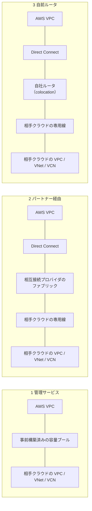
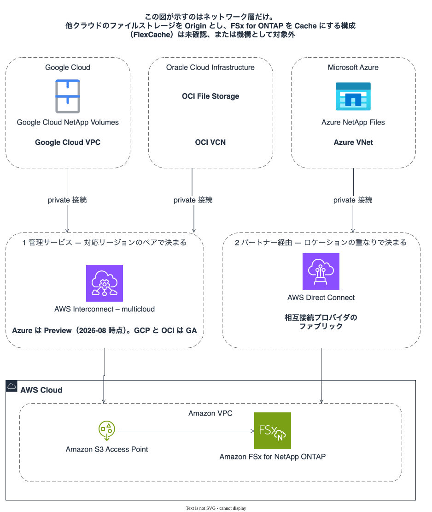
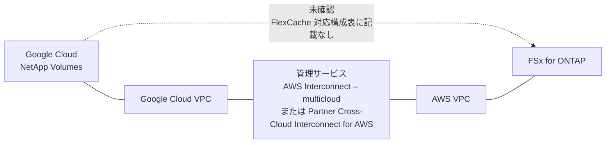
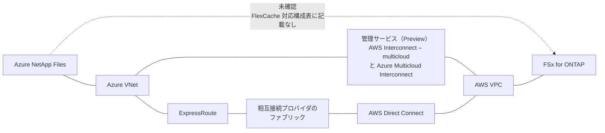
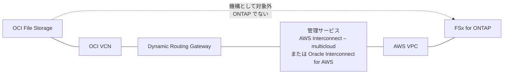

# 他クラウドとの接続経路

<!-- lang-switcher:start -->
🌐 [日本語](multi-cloud-connectivity.md) | [English](../en/multi-cloud-connectivity.md) | [🏠 リポジトリトップ](../../README.md)
<!-- lang-switcher:end -->

この文書が扱うのは**ネットワーク層だけ**である。AWS と Google Cloud / Microsoft Azure /
Oracle Cloud Infrastructure (OCI) の間を private につなぐ選択肢と、それぞれがどのリージョンで
使えるかを整理する。

**この構成の形は変わらない。** 収集は Origin ボリュームに付けた S3 Access Point、利用は Cache
ボリュームの NFS / SMB である（[構成の形](architecture.md)）。この文書は、その両端が別のクラウドに
分かれている場合に**下を通る経路**の話をする。

## この文書が主張しないこと

**他クラウドのファイルストレージを Origin として、FSx for ONTAP を Cache にできるとは書かない。**
AWS が明記している FlexCache 対応構成は 3 つで（[移植性](portability.md)）、その方向は含まれていない。
段階は**未確認**である。「できない」ではなく、公開ドキュメントに記載を見つけられていないという意味で
ある（[検証状況](verification-status.md)）。

機構として成り立たないものは、成り立たない理由まで書ける。FlexCache は ONTAP 間のクラスタ /
SVM ピアリングを要求するため、**ONTAP でないファイルストレージは FlexCache の Origin にも Cache にも
ならない。** 下表の右列がその区別である。

| プラットフォームのストレージ | ONTAP か | FlexCache の対象になりうるか |
|---|---|---|
| Google Cloud NetApp Volumes | ONTAP モードがある | 対応構成表に記載なし。**未確認** |
| Azure NetApp Files | ONTAP ベース | 対応構成表に記載なし。**未確認**。ANF 側の Cache は Origin に FSx for ONTAP を挙げていない |
| Google Cloud Filestore | ONTAP でない | 機構として対象外 |
| Azure Managed Lustre | ONTAP でない | 機構として対象外 |
| Azure Blob NFS | ONTAP でない | 機構として対象外 |
| OCI File Storage | ONTAP でない | 機構として対象外 |

**「未確認」と「機構として対象外」を同じ語で書かない。** 前者は調べれば段階が上がりうるもので、
後者は前提が違うものである。検証の予定は[この文書の末尾](#検証したい項目)にある。

## 接続の 3 分類

どの経路も「private につながる」という結果は同じで、**誰が物理を持ち、利用者が何を設定するか**が
違う。以降の各クラウドの節はこの分類に対応づけてある。

| 分類 | 事前に用意されているもの | 利用者が持つもの | 使えるかを決めるもの |
|---|---|---|---|
| 1 管理サービス | AWS と相手 CSP のルータ間の回線容量。物理配線・容量増設・サポートは両 CSP が持つ | コンソールまたは CLI で相手 CSP・相手リージョン・帯域を選ぶ。attachment が 1 つ払い出される | **サービス提供側が公開している対応リージョンのペア** |
| 2 パートナー経由 | 相互接続プロバイダが両クラウドの接続ロケーションに持つ物理設備 | AWS 側の hosted connection と virtual interface、相手クラウド側の専用線、プロバイダ内部の相互接続、両側の BGP | **Direct Connect ロケーションと、相手クラウドの接続ロケーション、およびプロバイダの拠点** |
| 3 自前ルータ | 何もない | 両方のロケーションのラックとルータ、配線、両側の BGP | 同じロケーションに設備を置けるか |

**3 行の右列は別の尺度である。** 1 は「そのペアが対応表にあるか」で決まり、2 と 3 は
「両方のロケーションに物理があるか」で決まる。**同じ表で比べられるものではないので、
この文書では比較を分けてある**（1 は[管理サービスの比較](#管理サービスの比較)、
2 と 3 は[パートナー経由と自前ルータ](#パートナー経由と自前ルータ)）。

**分類を変えても 1 の対応ペアは変わらない。** パートナー経由にしたからといって、管理サービスの
対応リージョンが増えるわけではない。別の作り方に切り替えているだけである。

### 実際のサービスで見た全体像

上の分類に実際のサービス名を入れると次の形になる。**図の矢印は AWS の VPC で止めてある。**
そこから先（他クラウドのファイルストレージを Origin として FSx for ONTAP を Cache にする構成）は
この文書が主張しない範囲である。

図と同じことを表にしておく。

| クラウド | ストレージ | 自クラウド側 | 現在取れる分類 | 接続サービス |
|---|---|---|---|---|
| Google Cloud | Google Cloud NetApp Volumes | Google Cloud VPC | 1 管理サービス（GA） | AWS Interconnect – multicloud（GA、8 ペア）または Partner Cross-Cloud Interconnect for AWS |
| OCI | OCI File Storage | OCI VCN | 1 管理サービス（GA） | AWS Interconnect – multicloud（GA、1 ペア）または Oracle Interconnect for AWS |
| Azure | Azure NetApp Files | Azure VNet | 1 管理サービス（**Preview**）または 2 パートナー経由 | AWS Interconnect – multicloud（Preview、4 ペア）と Azure Multicloud Interconnect、または ExpressRoute と Direct Connect を相互接続プロバイダのファブリックで結ぶ |

**表の「現在取れる分類」は、そのクラウドで分類 1 が使えるかどうかを示すものである。**
3 クラウドとも分類 2 で作ることはできる。**Azure だけライフサイクルが Preview であり、
GA の 2 つと同じ扱いにしない。** Preview の対応ペアと機能は変更されうるため、
本番の設計を Preview の挙動に依存させる場合はそれが前提になる。

図中のアイコンについて。Azure NetApp Files は Microsoft の
[Azure architecture icons](https://learn.microsoft.com/ja-jp/azure/architecture/icons/)を使い、
製品名をアイコンの近くに置くという同ページの指示に従っている。**Google Cloud NetApp Volumes には
固有アイコンが存在しない。** Google の製品アイコン体系は core product にだけ固有アイコンを与え、
それ以外はカテゴリアイコンと製品名で示す方式で、同社のガイドは NetApp Volumes を Storage
カテゴリに分類している（[Google Cloud icons](https://cloud.google.com/icons?hl=ja)）。
そのため Storage カテゴリアイコンと製品名で示している。OCI はこのリポジトリがアイコンを用意できて
いないため名前だけである。

## AWS Interconnect – multicloud

AWS が Amazon VPC と他 CSP の環境の間に private な L3 接続を提供する管理サービスで、
**2026-04 に GA になった**（[GA 告知](https://aws.amazon.com/about-aws/whats-new/2026/04/aws-announces-ga-AWS-interconnect-multicloud/)、
[製品ページ](https://aws.amazon.com/interconnect/multicloud/)）。

| 項目 | 内容 | 出典 |
|---|---|---|
| 作成手順 | 相手 CSP、相手側リージョン、必要帯域の 3 つを指定する。完了すると容量を表す attachment が 1 つ払い出される | [製品ページ](https://aws.amazon.com/interconnect/multicloud/) |
| 帯域変更 | 接続を作り直さずに属性の変更で増減できる | 同上 |
| 冗長性 | 4 経路の冗長性が組み込まれている | 同上 |
| 暗号化 | AWS ルータと相手 CSP ルータの間の**物理接続を暗号化する**。製品ページの記述はこの文言で、規格名を挙げていない。MACsec を名指しした発言はブログの引用にしかない（[暗号化の層の差](#暗号化--物理リンクと-flexcache-トラフィックの層の差)） | 同上 |
| 接続先の AWS ネットワークサービス | Amazon VPC、AWS Transit Gateway、AWS Cloud WAN | 同上 |
| Transit Gateway / virtual private gateway の制約 | どちらもリージョン単位のサービスで、**そのリージョンを担当する interconnection point の multicloud Interconnect とだけ使える** | [Getting started](https://docs.aws.amazon.com/interconnect/latest/userguide/getting-started.html) |
| Cloud WAN の扱い | global なサービスで、どのリージョンの Interconnect にも到達できる | 同上 |
| API 仕様 | 他の CSP / パートナーが採用できる形で公開されている | [製品ページ](https://aws.amazon.com/interconnect/multicloud/) |

**この違いは設計に効く。** 相手クラウドの拠点と AWS 側の利用リージョンが離れている場合、
Transit Gateway では届かず Cloud WAN が必要になる。

### 対応リージョンのペア

AWS が公開している対応ペアは次のとおりである
（[Regional Availability](https://docs.aws.amazon.com/interconnect/latest/userguide/region-availability.html)、
2026-09-02 取得）。**ここに無いペアは、この管理サービスでは作れない。**
右列は CSP ごとのライフサイクルで、**Preview の行を GA の行と同じ扱いにしない。**

| AWS リージョン | 相手側 CSP とリージョン | ライフサイクル |
|---|---|---|
| us-east-1（バージニア北部） | Google Cloud us-east4（バージニア北部） | GA |
| us-west-1（北カリフォルニア） | Google Cloud us-west2（ロサンゼルス） | GA |
| us-west-2（オレゴン） | Google Cloud us-west1（オレゴン） | GA |
| eu-west-2（ロンドン） | Google Cloud europe-west2（ロンドン） | GA |
| eu-central-1（フランクフルト） | Google Cloud europe-west3（フランクフルト） | GA |
| eu-north-1（ストックホルム） | Google Cloud europe-north2（ストックホルム） | GA |
| ap-southeast-1（シンガポール） | Google Cloud asia-southeast1（シンガポール） | GA |
| ap-southeast-2（シドニー） | Google Cloud australia-southeast1（シドニー） | GA |
| us-east-1（バージニア北部） | Azure eastus（米国東部） | Preview |
| us-west-1（北カリフォルニア） | Azure westus（米国西部） | Preview |
| eu-central-1（フランクフルト） | Azure germanywestcentral（ドイツ中西部） | Preview |
| ap-southeast-2（シドニー） | Azure australiaeast（オーストラリア東部） | Preview |
| us-east-1（バージニア北部） | OCI us-ashburn-1（アッシュバーン） | GA |

**この表は人手で維持しない。** `make interconnect-regions` が上記ページを取得して日本語版・英語版の
両方の表と突き合わせ、食い違いがあれば失敗する。取得できなかった場合は「差分なし」ではなく
**取得できなかったこととして失敗する**（[検査ツール側の規約](../agent/policy-in-code.md)）。

**`ap-northeast-1`（東京）と `ap-northeast-3`（大阪）は、どの CSP のペアにも含まれていない。**
日本を起点にする場合の現状は[日本リージョンの現状](#日本リージョンの現状)にまとめた。

### 同名の別サービス — AWS Interconnect – last mile

同じユーザーガイドに `AWS Interconnect – last mile` がある。**これは CSP 間を結ぶものではなく、
事業者回線を AWS に引くサービスである。** Lumen との提供で、us-east-1 のニュージャージー拠点から
任意の AWS リージョンへ、または米国本土内から Lumen のファブリック経由で接続する
（[Regional Availability](https://docs.aws.amazon.com/interconnect/latest/userguide/region-availability.html)）。
配布側が拠点にあるこの構成では経路の一部になりうるが、**上の 3 分類は cloud-to-cloud の作り方の
分類であり、軸が違うので分類の表には入れない。** 段階はドキュメント記載で、当リポジトリは
この経路を実測していない。

## Google Cloud

### ストレージサービス

| サービス | 収集層として使えるか | 出典 |
|---|---|---|
| Google Cloud NetApp Volumes | S3 multiprotocol で可。**ONTAP モードのみ**。段階はドキュメント記載 | [サポート状況](support-matrix.md) |
| Google Cloud Filestore | ONTAP でないため、この構成の機構は適用できない | — |

呼び名と実装元の違いは[用語の整理](reference/glossary/object-access-on-ontap.md)にある。

### 接続の選択肢

Google Cloud との間には**管理サービスが 2 つある**。AWS 側から作るものと Google 側から作るもので、
どちらも同じ「事前構築済みの容量を使う」形である。

#### AWS 側 — AWS Interconnect – multicloud

上記のとおり GA で、Google Cloud は最初の対応 CSP である。対応ペアは 8 組。

#### Google 側 — Partner Cross-Cloud Interconnect for AWS

Google Cloud が AWS との間に提供する管理サービスで、AWS と共同で設計した underlay の上に
リージョン間の transport を作る（[概要](https://docs.cloud.google.com/network-connectivity/docs/interconnect/concepts/partner-cci-for-aws-overview)）。

| 項目 | 内容 |
|---|---|
| SLA | Google と相手 CSP がそれぞれの区間の SLA を持ち、両側で管理・抽象化される |
| 帯域 | 1 Gbps から 100 Gbps の事前承認済みの刻み。オンデマンドで増減できる |
| プロビジョニング時間 | 数分 |
| 発注の向き | Google Cloud 側と AWS 側のどちらからでも開始できる |
| 冗長性 | 製品に組み込まれている（利用者が個別に構成しない） |
| VPC への接続 | VPC Network Peering または Network Connectivity Center (NCC) |
| クォータ | 既定でプロジェクトあたり・リージョンあたり transport リソース 1 つ |

従来の Cross-Cloud Interconnect との差は同ページの比較表にある。物理プロビジョニングが不要になり、
接続の刻みが 10 / 100 Gbps 単位から 1 Gbps 単位に変わり、所要が 1〜4 週間から数分になる。
**冗長性を利用者が構成する必要がなくなる点が、運用上の主な差である。**

### 経路の形

| 区間 | 機構 | 段階 |
|---|---|---|
| Google Cloud NetApp Volumes ↔ Google Cloud VPC | GCNV のマウント経路 | Google Cloud / NetApp のドキュメント記載 |
| Google Cloud VPC ↔ AWS VPC | AWS Interconnect – multicloud または Partner Cross-Cloud Interconnect for AWS | **GA**。対応ペアは 8 組で日本を含まない |
| AWS VPC ↔ FSx for ONTAP | 同一リージョン・同一アカウントのボリュームと S3 Access Point | [検証済み](verification-status.md) |
| Google Cloud NetApp Volumes → FSx for ONTAP を Cache とする FlexCache | — | **未確認**。上の破線 |

**破線の区間は、下の実線がつながっても成立するとは限らない。** ネットワークが到達することと、
FlexCache の対応構成に載っていることは別である。

## Microsoft Azure

### ストレージサービス

| サービス | 収集層として使えるか | 出典 |
|---|---|---|
| Azure NetApp Files | object REST API で可。**既存データのあるボリュームが必要**（空ボリューム不可）。**キャッシュボリュームでは object REST API 非対応** | [サポート状況](support-matrix.md)、[移植性](portability.md) |
| Azure Managed Lustre | ONTAP でないため、この構成の機構は適用できない | — |
| Azure Blob NFS | 同上 | — |

### 接続の選択肢

**Azure は 2026-08 に AWS Interconnect – multicloud の対応 CSP に加わり、Preview になった**
（[preview 告知](https://aws.amazon.com/about-aws/whats-new/2026/08/aws-announces-AWS-interconnect-multicloud-microsoft-azure-preview/)、
[製品ページ](https://aws.amazon.com/interconnect/multicloud/)の表記は "Microsoft Azure (Preview)"）。
Google Cloud と OCI と同じく、**Azure 側にも対になる管理サービスがある。**

| 分類 | 選択肢 | 状況 |
|---|---|---|
| 1 管理サービス | AWS Interconnect – multicloud | **Preview**。対応する AWS リージョンは us-east-1、us-west-1、eu-central-1、ap-southeast-2 の 4 つで、[対応リージョンのペア](#対応リージョンのペア)にある。コンソール・CLI・API のいずれからも作成できる |
| 1 管理サービス | Azure Multicloud Interconnect | Azure 側から作る対向のサービス。**出典が Microsoft のブログのみで、Microsoft Learn のリファレンスには未記載**（下記） |
| 2 パートナー経由 | ExpressRoute と Direct Connect を相互接続プロバイダのファブリックで結ぶ | 各サービスはドキュメント記載。**この組み合わせを当リポジトリは実測していない**。可否は[ロケーションの重なり](#パートナー経由と自前ルータ)で決まる |

**分類 2 は分類 1 の代わりに使えるという意味ではない。** 運用の責任分担が変わり、確認する項目も
増える。どちらを採るかは[選び方](#選び方)にある。

**Preview を GA と同じ根拠にしない。** 対応ペア・機能・料金はいずれも変更されうる。AWS の
preview 告知は対応リージョンを 4 つ挙げているが、帯域の刻みと SLA についてはこの段階では
述べていない。

#### Azure Multicloud Interconnect の出典の弱さ

Azure 側のサービスについて見つけられた記述は Microsoft の
[Azure blog](https://azure.microsoft.com/en-us/blog/introducing-azure-multicloud-interconnect-for-aws/) と
[Tech Community の記事](https://techcommunity.microsoft.com/blog/azurenetworkingblog/simpler-private-connectivity-between-azure-and-aws-with-azure-multicloud-interco/4550556)で、
**Microsoft Learn の [Azure Networking Design Guide の cross-cloud ページ](https://learn.microsoft.com/en-us/azure/networking/design-guide/cross-cloud)には
記載を見つけられていない。** ブログにある記述は次の 2 点だが、リファレンスで裏を取れていない。

| ブログの記述 | 扱い |
|---|---|
| GA 時点で最大 100 Gbps、需要に応じて容量を動的に拡張できる | ブログのみ。GA 時点の話であり、Preview の値ではない |
| Azure Private Link まで private な経路が延びる | ブログのみ。この構成は Azure 側のストレージを Origin にしないため、直接は効かない |

**ブログはリファレンスの代わりにならない。** 設計の根拠にする場合は、GA 時点で Microsoft Learn
側に記載が現れるかを確認すること。

### 経路の形

**経路が 2 通りある。** 上が分類 1（Preview）、下が分類 2 である。

| 区間 | 機構 | 誰が設定するか | 段階 |
|---|---|---|---|
| Azure NetApp Files ↔ Azure VNet | ANF のマウント経路 | 利用者 | Microsoft のドキュメント記載 |
| Azure VNet ↔ AWS VPC（分類 1） | AWS Interconnect – multicloud と Azure Multicloud Interconnect | 両 CSP が物理と冗長性を持ち、利用者は相手 CSP・リージョン・帯域を選ぶ | **Preview**。4 ペア |
| Azure VNet ↔ ExpressRoute（分類 2） | ExpressRoute 回線と接続 | 利用者 | ドキュメント記載 |
| ExpressRoute ↔ Direct Connect（分類 2） | 相互接続プロバイダのファブリック内での相互接続 | 利用者とプロバイダ | プロバイダごとに異なる。**当リポジトリでは未確認** |
| Direct Connect ↔ AWS VPC（分類 2） | virtual interface と virtual private gateway / Transit Gateway | 利用者 | ドキュメント記載 |
| Azure NetApp Files → FSx for ONTAP を Cache とする FlexCache | — | — | **未確認**。上の破線 |

**分類 1 が Preview になっても破線は変わらない。** ネットワークが到達することと、FlexCache の
対応構成に載っていることは別である。

## Oracle Cloud Infrastructure (OCI)

### ストレージサービス

| サービス | この構成との関係 |
|---|---|
| OCI File Storage | NFS のファイルストレージ。ONTAP でないため、この構成の機構は適用できない |
| OCI Object Storage | オブジェクトストレージ。収集側のアプリケーションが書き込む先として使う場合、この構成の S3 Access Point とは別の経路になる |

### 接続の選択肢

OCI については**管理サービスが 2 つあり、どちらも us-east-1 ↔ us-ashburn-1 の 1 ペアだけ**である。

| 選択肢 | 段階 | 対応リージョン | 暗号化 |
|---|---|---|---|
| AWS Interconnect – multicloud | **GA**（[preview 2026-05](https://aws.amazon.com/about-aws/whats-new/2026/05/aws-announces-AWS-interconnect-multicloud-oci-preview/) → [GA 2026-07](https://aws.amazon.com/about-aws/whats-new/2026/07/aws-announces-AWS-interconnect-multicloud-OCI-GA/)） | us-east-1 ↔ us-ashburn-1 | 物理接続の暗号化（AWS は規格名を挙げていない） |
| Oracle Interconnect for AWS | ドキュメント記載 | us-ashburn-1 ↔ us-east-1 | **MACsec (IEEE 802.1AE) と明記**（[Oracle](https://docs.oracle.com/iaas/Content/multicloud/interconnect-aws.htm)） |

Oracle Interconnect for AWS は FastConnect を基盤にした管理サービスで、BGP の経路交換・負荷分散・
暗号化・冗長性・ネットワーク分離を OCI と AWS が構成・管理する。各 virtual circuit は 2 つの
FastConnect ロケーションにまたがる冗長な FastConnect デバイスに対応づけられ、経路は ECMP で
分散される（同上）。

**通過できないトラフィックが明記されている。** オンプレミスネットワークから OCI を経由して VPC へ、
または オンプレミスから AWS を経由して OCI へ、というトラフィックはこの接続では通らない（同上）。
オンプレミス拠点を含む設計ではここが効く。

### 経路の形

| 区間 | 機構 | 段階 |
|---|---|---|
| OCI File Storage ↔ OCI VCN | File Storage のマウント経路 | Oracle のドキュメント記載 |
| OCI VCN ↔ Dynamic Routing Gateway | virtual circuit の DRG attachment。DRG のルートテーブルと import route distribution で AWS へ広告する CIDR を制御する | ドキュメント記載 |
| OCI ↔ AWS VPC | AWS Interconnect – multicloud または Oracle Interconnect for AWS | **GA**。us-east-1 ↔ us-ashburn-1 のみ |
| OCI File Storage → FSx for ONTAP を Cache とする FlexCache | — | **機構として対象外**。上の破線 |

## 管理サービスの比較

**この節は分類 1（管理サービス）だけを比べる。** 分類 2 と 3 はライフサイクルの段階も対応リージョンの
ペアも持たないため、この表には入れない（[パートナー経由と自前ルータ](#パートナー経由と自前ルータ)）。
Direct Connect と ExpressRoute / Cloud Interconnect / FastConnect は分類 2 と 3 を組み立てる
部品であり、ここで比べている cloud-to-cloud の管理サービスとは別のものである。

**ライフサイクルの段階ごとに分けて示す。混ぜない。** ここで併記するのは各サービスの提供側が
公開しているライフサイクル（GA / Preview / 予定）で、このリポジトリが主張の確度に使う
4 段階（[検証状況](verification-status.md)）とは別の軸である。

### Generally Available

| クラウド | 接続サービス | 対応リージョンのペア | 適する場面 |
|---|---|---|---|
| Google Cloud | AWS Interconnect – multicloud | 8 組（米国 3・欧州 3・アジア太平洋 2）。日本を含まない | 対応ペアの範囲内で、物理と冗長性を持ちたくない場合 |
| Google Cloud | Partner Cross-Cloud Interconnect for AWS | Google Cloud 側の paired location に従う | 1 Gbps 単位の帯域が要る場合、Google Cloud 側から発注したい場合 |
| OCI | AWS Interconnect – multicloud | us-east-1 ↔ us-ashburn-1 | このペアに閉じる場合 |
| OCI | Oracle Interconnect for AWS | us-ashburn-1 ↔ us-east-1 | 同じペア。MACsec が明記されている点を根拠にしたい場合 |

### Preview

| クラウド | 接続サービス | 対応リージョンのペア | 適する場面 |
|---|---|---|---|
| Azure | AWS Interconnect – multicloud | 4 組（us-east-1、us-west-1、eu-central-1、ap-southeast-2）。日本を含まない | Preview の変更を受け入れられる検証目的。**本番の設計根拠にはしない** |
| Azure | Azure Multicloud Interconnect | 上と同じ経路の Azure 側 | 同上。加えて**リファレンスに未記載**であることが前提になる |

Google Cloud（2025-11 に preview 告知）と OCI（2026-05 に preview 告知）はいずれも GA へ移行済みで、
Azure は 2026-08 に preview 告知が出た段階である。

### 予定

**現時点で該当なし。** 3 つの CSP はいずれも Preview 以上に達している。次の CSP が加わったときに
ここへ戻す。

## パートナー経由と自前ルータ

分類 2 と 3 は管理サービスとは**別の作り方**であり、対応リージョンのペアという概念を持たない。
上の表と並べて比べられるものではないので、節を分けてある。ここでは分類 2（パートナー経由）を
中心に、用意するものと確認する項目を挙げる。

### 用意するもの

| 場所 | 用意するもの | 誰が設定するか |
|---|---|---|
| AWS 側 | 相互接続プロバイダから調達する Direct Connect の hosted connection と、その上の virtual interface | 利用者（プロバイダが払い出す） |
| 相手クラウド側 | 同じプロバイダから調達する ExpressRoute 回線 / Cloud Interconnect / FastConnect | 利用者 |
| プロバイダ内部 | 上の 2 つを結ぶ相互接続 | 利用者がプロバイダのポータルで設定 |
| 両側 | BGP のピアリングと経路広告 | 利用者 |

管理サービスとの差は、**経路とルーティングの責任を利用者が持つ**ことである。管理サービスでは
両 CSP が持つ。

### 使えるかを決めるもの

**対応リージョンのペアの表は、ここでは使わない。** 決めるのは次の 3 つの重なりである。

| 要素 | 確認先 |
|---|---|
| Direct Connect ロケーション | [AWS Direct Connect ロケーション](https://aws.amazon.com/directconnect/locations)。大阪のロケーションは[2024-12 に追加](https://aws.amazon.com/about-aws/whats-new/2024/12/aws-direct-connect-location-osaka-japan/) |
| 相手クラウドの接続ロケーション | Azure は ExpressRoute の peering location、Google Cloud は Cloud Interconnect の colocation facility、OCI は FastConnect のロケーション一覧 |
| 相互接続プロバイダの拠点 | プロバイダのロケーション一覧。上の 2 つの両方に居る必要がある |

### 確認する項目

**当リポジトリはこの経路を実測していない。** 以下は設計を始める前に一次資料で確認する項目である。

| 項目 | 確認先 |
|---|---|
| MACsec を使うか | [MAC Security in Direct Connect](https://docs.aws.amazon.com/directconnect/latest/UserGuide/MACsec.html)。10 Gbps と 100 Gbps の**専用接続**、かつ**対応 PoP が限られる**（[前提](https://docs.aws.amazon.com/directconnect/latest/UserGuide/direct-connect-mac-sec-getting-started.html)）。2025-07 に対応するパートナー interconnect へ拡張された |
| MTU の一致 | 経路上のすべての区間。**不一致だと大きな読み取りが止まる**（[PoC チェックリスト](poc-checklist.md)） |
| 帯域と料金 | プロバイダと各クラウドの料金表。**当リポジトリは金額を計測していないため書かない**（[検証状況](verification-status.md)） |

## 日本リージョンの現状

**東京・大阪のいずれも、AWS Interconnect – multicloud の対応ペアに含まれていない**
（[Regional Availability](https://docs.aws.amazon.com/interconnect/latest/userguide/region-availability.html)）。
Oracle Interconnect for AWS も us-ashburn-1 ↔ us-east-1 のみである
（[Oracle](https://docs.oracle.com/iaas/Content/multicloud/interconnect-aws.htm)）。
**これは分類 1 についての事実である。**

日本の東西で AWS と他クラウドを private につなぐ場合は分類 2 または 3 になり、その可否は
[3 つのロケーションの重なり](#使えるかを決めるもの)で決まる。**Azure が Preview に上がっても
日本のペアは増えていない**（対応は us-east-1、us-west-1、eu-central-1、ap-southeast-2）。

## 選び方

**判断は 2 段階で、順序が決まっている。** 先に分類を決め、そのあとで分類の中を比べる。

1. **分類 1 が使えるかを、対応リージョンのペアの表で確かめる。** 相手クラウドと、使いたい AWS
   リージョンの組がその表にあるかどうかだけで決まる。あれば分類 1 を使う。物理・容量・冗長性・
   サポートを両 CSP が持つ。
2. **無ければ分類 2 または 3 を検討する。これは別の作り方であって、分類 1 の対応ペアを広げる
   手段ではない。** 可否は上の表ではなく、Direct Connect ロケーション・相手クラウドの接続
   ロケーション・プロバイダの拠点で決まる。経路とルーティングの責任は利用者が持つ。
3. **分類 1 が使える場合に、その中で比べる。** Google Cloud は AWS 側と Google 側の 2 つの
   管理サービスがあり、帯域の刻みと発注の向きが違う。OCI は 2 つあり、暗号化の記述の明示度が違う。
   Azure も 2 つあるが、どちらも Preview である。
4. **ライフサイクルを可否と混ぜない。** ペアが表にあることと、そのペアが GA であることは別で
   ある。Azure の 4 ペアは Preview なので、**表にあることを GA と同じ根拠として扱わない。**
   本番で分類 1 を前提にするなら、GA まで待つか、Preview の変更を受け入れられる範囲に
   影響を閉じるか、分類 2 で作るかのいずれかになる。

**この構成側の除外条件も同じ粒度で挙げる。** 接続がつながっても、他クラウドのファイルストレージを
Origin として FSx for ONTAP を Cache にする構成は未確認である。ネットワークの選択は、その未確認を
解消しない。

## 暗号化 — 物理リンクと FlexCache トラフィックの層の差

**物理リンクの暗号化と、FlexCache のトラフィックの暗号化は別の層である。** 前者があるから後者が
不要になることはない。

| 層 | 機構 | 対象 | 段階 |
|---|---|---|---|
| 物理リンク | MACsec (IEEE 802.1AE) | Oracle Interconnect for AWS の OCI FastConnect デバイスと AWS ネットワークデバイスの間（[Oracle](https://docs.oracle.com/iaas/Content/multicloud/interconnect-aws.htm)） | ドキュメント記載 |
| 物理リンク | MACsec | Direct Connect の 10 / 100 Gbps 専用接続、対応 PoP のみ（[AWS](https://docs.aws.amazon.com/directconnect/latest/UserGuide/MACsec.html)） | ドキュメント記載 |
| 物理リンク | 「物理接続の暗号化」 | AWS Interconnect – multicloud。**製品ページの本文は規格名を挙げていない**（[製品ページ](https://aws.amazon.com/interconnect/multicloud/)） | ドキュメント記載 |
| 物理リンク | MACsec | 同じサービスについて、**Microsoft のブログに載った AWS 側の役員の発言が MACsec を名指ししている**（[Azure blog](https://azure.microsoft.com/en-us/blog/introducing-azure-multicloud-interconnect-for-aws/)） | **出典はブログの引用のみ**。サービスのドキュメントで裏を取れていない |
| ONTAP のトラフィック | cluster peering encryption。ONTAP 9.6 以降、TLS 1.2 AES-256 GCM、事前共有鍵 (PSK) | **SnapMirror、SnapVault、FlexCache**（[NetApp](https://docs.netapp.com/us-en/ontap-technical-reports/ontap-security-hardening/data-replication-encryption.html)） | ドキュメント記載 |
| ONTAP のトラフィック | IPsec。ONTAP 9.8 以降 | クライアントと SVM の間の IP トラフィック全般。**NetApp は SnapMirror と cluster peering には TLS を推奨している**（[NetApp](https://docs.netapp.com/us-en/ontap/networking/ipsec-prepare.html)） | ドキュメント記載 |

**ONTAP 自身が intercluster LIF に MACsec を提供するという記載は見つけられていない。** 段階は
未確認である。ONTAP の MACsec として見つかるのは 2 つとも別の対象で、1 つは MetroCluster IP の
WAN ISL に対する Cisco スイッチ側の設定（任意）、もう 1 つは Google Cloud NetApp Volumes の
Performance service type と Google Cloud の間で使われている方式（[NetApp](https://docs.netapp.com/us-en/netapp-solutions/ehc/ncvs/ncvs-gc-data-encryption-in-transit.html)）で、
**後者は利用者が設定するものではない。**

### MTU

MACsec も暗号化のヘッダを持つため、**経路上の MTU を経路全体でそろえる必要がある。**
MTU の不一致で起きるのは接続失敗ではなく、小さな読み取りは通るのに大きな読み取りが止まる、という
形の不具合である。この確認は[PoC チェックリスト](poc-checklist.md)に入っている。

### 切り分けとパケットキャプチャ

**MACsec は L2 で暗号化するため、リンク上でキャプチャしても中身は読めない。** 切り分けは
経路の途中ではなく、暗号化の外側にあたる両端で取る。ONTAP 側は cluster peering encryption が
別に効いているため、**リンクの暗号化を外しても FlexCache のトラフィックは平文にならない。**

**性能への影響は書かない。** 出典を見つけられていない（[検証状況](verification-status.md)）。

## FlexCache と SnapMirror — 複製と Cache の違い

**すべての Cache 構成が複製を必要とするわけではない。** この構成が使うのは FlexCache だけである。

| 観点 | SnapMirror（複製） | FlexCache（Cache） |
|---|---|---|
| 何が動くか | 宛先に対して能動的に押す | **読まれた範囲だけを取り込む** |
| 宛先の容量 | ソースに対応する容量が要る | 疎。全量を持たない |
| 起動のきっかけ | スケジュールまたは手動 | 利用側の読み取り |
| この構成での位置 | 使わない。利用側で書き込みが多い場合の代替案として挙げてある（[代替案との比較](reference/comparison/alternatives.md)、[選び方](reference/decision-trees/choosing-this-architecture.md)） | 配布層の機構 |

**共通するもの**: どちらも ONTAP 間のクラスタ / SVM ピアリングを要求する。したがって
**相手が ONTAP でなければどちらも使えない。** この文書の[冒頭の表](#この文書が主張しないこと)が
その区別である。

ピアリングの経路はこのリポジトリの外で用意する。作成順序と削除順序は
[配布側のデプロイ](deployment/onprem-terraform.md)にある。

## データの所在

**Cache 構成が減らせるのは移動する量で、移動そのものではない。**

| 主張できること | 主張できないこと |
|---|---|
| FlexCache は読まれた範囲だけを取り込むため、全量複製より移動する量が少ない | データが移動しない、とは言えない。読まれたものは経路を通る |
| どのデータをどの拠点から読ませるかを設計で決められる | 接続層の選択がデータの所在を決めるわけではない |
| 米国のデータを米国のリージョンに置き、日本のデータを日本のリージョンに置く、という配置は Origin と Cache の置き場所で表現できる | その配置が特定の規制の要件を満たすかは、この文書では判断しない |

**これは設計上の整理であり、法令・コンプライアンスの判断ではない。** 越境の可否は、どのデータが
どの経路で読まれるかに依存する。読まれた範囲だけが移動するという性質は、移動する量を小さくするが、
**越境しないことの保証にはならない。**

## 検証したい項目

各クラウドでの検証を予定している。**段階の出所は[検証状況](verification-status.md)であり、
下表はその抜粋である。** 食い違った場合は検証状況側が正しい。段階を上げるときは同文書の規則に従い、
環境と手順を併記する。

| 項目 | 現在の段階 | 何が分かれば段階が上がるか |
|---|---|---|
| Google Cloud NetApp Volumes を Origin、FSx for ONTAP を Cache とする FlexCache | 未確認 | 一次資料の記載、または実機でのクラスタピアリングと Cache 作成の成否 |
| Azure NetApp Files を Origin、FSx for ONTAP を Cache とする FlexCache | 未確認 | 同上。ANF 側がクラスタピアリングを外部に提供するかを含む |
| FSx for ONTAP を Origin、Google Cloud NetApp Volumes / Azure NetApp Files を Cache とする FlexCache | 未確認（[検証状況](verification-status.md)に既出） | 同上 |
| パートナー経由（Direct Connect + プロバイダのファブリック + 相手クラウドの専用線）でのクラスタピアリング成立 | 未確認 | 実機での疎通と、MTU をそろえた状態での FlexCache 読み取り |
| AWS Interconnect – multicloud 経由でのクラスタピアリング成立と、その経路での FlexCache 読み取り | 未確認 | 実機での疎通。**対応ペアに日本が無いため、測定するなら対応ペアのリージョンに環境を作る必要がある** |
| Azure Multicloud Interconnect の帯域・SLA・料金 | 未確認 | Microsoft Learn 側のリファレンスに記載が現れること。ブログの数値は GA 時点の話で Preview の値ではない |
| 遠隔・高レイテンシ経路での可視化までの所要時間 | 未検証（[検証状況](verification-status.md)に既出） | 環境を併記した測定 |
| 各経路の帯域あたり料金 | 未計測 | サンプル実行と本番見積りを分けた記載 |

## 関連ドキュメント

| ドキュメント | 内容 |
|---|---|
| [構成の形](architecture.md) | 2 層の全体像と、S3 Access Point を Origin 側にだけ付ける理由 |
| [移植性](portability.md) | 層ごとの置き換えと、プラットフォーム別の判定 |
| [サポート状況](support-matrix.md) | 収集層・配布層の対応状況と制約 |
| [検証状況](verification-status.md) | 4 つの段階の定義と、各主張の現在の段階 |
| [PoC チェックリスト](poc-checklist.md) | 未確認を埋める順序。MTU の確認を含む |
| [配布側のデプロイ](deployment/onprem-terraform.md) | ピアリングをこのリポジトリが作らない理由と、削除順序 |
| [用語の整理](reference/glossary/object-access-on-ontap.md) | 「ファイルを S3 で見せる」機構の呼び名と実装元 |

<!-- lang-switcher:start -->
🌐 [日本語](multi-cloud-connectivity.md) | [English](../en/multi-cloud-connectivity.md) | [🏠 リポジトリトップ](../../README.md)
<!-- lang-switcher:end -->
