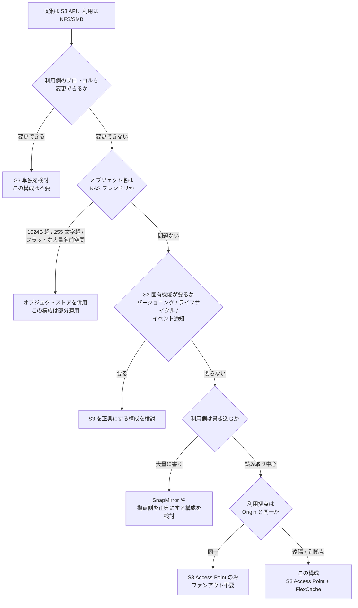

# 選び方 — この構成を採るかどうか
<!-- lang-switcher:start -->
🌐 [日本語](choosing-this-architecture.md) | [English](../../../en/reference/decision-trees/choosing-this-architecture.md) | [🏠 リポジトリトップ](../../../../README.md)
<!-- lang-switcher:end -->

判断の分岐点は 5 つある。フローチャートと下の表は同じことを述べている。
Mermaid はすべての閲覧環境で描画されるわけではないので、判断の根拠は表の側にも置く。

## 分岐点を表で読む

| # | 問い | 答えが「はい」なら | 答えが「いいえ」なら |
|---|---|---|---|
| 1 | 利用側のプロトコルを変更できるか | S3 単独を検討する。この構成は不要 | 2 へ |
| 2 | オブジェクト名は NAS フレンドリか（S3 名 1024 バイト以内、ファイル名 255 文字以内、スラッシュを含む階層を持つ） | 3 へ | オブジェクトストアを併用する。この構成は部分適用 |
| 3 | S3 固有機能（バージョニング、ライフサイクル、イベント通知）が要るか | S3 を正典にする構成を検討する | 4 へ |
| 4 | 利用側は大量に書き込むか | SnapMirror や拠点側を正典にする構成を検討する | 5 へ |
| 5 | 利用拠点は Origin と同一か | S3 Access Point のみでよい。ファンアウトは不要 | この構成が対象とする状況 |

## 5 に到達したあとに決めること

この構成を採ると決めた時点で、まだ 1 つ残っている。

**利用拠点で NFS を使うのか SMB を使うのか。** これは Origin ボリュームを作る前に決める必要が
ある。詳細と出典は[最初に決めること](../../design-first-decisions.md)にある。

## 判断を保留してよいもの / 保留できないもの

| 保留できる | 保留できない |
|---|---|
| ファンアウト先の台数 | 利用側のプロトコル（NFS か SMB か） |
| Cache のサイズ | Origin のセキュリティスタイル |
| リージョン間に広げるか | S3 Access Point の識別情報（UNIX か Windows か） |
| 収集層を他プラットフォームに置き換えるか | S3 Access Point の `NetworkOrigin` |

右の列は、いずれも後から変えると作り直しになる項目である。

## 関連ドキュメント

| ドキュメント | 内容 |
|---|---|
| [代替案との比較](../comparison/alternatives.md) | 各方式の向く条件・向かない条件と代償 |
| [FinOps の費用構造](../comparison/finops-s3-vs-s3ap.md) | 費用面での判断材料。固定費の下限とリクエスト単価の差 |
| [最初に決めること](../../design-first-decisions.md) | 保留できない判断 |
| [構成の形](../../architecture.md) | この構成が解くこと・解かないこと |
| [サポート状況](../../support-matrix.md) | 前提となる対応状況と最小バージョン |

---

<!-- lang-switcher:start -->
🌐 [日本語](choosing-this-architecture.md) | [English](../../../en/reference/decision-trees/choosing-this-architecture.md) | [🏠 リポジトリトップ](../../../../README.md)
<!-- lang-switcher:end -->
