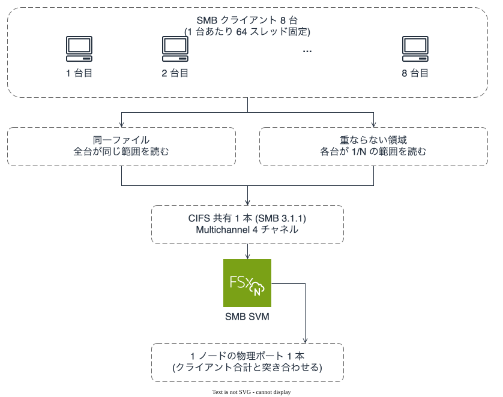
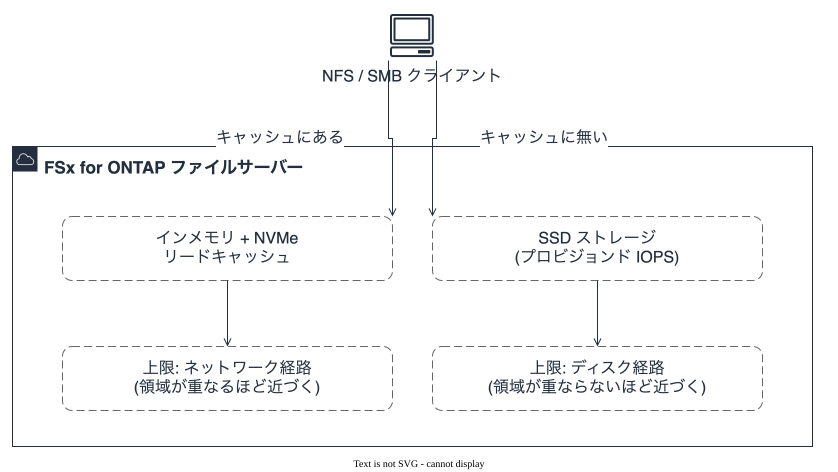

# プロトコル別測定の結果

**測定中の記録である。** 完了したケースだけを載せ、残りは末尾の未測定表に置く。可否は
[プロトコル別の可否](protocol-matrix-efs-vs-ontap.md)にある。環境と手順は
[測定環境](../../../environments/perf-matrix/README.md)にあり、テンプレートとスクリプトから
再現できる。

## この測定でいちばん効いた要因

**単一接続の測定は、ストレージではなく EC2 の 1 フローあたりの帯域上限を測っている。**
そして接続を増やしたあと何に当たるかは、**読むデータがキャッシュから返るかどうか**で決まる。
製品名でも世代でもプロトコルでもない。

| 構成 | 接続数 | 1 MiB 逐次読み | 応答時間 |
|---|---|---|---|
| FSx for ONTAP NFSv4.1、`nconnect=16` | 16 | **3,551〜5,149 MB/s** | 144.18 / 99.44 ms |
| FSx for ONTAP SMB 3.1.1、Multichannel | 4 | 2,227.61 MB/s | 229.78 ms |
| Amazon EFS、マウントヘルパー（ローカルプロキシ経由） | 1 + プロキシ | 1,495.82 MB/s | 342.28 ms |
| FSx for ONTAP NFSv4.1、`nconnect` なし | 1 | 591.62 MB/s | 865.40 ms |
| FSx for ONTAP SMB 3.1.1、Multichannel 無効 | 1 | 574.24 MB/s | 891.60 ms |
| Amazon EFS、素の `mount -t nfs` | 1 | 499.79 MB/s | 1,024.41 ms |
| Amazon EFS、`nconnect=16` | — | **I/O が停滞して測定不能** | — |

**単一接続の 3 行は 500〜592 MB/s に収まる。しかし当たっている上限は 2 製品で別物である。**

| 単一接続の実測 | 当たっている上限 | 出典 |
|---|---|---|
| FSx for ONTAP NFS 591.62 MB/s（4.7 Gbps） | **EC2 の 1 フローあたり全二重 5 Gbps** | [FSx for ONTAP performance](https://docs.aws.amazon.com/fsx/latest/ONTAPGuide/performance.html) が明記し、`nconnect` / SMB Multichannel で超えられるとしている |
| FSx for ONTAP SMB 574.24 MB/s（4.6 Gbps） | 同上 | 同上 |
| **EFS 素マウント 499.79 MB/s** | **EFS の 1 クライアントあたり 500 MiBps** | [Amazon EFS quotas](https://docs.aws.amazon.com/efs/latest/ug/limits.html) の Quotas for NFS clients |

> **当初この 3 行をまとめて「EC2 の 1 フロー上限」と説明した。EFS については誤りだった。**
> EFS には**クライアント単位のスループット上限が別に文書化されており**、実測 499.79 MB/s は
> 5 Gbps（625 MB/s）ではなく **500 MiBps に一致する。** 数字が近いので同じ原因に見えたが、
> 別の上限である。**「似た値だから同じ理由」で束ねない。**

**単一接続で 2 製品を比べた 1.18 倍は、それぞれ別の上限を測った値の比だった。**

**接続を増やすと上限は 2 通りある。** どちらに当たるかは作業セットとキャッシュの大小で決まり、
同じファイルシステム・同じワークロード形状・同じ接続数でも **5.5 倍**変わる（下の台数試験）。

**`nconnect=16` の行が幅を持っているのはそのためである。** 同一設定・同一パラメータファイル・
同一の測定ツールで 2 回測って 3,551.18 と 5,148.56、**45% 違った。** 違いはキャッシュに何が残っていたか
だけである（詳細は下）。

**したがって、このファイルシステムのスループットを 1 つの数字で書くことはできない。**
書くなら、**接続数・データ共有の有無・キャッシュの温まり方**を併記する。

## 測定条件（共通）

| 項目 | 値 |
|---|---|
| 測定日 | 2026-09-05 |
| リージョン | ap-northeast-1、単一 AZ、全ターゲットと全クライアントが同一サブネット |
| ONTAP | 9.18.1P5 |
| FSx for ONTAP | 第二世代 SINGLE_AZ_2、**6,144 MBps ×1 HA ペア**、SSD 4,096 GiB、プロビジョンド 200,000 IOPS |
| **NVMe リードキャッシュ** | **無効**（両ノードで読み直して確認。**AWS も高スループット時は無効化を推奨**） |
| `tcp-max-xfer-size` | **1,048,576 へ引き上げ済み**（既定 65,536 のままだと `rsize` が 64 KiB に切り下がる） |
| ボリューム | NFS 用 900 GiB / UNIX、SMB 用 900 GiB / NTFS、いずれも階層化なし・インライン効率化なし |
| Amazon EFS | Elastic、東京 |
| テストデータ | 非圧縮。FSx for ONTAP 600 GiB、EFS 300 GiB（理由は下） |
| クライアント | c5n.9xlarge（Linux / Windows とも同一型）、ネットワーク 50 Gbps は保証値 |
| 測定器 | VDBENCH 5.04.07。曲線は auto_vdbench 1.1.0 経由、比較は VDBENCH 直接 |
| 並列度 | 512 スレッド |

**EFS のテストファイルが小さいのは 2 つの理由による。** 600 GiB は FSx for ONTAP の 256 GB
インメモリキャッシュを超えるために決めた大きさで、EFS に同じ層はない。加えて **EFS Elastic は
読み書きした量に $0.07/GB 課金されるので、大きさが費用になる。**

## FSx for ONTAP 第二世代、nconnect=16（auto_vdbench、目標値を振った系列）

実効マウント: `vers=4.1,rsize=1048576,wsize=1048576,hard,proto=tcp,nconnect=16,timeo=600,sec=sys`

**この系列は目標 IOPS を振った曲線であり、行ごとに多重度が違う。** 下の
[同一パラメータでの横並び](#同一パラメータでの横並びvdbench-直接300-秒--ウォームアップ-60-秒)は
全行 512 スレッドに固定した別の測定である。**2 つの表の行を混ぜて並べない。**

### 1 MiB 逐次読み

| 目標 IOPS | 達成 IOPS | スループット | 応答時間 |
|---|---|---|---|
| 500 | 496.1 | 496 MB/s | 1.96 ms |
| 1,000 | 1,002.9 | 1,003 MB/s | 3.74 ms |
| 2,100 | 2,102.1 | 2,102 MB/s | 5.52 ms |
| 4,200 | 4,190.3 | 4,190 MB/s | 7.80 ms |
| **4,400** | **4,405.9** | **4,406 MB/s** | **8.86 ms** |
| 無制限 | 4,204.5 | 4,204 MB/s | **121.79 ms** |

レイテンシ基準（auto_vdbench 算出）: 2 ms で 508 IOPS、3 ms で 793、4 ms で 1,165。

**無制限に流すと下がる。** 目標 4,400 なら 8.86 ms で 4,406 MB/s 出るのに、無制限では
4,204 MB/s で 121.79 ms。**スループットが 5% 下がり応答時間は 14 倍になる。**
**`iorate=max` の 1 点を「上限」として記録すると、到達可能な値より低く、レイテンシが 1 桁悪い
数字が残る。**

### 1 MiB 逐次書き

| 目標 IOPS | 達成 IOPS | スループット | 応答時間 |
|---|---|---|---|
| 250 | 250.4 | 250 MB/s | 3.00 ms |
| 500 | 501.6 | 502 MB/s | 3.13 ms |
| 1,000 | 999.7 | 1,000 MB/s | 3.88 ms |
| 2,000 | 2,005.5 | 2,005 MB/s | **28.17 ms** |
| 2,100 | 2,055.2 | **2,055 MB/s** | **248.89 ms** |
| 無制限 | 2,047.1 | 2,047 MB/s | 249.89 ms |

**膝が非常に急である。** 2,000 で 28.17 ms、2,100 で 248.89 ms。**目標値を 5% 上げると
応答時間が 9 倍**になる。

### その他のブロックサイズ（目標値を振った系列の最大）

**多重度は行ごとに違う。** 逆算値を併記する（[応答時間からの多重度の逆算](#応答時間からの多重度の逆算)）。

| シナリオ | 達成 IOPS | スループット | 応答時間 | 逆算した多重度 |
|---|---|---|---|---|
| 64 KiB 逐次読み | 27,027.6 | 1,689 MB/s | 2.45 ms | 66 |
| 4 KiB ランダム読み | 90,573.8 | 354 MB/s | 5.65 ms | 512 |

**4 KiB は約 90,000 IOPS で 3 点そろって止まった**（90,313 / 90,088 / 90,574）。プロビジョンド
200,000 IOPS の 45% で、スループットは 354 MB/s。**同じファイルシステムで、ブロックサイズを
変えるだけで 4,406 MB/s と 354 MB/s になる。**

## 同一パラメータでの横並び（VDBENCH 直接、300 秒 + ウォームアップ 60 秒）

**ワークロード定義は 1 つのファイルを共有している。** 差はホスト定義・パス・`openflag` の 3 つだけ
（[パラメータファイル](../../../environments/perf-matrix/vdbench/)）。

**4 列すべてが同じパラメータファイル・同じ 600 GiB のファイル・同じ 512 スレッド・同じ
`openflag` で、VDBENCH 直接である。**

| シナリオ | NFS 1 接続 | SMB 1 チャネル | SMB 4 チャネル | NFS 16 接続 |
|---|---|---|---|---|
| 1 MiB 逐次読み | 591.62 | 574.24 | 2,227.61 | **3,551.18** |
| 64 KiB 逐次読み | 590.29 | 568.61 | **1,610.25** | 1,388.47 |
| 1 MiB 逐次書き | 591.57 | 574.22 | 1,698.42 | **2,047.27** |
| 64 KiB 逐次書き | 587.40 | 572.80 | 1,621.97 | **1,980.44** |
| 4 KiB ランダム読み（IOPS） | 59,691 | 67,561 | **126,507** | 89,536 |
| 4 KiB ランダム書き（IOPS） | 65,606 | 68,103 | **130,284** | 89,393 ※ |
| 64 KiB ランダム読み | 590.28 | 555.38 | 1,595.57 | **2,042.47** |

単位は MB/s（1024²）。※ の 1 点だけクライアント CPU が 89.1% に達しており、ストレージ側の
値ではない（キュー深度も 512 に届かず 429.5）。**同じ表の他の行は 6.8〜19.8% で余っている。**

> **この表の 2 つの複数接続列は、キャッシュの温度が揃っていない。** 4 列すべて同じパラメータ
> ファイル・同じスレッド数で測っているが、**実行の順序が残っている。**
>
> | 列 | 直前に何が走ったか | ボリュームの状態 |
> |---|---|---|
> | SMB 4 チャネル | 同じ SMB ボリュームで単一チャネルの 7 シナリオ | **温まっている** |
> | NFS 16 接続 | 数時間前の別ボリューム（SMB 側）の測定 | **冷えている** |
>
> **同一設定でキャッシュの温度だけが違うと 45% 動く**ことは下で実測している。
> **つまり「4 KiB ランダムで 4 チャネルの SMB が 16 接続の NFS を上回る」には、
> この非対称が含まれている。** どちらが速いかの結論をこの 2 列から取らない。
>
> **単一接続の 2 列は影響を受けない。** どちらも 1 フローの上限に張り付いており、
> キャッシュから返るかどうかで動く余地がない（64 KiB 以上がすべて約 590 / 約 570 に収まる）。

**どちらのプロトコルが速いかはシナリオで入れ替わる。** 4 チャネルの SMB は、4 KiB ランダムと
64 KiB 逐次読みで 16 接続の NFS を上回る。1 MiB 逐次読みと書き込みでは NFS が上回る。
**「SMB は NFS より遅い」も「速い」も、この測定からは言えない。**

**単一接続では、ブロックサイズも読み書きの向きも結果をほとんど変えない。** 64 KiB 以上は
すべて約 590 MB/s（NFS）・約 570 MB/s（SMB）に収まる。**1 フローの上限に当たっている間、
その後ろにあるストレージの性質は見えない。**

**4 KiB だけは帯域ではなく IOPS で止まる。** 200,000 をプロビジョンして、NFS 16 接続で 45%、
SMB 4 チャネルで 63〜65%。**接続を 4 倍にしても 4 KiB は 1.5〜1.9 倍しか伸びない。**

> **この 45% と 63〜65% は、ディスク読み取りの増幅率の逆数である。**
> クライアントの 1 回の読みがディスクで何回になるかで、クライアントが見る IOPS が
> 指定値の何割になるかが決まる（[F-9](#デプロイ間の-131k--203k--242k-を決めているのがディスク読み取りの増幅率であること)
> でブロック側を実測。増幅 1.5 で 66%、増幅 0.8 で 102%）。
> **ただしファイル側でこの比を出したわけではない。** 上の 2 つは指定値に対する比であって、
> 増幅率そのものは測っていない。

**64 KiB 逐次読みが 64 KiB ランダム読みより遅い**（NFS 16 接続で 1,388 対 2,042）。逐次のほうが
速いという前提は、この構成では成り立たなかった。理由は未確認である。

## Amazon EFS（VDBENCH 直接、120 秒 + ウォームアップ 30 秒）

| シナリオ | 素の `mount -t nfs` | マウントヘルパー（TLS） | 比 |
|---|---|---|---|
| 1 MiB 逐次読み | 499.79 MB/s / 1,024.41 ms | **1,495.82 MB/s** / 342.28 ms | 3.0 倍 |
| 1 MiB 逐次書き | 499.75 MB/s / 1,024.28 ms | 854.72 MB/s / 598.57 ms | 1.7 倍 |
| 4 KiB ランダム読み | 46.29 MB/s / 43.20 ms（11,850 IOPS） | 40.16 MB/s / 49.79 ms（10,282 IOPS） | **0.87 倍** |

**素のマウントは読みも書きも正確に 500 MB/s で張り付いた。** 499.79 と 499.75 である。
**読み書きが対称に同じ値になるのは、帯域の詰まりではなくクライアント単位のレート制限の形**である
（EFS Elastic のファイルシステム上限は読み 61,440 / 書き 5,120 MiBps と非対称。
[Amazon EFS quotas](https://docs.aws.amazon.com/efs/latest/ug/limits.html)）。FSx for ONTAP の
単一接続側は 591.6 / 590.3 / 587.4 と揺れており、こちらは詰まりの形をしている。

**マウントヘルパーは一律に速いわけではない。** 大きな逐次読みでは 3 倍だが、書き込みは 1.7 倍、
**4 KiB ランダム読みでは素のマウントより遅い。** ヘルパーはローカルプロキシを経路に挟むので
（マウント先が `127.0.0.1` になる）、小さな I/O では往復が損になる。クライアント CPU も
1.6% から 5.2% へ上がる。

## Amazon EFS と nconnect

**AWS は EFS を `nconnect` 非対応と記載している。実測すると、非対応の現れ方が「拒否」ではない。**

| 観測 | 状態 |
|---|---|
| `nconnect=16` でのマウントが成功する | 実測。エラーも警告も出ない |
| 実効オプションに `nconnect=16` が現れる | 実測（`/proc/mounts`） |
| その状態で **I/O が停滞する** | **実測・再現**。VDBENCH は 512 スレッド中 495 が完了せず `Run aborted`、`dd` は 8 並列も単一ストリームも 90 秒でタイムアウト |

**設定した本人には成功したように見える。** マウントは通り、実効オプションにも出る。

### クライアント側でサーバー単位にキャッシュされる `nconnect`

**この性質のせいで、上の再現には手順が要る。**

| 観測 | 状態 |
|---|---|
| アンマウント直後に `nconnect` なしで再マウントしても、実効オプションに `nconnect=16` が残る | 実測・再現 |
| 同一サーバーへ別のマウントが既にあると、新しい `nconnect` 指定が**黙って落ちる** | 実測・再現 |
| 再起動すれば清浄になる | 実測 |

**つまり「要求したオプションが効いているか」は、実効値を読むだけでは足りない。** 同一サーバーへの
他のマウントの有無まで見る必要がある。**実効値と要求値が食い違ったら、測らずに一度やり直す。**

## EFS Provisioned という対照

**「素のマウントが 500 MB/s で張り付いたのは Elastic モードの制限ではないか」は当然の疑問なので、
Provisioned で測った。**

| 測定 | スループット | 応答時間 |
|---|---|---|
| Elastic、素のマウント | 499.79 MB/s | 1,024.409 ms |
| **Provisioned 1,024 MiBps、素のマウント** | **499.79 MB/s** | 1,024.410 ms |

**小数第 2 位まで同じ値になった。** スループットモードを変えても、プロビジョンを 1,024 MiBps
（実測値の 2 倍以上）にしても、**単一接続の値は動かない。**

**したがって 500 MB/s は EFS のスループット設定ではなく、1 フローの上限である。**
EFS は `nconnect` に対応しないので、素のマウントでは 2 本目のフローを開けない。

### ヘルパーの効果が消えた件の切り分け

**最初の 2 回はスループットモードとテストファイルの大きさが同時に違っていた**（300 GiB 対
32 GiB。Provisioned 側を小さくしたのは $0.07/GB の書き込み課金と作成時間のため）。
そこで **Elastic を 32 GiB で測り、違いを 1 つに減らした。**

| モード | テストファイル | 素マウント | マウントヘルパー | ヘルパーの倍率 |
|---|---|---|---|---|
| Elastic | 300 GiB | 499.79 MB/s | 1,495.82 MB/s | 3.00 |
| **Elastic** | **32 GiB** | **499.79 MB/s** | **1,484.07 MB/s** | **2.97** |
| Provisioned 1,024 MiBps | 32 GiB | 499.79 MB/s | 498.61 MB/s | **1.00** |

**大きさではなくモードだった。** Elastic の 300 GiB と 32 GiB は 0.8% 差で、
**素マウントは 3 条件すべてで 499.79 MB/s である。**

### 3 倍の正体はクライアント単位のクォータだった

**[Amazon EFS quotas](https://docs.aws.amazon.com/efs/latest/ug/limits.html) の
「Quotas for NFS clients」に、上の 5 つの数字すべてが書かれていた。** 要約すると
**1 クライアントあたりの上限は 500 MiBps。ただし Elastic かつ amazon-efs-utils 2.0 以降で
マウントした場合は 1,500 MiBps** である。

| 測定 | 実測 | 該当する公表上限 |
|---|---|---|
| Elastic、素マウント | 499.79 MB/s | 500 MiBps |
| Provisioned、素マウント | 499.79 MB/s | 500 MiBps |
| Elastic、ヘルパー、300 GiB | 1,495.82 MB/s | **1,500 MiBps** |
| Elastic、ヘルパー、32 GiB | 1,484.07 MB/s | **1,500 MiBps** |
| **Provisioned、ヘルパー** | **498.61 MB/s** | **500 MiBps**（1,500 は Elastic 限定） |

**5 件すべてが一致する。** そして **Provisioned でヘルパーが効かなかった理由も同じ文にある** —
**1,500 MiBps の条件は「Elastic であること」であり、Provisioned は満たさない。**

> **上限の計算には注記がある。** 同じページは、クライアントのスループットを送受信バイトの合計で
> 数え、**読み取りには 1/3 のメータリング率を適用する**としている。**この注記と上の一致の
> 関係は検証していない。** 実測が公表の見出し数値（500 / 1,500）にそのまま一致した、という
> 事実だけを記録する。

### ヘルパーが上限を上げる機構

**ヘルパーのローカルプロキシは、マウントターゲットへ複数の TCP を張っている。** 読み取り中に
数えた。

| 観測 | 値 |
|---|---|
| 素マウントの、マウントターゲット宛て確立済み TCP | **1 本** |
| ヘルパー使用時の、同じ宛先への確立済み TCP | **5 本**（すべて単一の `efs-proxy` プロセスが所有） |
| カーネルの NFS クライアントから見えるマウント先 | `127.0.0.1` |

**`nconnect` が構造上届かないのはこれが理由である。** クライアントの NFS が話す相手は
ループバックのプロキシなので、`nconnect` を渡してもプロキシとの間の接続数になる。

**ただしフロー数は上限そのものではない。** 倍率 2.97 は **1,500 ÷ 500 = 3.0** に一致しており、
5 本というフロー数には比例していない。**フローは上限に到達するための手段で、天井を決めている
のはクォータである。** 当初これを「フロー数に比例しないのは未確認」と書いたが、
**比例しないのが正しい。**

### 付随して分かったこと

| 事象 | 実測 |
|---|---|
| Provisioned にプロビジョンできる値の上限 | **1,024 MiB/s**。3,072 を要求するとスタック作成が `exceeds the maximum limit 1024.000000 MiB/s` で失敗する。[EFS quotas](https://docs.aws.amazon.com/efs/latest/ug/limits.html) の Provisioned の表は、東京を含む「All other AWS Regions」で **読み 3 GiBps / 書き 1 GiBps**。**エラーの 1,024 MiB/s は書き（メータード）側の 1 GiBps に一致する。** この上限は **AWS Support への申請で引き上げられる**（Service Quotas コンソールで自己解決できるのはファイルシステム数と読み IOPS のみ） |
| 単一スレッドの `dd`（`bs=1M`、`oflag=direct`）での書き込み | **28.7 MB/s**。32 GiB の作成に 1,195 秒かかった |

**テストファイルの作成時間を見積もりに入れる。** 32 GiB で 20 分である。

## SMB の入り口

**FSx for ONTAP はボリュームを `c$` の下に見せるが、`c$` は管理共有である。** アクセスには SVM の
`FileSystemAdministratorsGroup`（この環境では `Domain Admins`）のメンバーが必要で、
**`Domain Users` だけのアカウントは拒否される**（`System error 5`）。

**`Domain Admins` のメンバーは権限評価の一部を迂回するので、代表的な値にならない。** そこで
名前付き共有を作り、非特権アカウント（`Domain Users` のみ）で測った。上の SMB 行はその条件である。
ダイアレクトは **SMB 3.1.1**。

**SMB Multichannel は既定で無効だった**（`is_multichannel_enabled: false`、
`max_connections_per_session: 32`）。**NFS の `nconnect` はクライアント側の指定、SMB の
Multichannel はサーバー側の設定**で、どちらも既定では単一接続になる。上の SMB 行は単一チャネルの
値である。

## SMB Multichannel の有効化とチャネル数

**サーバー側で有効にしただけではチャネルは増えない。** 既存セッションは張り直されないので、
`Remove-SmbMapping` と `New-SmbMapping` でセッションを再確立してから測る。

| 確認項目 | 値 |
|---|---|
| サーバー側 `is_multichannel_enabled` | `true` へ変更後、読み直して確認 |
| サーバー側 `max_connections_per_session` | 32（既定のまま） |
| クライアント `EnableMultiChannel` | `True`（既定） |
| クライアント NIC の RSS 受信キュー | 32（`c5n.9xlarge` の ENA 1 枚） |
| **`CurrentChannels` / `MaxChannels`** | **4 / 4** |
| SVM の IP 宛て確立済み TCP | **4 本**（`Get-NetTCPConnection`） |

**NIC が 1 枚でもチャネルは 4 本張れた。** RSS 対応 NIC が 1 枚あれば Windows は複数チャネルを
張るので、「複数 NIC がないと Multichannel は効かない」は当てはまらない。ただし
**このクライアントで観測したチャネル数は 4 であり、`max_connections_per_session` の 32 でも
`nconnect` の 16 でもなかった。** 4 が製品の上限なのか、この NIC・この OS・この構成で
そうなったのかは**確認していない**（`CurrentChannels` と `MaxChannels` がともに 4 と読めた、
という観測である）。

**チャネル数はアイドル時に減る。** 負荷をかけている間に読むこと。

### Multichannel の有無による差（VDBENCH 直接、同一パラメータ、512 スレッド）

| シナリオ | 単一チャネル | 4 チャネル | 比 |
|---|---|---|---|
| 1 MiB 逐次読み | 574.24 MB/s / 891.60 ms | **2,227.61 MB/s** / 229.78 ms | 3.88 倍 |
| 64 KiB 逐次読み | 568.61 MB/s / 56.28 ms | 1,610.25 MB/s / 19.87 ms | 2.83 倍 |
| 1 MiB 逐次書き | 574.22 MB/s / 891.40 ms | 1,698.42 MB/s / 301.32 ms | 2.96 倍 |
| 64 KiB 逐次書き | 572.80 MB/s / 55.85 ms | 1,621.97 MB/s / 19.71 ms | 2.83 倍 |
| 4 KiB ランダム読み | 263.91 MB/s（67,561 IOPS） | 494.17 MB/s（**126,507 IOPS**） | 1.87 倍 |
| 4 KiB ランダム書き | 266.03 MB/s（68,103 IOPS） | 508.92 MB/s（**130,284 IOPS**） | 1.91 倍 |
| 64 KiB ランダム読み | 555.38 MB/s（8,886 IOPS） | 1,595.57 MB/s（25,529 IOPS） | 2.87 倍 |

**チャネル 4 本で 1 MiB 逐次読みは 3.88 倍、1 接続あたりでは 574 から 557 へしか落ちていない。**
つまり 4 本の範囲ではまだ飽和していない。**接続数が効くという読みは、NFS の `nconnect` とは
別のプロトコル・別の OS・別の実装でも成り立った。**

**4 KiB ランダムだけ伸びが 1.9 倍で頭打ちになる。** ここは帯域ではなく IOPS の側で、
プロビジョンドした 200,000 IOPS に対して 63〜65% に達している。**同じ設定のファイルシステムで、
ブロックサイズによって「接続数を増やせば伸びる」かどうかが変わる。**

## 台数試験と、2 つの上限

**単一クライアントの値が何の上限なのかは、台数を増やさないと分からない。** 1 台では
LIF・ノード・ファイルシステムを同じ経路で通るので、どれが詰まっているかを分離できない。

`c5n.2xlarge` を 1 / 2 / 4 / 6 / 8 台、**1 台あたり 64 スレッド・`nconnect=16` に固定**して
台数だけを変えた。総スレッド数を固定して台数で割ると、1 点ごとに 2 つが同時に変わって
また分離できなくなる。

**クライアント側の合計は証拠にならないので、ONTAP の物理ポートの累積カウンタを差分して
突き合わせた**（`nic_common` の `transmit_bytes`）。

### 同じファイルを全台が読む場合

| 台数 | 接続数 | クライアント合計 | ポート実測 | 1 台あたり | 前点比 |
|---|---|---|---|---|---|
| 1 | 16 | 2,664.58 MB/s | 2,698.7 MiB/s | 2,664.58 | — |
| 2 | 32 | 5,310.91 MB/s | 5,347.2 MiB/s | 2,655.45 | 1.99 |
| 4 | 64 | 8,562.94 MB/s | 8,635.2 MiB/s | 2,140.74 | 1.61 |
| 6 | 96 | 10,683.82 MB/s | 10,819.7 MiB/s | 1,780.64 | 1.25 |
| 8 | 128 | 11,916.29 MB/s | **12,173.0 MiB/s** | 1,489.54 | 1.12 |

**全点でポート実測がクライアント合計を 1.3% 以内で上回った**（差はプロトコルのオーバーヘッド）。
**そして 8 点すべてが `-01:e0e` の 1 ポートを通り、`-02:e0e` は 0 だった。**

### 重ならない領域を各台に割り当てた場合

作業セットを 600 GiB 一定に保ち、8 台なら 75 GiB ずつ、4 台なら 150 GiB ずつと分割して、
**どのブロックも共有されないようにした。**

| 台数 | 接続数 | クライアント合計 | ポート実測 | 1 台あたり |
|---|---|---|---|---|
| 2 | 32 | 2,299.05 MB/s | 2,323.4 MiB/s | 1,149.53 |
| 4 | 64 | 2,197.54 MB/s | 2,207.9 MiB/s | 549.38 |
| 8 | 128 | 2,173.37 MB/s | 2,191.7 MiB/s | 271.67 |

**接続を 32 から 128 へ 4 倍にしても伸びない。** 32 接続で既に飽和している。

### 差が 5.5 倍になる理由

| n=8、128 接続 | 合計 | 比 |
|---|---|---|
| 同じファイルを共有 | 11,916.29 MB/s | — |
| 重ならない領域 | 2,173.37 MB/s | **0.18 倍** |

**違いはデータを共有しているかどうかだけである。** 共有していれば 1 回のディスク読み取りが
全台を満たせる。AWS は同じ性能ページに **SSD IOPS が使われるのはファイルサーバの
メモリ / NVMe キャッシュに無いデータへアクセスするときだけ**と書いている。

**公表値と突き合わせると、2 つの上限がそれぞれ説明できる。**

| 経路 | 公表値（このファイルシステムの構成） | 実測 | 達成率 |
|---|---|---|---|
| ネットワーク（キャッシュから返る読み） | **12,500 MBps**（ベースライン、バーストなし） | 12,763 MBps | 102% |
| ディスク（キャッシュに無い読み） | **3,072 MBps** | 2,411 MBps | 78% |

**`6,144 MBps` は公表表で「スループット容量」（`throughput capacity`）と呼ばれている列の値で、
ネットワークの上限ではない。**
その構成でのネットワークスループット容量はベースライン 12,500 MBps、ディスクスループットは
ベースライン 6,144 MBps と公表されている。**さらにディスク側は 2 つの小さいほうで決まる。**

```text
ディスクスループットの上限 = min(スループット容量が与える値, SSD 容量が与える値)
                           = min(6,144 MBps, 768 MBps/TiB × 4 TiB)
                           = 3,072 MBps
```

**つまりこのファイルシステムのディスク読み取りは、スループット容量ではなく SSD 容量 4 TiB で
半分に絞られていた。** SSD 4,096 GiB を選んだのは 200,000 IOPS をプロビジョンするため
（1 GB あたり 50 IOPS 上限）だったが、その選択がディスクスループットの上限も決めていた。

### キャッシュの温まり方だけで 45% 違った件

**同一設定を 2 回測って 3,551.18 と 5,148.56 になった。** 変えたつもりのものは何もない。

| 測定 | 値 | そのときのキャッシュ |
|---|---|---|
| 1 回目 | 3,551.18 MB/s / 144.179 ms | 直前は別ボリューム（SMB 側）の測定。この 600 GiB は数時間触られていない |
| 2 回目 | 5,148.56 MB/s / 99.440 ms | 直前に台数試験がこの 600 GiB を何度も通読している |

**どちらの行も多重度の検算を通り、パラメータファイルも測定ツールも同じである。** 差はインメモリ
キャッシュ 256 GB に何が残っていたかだけで、**それが 45% を動かす。**

**これは上の 5.5 倍と同じ現象を、1 台・同一設定で見たものである。** 読み取りの支配要因は
キャッシュ常駐率で、接続数はそこへ到達させる門にすぎない。

**測る側への含意。** ウォームアップを何秒とるかではなく、**直前に何を読んだか**が結果を決める。
再現可能な数字にするには、測定の前にキャッシュの状態をそろえる（毎回冷やす、あるいは毎回
同じ手順で温める）必要がある。**この測定はそろえていない。** だから複数接続の行は
1 回の実測値であり、上下に 45% の幅を見込んで読む。

### LIF 1 本という仮説の否定

**前回の記録では「1 本の LIF・1 ノードを通る経路の上限が 4,400 MB/s だった」と書いた。これは
誤りだった。** 同じ 1 本の LIF・同じ 1 ポートが 12,173 MiB/s = **102 Gbps** を通している。

**単一クライアントの 3,551 MB/s はクライアント側の限界だった。** LIF もファイルシステムも
まだ余っていた。**1 台で測った値を「ストレージの上限」と書くと、この向きに間違える。**

## NFS のバージョン差（v3 / v4.0 / v4.1 / v4.2）

**`vers=` 以外を変えずに 4 回測った。** 1 MiB 逐次読み、`nconnect=16`、512 スレッド、300 秒。
**バージョンごとに再起動を挟んでいる**（`nconnect` はクライアント側でサーバー単位に
キャッシュされるため。下の節を参照）。

| バージョン | スループット | 応答時間 | **最大応答** | **標準偏差** | 開いた TCP |
|---|---|---|---|---|---|
| NFSv3 | 5,342.23 MB/s | 95.845 ms | 2,700.70 ms | 348.887 | 16 |
| NFSv4.0 | 4,803.59 MB/s | 106.577 ms | 3,247.30 ms | 358.677 | 16 |
| NFSv4.1 | 5,148.56 MB/s | 99.440 ms | **561.92 ms** | **21.464** | 16 |
| NFSv4.2 | 5,116.81 MB/s | 100.067 ms | 906.82 ms | 25.688 | 16 |

**スループットは 4 版で 11% しか違わない**（4,803〜5,342）。**上のキャッシュ由来の 45% より小さい。
つまりこの幅からバージョンの優劣は読めない。**

**差が出たのはばらつきである。** v4.1 と v4.2 の標準偏差は v3 と v4.0 の **16 分の 1**、最大応答は
3 分の 1 から 6 分の 1 である。**同じ平均スループットを、はるかに安定して出している。**

### nconnect と NFSv4.0

**AWS は `nconnect` の対応を「NFSv3 と NFSv4.1+」と書いている。** NFSv4.0 は入っていない。

| 観測（NFSv4.0、`nconnect=16` 要求） | 結果 |
|---|---|
| マウント | 成功 |
| 実効オプションの `vers` | `vers=4.0` |
| 実効オプションの `nconnect` | `nconnect=16` |
| **実際に開いた TCP 接続（`ss` で計数）** | **16 本** |
| スループット | 4,803.59 MB/s（単一接続の 8.1 倍） |

**接続は実際に 16 本開き、単一接続の 8 倍出た。** EFS の `nconnect` のように停滞もしない。

**ただし「動いた」と「サポートされている」は別の主張である。** 文書に載っていない構成が
動くことはあるし、動くことは将来も動く保証にならない。**この 1 点を根拠に本番構成を
NFSv4.0 + `nconnect` にしない。** 記録するのは、実効オプションだけでなく **接続数まで数えたので
「効いているように見えるだけ」ではないと言える**という事実である。

## 指定値との差

**次の 2 つは単一クライアントの値の説明にならない。**

| 候補 | 実測 | 判定 |
|---|---|---|
| クライアントのネットワーク帯域 | 3,551 MB/s = 29.8 Gbps、保証値 50 Gbps | 届いていない |
| クライアントの CPU | 6.8%（sys + user） | 余っている |

**確認できた事実として、この SVM の NFS / SMB データ LIF は 1 本しかない。** iSCSI は両ノードに
LIF があるが、NFS / SMB 用は 1 本で、**NFS を 2 ノードへ分散させる宛先が存在しない。**
指定値の 6,144 MBps は HA ペア単位である。

**さらに、2 つの SVM の `default-data-files` LIF は同じノードの同じ物理ポートに載っていた。**

| SVM | LIF | サービスポリシー | ノード | ポート |
|---|---|---|---|---|
| NFS 用 | `nfs_smb_management_1` | `default-data-files` | `-01` | `e0e` |
| SMB 用 | `nfs_smb_management_1` | `default-data-files` | `-01` | `e0e` |
| NFS 用 | `iscsi_1` / `iscsi_2` | `default-data-iscsi` | `-01` / `-02` | `e0e` |

アドレスは SVM ごとに別だが、載っているノードとポートは同じである。

**測定の順序がこれで決まる。** NFS と SMB を同時に走らせると同じポートを取り合うので、
プロトコル別の比較にならない。この測定はすべて直列に実行した。

**そして、SMB クライアントに通知されたサーバー側リンク速度は 10 Gbps だった**
（`Get-SmbMultichannelConnection` の `ServerLinkSpeed`）。**同じ `e0e` を通る NFS の実測は
4,406 MB/s = 35.2 Gbps で、通知値の 3.5 倍である。** 通知されるリンク速度から容量を見積もらない。

> **この読みは後の測定で否定された。** 当時は「1 本の LIF・1 ノードを通る経路の上限が
> 4,406 MB/s だった」と読み、台数を増やして確かめる必要があると書いた。**確かめた結果、
> 同じ 1 本の LIF・同じ物理ポート `e0e` が 12,173 MiB/s = 102 Gbps を通した。**
> 経緯は[LIF 1 本という仮説の否定](#lif-1-本という仮説の否定)にある。
> **この段落の 4,406 MB/s を経路の上限として引用しない。**

## 書き込みの持続（15 分）

**公表の書き込み値を超えた測定が 120 秒窓だったので、900 秒で測り直した。減衰しなかった。**

| 項目 | 値 |
|---|---|
| 定常窓の平均 | **2,063.00 MB/s**（`avg_7-96`、ウォームアップ 60 秒の後 900 秒） |
| 10 秒区間の最小 / 最大 | 1,749.0 / 2,128.4 MB/s |
| 累計書き込み量 | **約 1.77 TiB** |
| 多重度の検算 | 2,063 × 0.248018 s = 511.6（設定は 512） |
| 減衰 | **観測されず。最初の 1 分と最後の 1 分が同じ範囲にある** |

**吸収では説明できない。** インメモリキャッシュは 256 GB、NVMe キャッシュは無効で、書いた量は
その 7 倍である。**データ削減も効いていない。**

| ボリュームの効率化設定 | 値 |
|---|---|
| `state` | `disabled` |
| `compression` / `dedupe` / `compaction` | すべて `none` |
| `space_savings.total` | **0** |

**公表値との関係は次のようになる。**

公表ドキュメントは「第二世代は読み取りでスループット容量の全量、**書き込みはその 3 分の 1** まで
出せる。ただし 6,144 MB/s の選択肢は例外で、下の表に載せた」と書き、その例外表で
Single-AZ の書き込みを **1,024 MBps** としている。

| 比較対象 | 値 | 実測 2,164 MBps との差 |
|---|---|---|
| 「3 分の 1」の一般則（6,144 ÷ 3） | 2,048 MBps | **+5.6%** |
| 6,144 の例外として表に載る値 | 1,024 MBps | +111% |

**実測は一般則側と一致し、例外値とは一致しない。** どちらが正しいかは判断せず、実測値と条件を
そのまま記録する。**この 1 点を「公表値の 2 倍出た」という形で引用しない。**

**参考として、書き込みはセカンダリへの複製のため読み取りの 2 倍のネットワーク帯域を使う**と
同じドキュメントに書かれている。2,164 MBps の書き込みは 4,328 MBps のネットワークを使い、
ネットワークのベースライン 12,500 MBps には収まっている。

## 応答時間からの多重度の逆算

**同じ測定ツールの同じ名前の測定でも、多重度が違えば別の測定である。** そして多重度の食い違いは、
**再測定せずに報告値だけから検出できる。**

未処理 I/O の本数は、待ち行列の関係から次で求まる。

```text
未処理 I/O = IOPS × 応答時間（秒）
```

この値が設定したスレッド数と一致しないなら、**その行は設定どおりに走っていない。**
この測定で実際に検出した例。

| 記録していた値 | 逆算 | 判定 |
|---|---|---|
| NFS `nconnect` なし 591.62 IOPS / 865.401 ms | 512 | 設定どおり |
| SMB 単一チャネル 574.24 IOPS / 891.603 ms | 512 | 設定どおり |
| SMB 4 チャネル 25,764 IOPS / 19.872 ms | 512 | 設定どおり |
| **NFS `nconnect=16` 4,405.9 IOPS / 8.856 ms** | **39** | **別条件。目標値を与えた点だった** |
| NFS `nconnect=16` 4,204.5 IOPS / 121.787 ms | 512 | こちらが無制限の点 |

**4,406 MB/s と 4,204.5 MB/s はどちらも実測だが、前者は多重度 39、後者は 512 である。**
スループットがほぼ同じで応答時間が 14 分の 1 なので、**低多重度の点のほうが良い結果**ではある。
それでも 512 スレッドの行と同じ表に置けば、読者は同条件だと受け取る。

**逆算が合わない行を見つけたら、数字を捨てるのではなく条件を書き足す。** 捨てると再測定の費用が
かかり、書き足せばその行は「別条件の実測値」として使える。

## 自動バックアップで測定が止まった経路

**キャッシュ制御下の測定は完走しなかった。原因は文書化済みの仕様であり、こちらの設計漏れである。**

> **この節は当初「発見」として書いた。誤りだったので書き直した。** 下の挙動はすべて公式ドキュメントと
> NetApp のナレッジベースに記載があり、**回避手段も documented である。** 実測して驚いた時点で
> 調べていれば、止まる前に設計へ入れられた。**「想定と違った」を「未知の挙動」として書かない。**

| 段階 | 観測 |
|---|---|
| 開始前の確認 | `snapshot_policy: none`、スナップショット **0 件**。効率化 `disabled`、削減量 0 |
| 実行中（開始 30 分後） | **`backup-*` という名前のスナップショットが出現**し、739 GiB を保持 |
| 書き込み速度 | 2,200 MB/s → **267 MB/s**（8 分の 1） |
| ボリューム使用率 | 88% → **100%**、空き 9.9 GiB |
| ファイルを `rm` した後 | **空き容量は戻らない**（スナップショットが上書き前のブロックを保持） |

**原因は FSx for ONTAP の自動日次バックアップである。** 既定は保持 30 日・毎日 15:00 UTC で、
テンプレートはこれを書いていなかったので既定が効いていた。測定は 14:30 UTC に始まり、
30 分後にバックアップが走った。

**上書き主体のワークロードでは、バックアップのスナップショットが上書き前のブロックを保持する
ため、ボリュームが埋まっていく。** 2,600 GiB のファイルを上書きし続けたので、
**書いた分がそのまま容量になった。**

**この機構は公式に記載がある。**
[Protecting your data with volume backups](https://docs.aws.amazon.com/fsx/latest/ONTAPGuide/using-backups.html)
は、バックアップがまずボリュームのスナップショットを取り、**そのスナップショットはボリューム内に
置かれて容量を消費し、次のバックアップが取られるまで残る**と書いている。
さらに [FSx for ONTAP のスナップショットが空き容量を消費する理由](https://repost.aws/knowledge-center/fsx-ontap-correct-snapshot-spill)
に、**アクティブファイルシステムから削除したデータも、スナップショットが参照している限り解放されない**
とある。`rm` して空きが戻らなかったのはこれである。

> **開始前に `snapshot-policy` とスナップショット数を確認しても防げない。** どちらも
> 実行前は正常に読める。**スナップショットはまだ存在しないからである。**

### documented な回避手段を使っていなかった

**ONTAP には、ボリュームが満杯になる前に容量を自動回収する仕組みがある。**
[What is volume autosize in Data ONTAP?](https://kb.netapp.com/on-prem/ontap/Ontap_OS/OS-KBs/What_is_volume_autosize_in_Data_ONTAP)
は、`volume autosize`（`grow` / `grow_shrink`）と **Snapshot autodelete** が協調して動き、
`-space-mgmt-try-first` がどちらを先に試すかを決めると書いている。

| 設定 | この測定環境の値 | 影響 |
|---|---|---|
| `autosize_mode` | **`off`**（テンプレートの既定のまま） | ボリュームは伸びない |
| Snapshot autodelete | **未設定** | バックアップのスナップショットは自動削除されない |
| `percent_snapshot_space` | 5%（既定） | 予備領域を超えた分はアクティブ領域へ溢れる |

**3 つとも documented な調整点で、どれか 1 つでも入れていれば止まらなかった。**
今回は測定の再現性を優先して `AutomaticBackupRetentionDays: 0` を選んだ（バックアップ自体を
取らせない）。**autosize や autodelete は容量を動かすので、容量が測定条件そのものである
このケースには向かない。** 本番構成なら逆で、autosize と autodelete を入れる。

### バックアップの削除とスナップショットの削除は別操作

| 操作 | 結果 |
|---|---|
| `aws fsx delete-backup` | 成功。バックアップは `DELETED` |
| その直後のボリューム空き容量 | 変わらない（519 GiB のまま） |
| ONTAP 側のスナップショット | `backup-00e9986d8bb0a7ea8` が 2,855 GiB を保持したまま存在 |
| ONTAP から直接削除 | 空きが 894 GiB へ回復 |

**これは不具合ではない。** 上のドキュメントどおり、バックアップ用スナップショットは
**次のバックアップが取られるまでボリューム内に残る**設計である。**バックアップという
オブジェクトを消すことと、ボリューム内のスナップショットが消えることは別である**という
点だけを覚えておけばよい。

### ボリューム削除時の最終バックアップ

| 観測 | 値 |
|---|---|
| 撤去後に残っていたバックアップ | **4 件**（900 GiB 版 2 件、3,200 GiB 版 2 件） |
| 種別 | `USER_INITIATED` と表示。**手動では 1 件も取っていない** |
| `teardown.sh` の最終行 | **`nothing tagged for deletion remains`** と表示していた |
| 実際 | バックアップストレージが課金され続けていた（最初の 2 件は 4 時間以上） |

**`SkipFinalBackup` の既定値は、ドキュメントで確認できていない。**
[DeleteVolumeOntapConfiguration](https://docs.aws.amazon.com/fsx/latest/APIReference/API_DeleteVolumeOntapConfiguration.html)
はこのフィールドの意味を書いているが既定値を明示していない（ファイルシステム削除側の
`SkipFinalBackup` は既定 `true`、つまり取らない、と別ページに記載がある）。
**上は「4 件残った」という観測であって、既定値についての主張ではない。**

**既定値が何であれ、明示すれば曖昧さは消える。** ボリュームに `SkipFinalBackup: true` を入れ、
`teardown.sh` にバックアップの削除と検証を追加した。**撤去スクリプトが「生きているリソース」
だけを見ていると、成功と報告しながら課金を残す** — ここが本題である。

### シンプロビジョニングは埋められることを保証しない

**3,200 GiB のボリューム 2 つを 4,096 GiB の SSD 上に作れる。** 作成は通る。
**両方を埋めることはできない。** 合計 6,402 GiB になる。作成時にエラーは出ないので、
**埋め始めてから気づく。**

**そして使える容量は 4,096 GiB より小さい。** 集約は 3,896 GiB と読めた。
[ONTAP Space Usage](https://kb.netapp.com/on-prem/ontap/Ontap_OS/OS-KBs/ONTAP_Space_Usage)
に、**WAFL が総ディスク容量の約 10% を集約レベルのメタデータと性能のために予約する
（ONTAP 9.12 以降は 5%）**とある。**プロビジョンした数字を使える容量として見積もらない。**

### 同じファイルに複数の SD を向けない

**VDBENCH は SD ごとに `SD_format` を実行する。** 1 つのファイルに 8 つの SD（全体 1 つ +
領域 7 つ）を向けたところ、**同じファイルを 8 回書こうとした**（合計 5,197 GiB）。
領域ごとに測りたいなら、**領域ごとに別のファイルにする。**

## S3 Access Point で断続的に AccessDenied になった件

**観測のみ。原因は特定していない。**

| 観測 | 値 |
|---|---|
| 構成 | UNIX 識別情報（`root`）、`NetworkOrigin: VPC`、アクセスポイントポリシーなし（IAM のみ） |
| 成功した書き込み | **490 オブジェクト / 31 GiB**。NFS 側からファイルとして見えることも確認 |
| 失敗 | 途中から `PutObject` が `AccessDenied`（`no identity-based policy allows`） |
| IAM | 対象アクセスポイントのみに絞ったインラインポリシーを付与済み。付与から数分後の失敗 |

**「途中まで成功して途中から失敗した」ので、権限の有無だけでは説明できない。** 公式に、
この症状の原因候補が複数書かれている。

| 文書 | 内容（要約） |
|---|---|
| [Troubleshooting S3 access point issues](https://docs.aws.amazon.com/fsx/latest/ONTAPGuide/troubleshooting-access-points-for-fsxn.html) | アクセスポイントが使う UNIX / Windows ユーザーが **name service から解決できなくなる**と失敗する |
| [Managing access point access](https://docs.aws.amazon.com/fsx/latest/ONTAPGuide/s3-ap-manage-access-fsxn.html) | 認可は **IAM とファイルシステム権限の二層**で、両方が通る必要がある |
| [centralized VPC endpoint 構成での AccessDenied](https://www.repost.aws/articles/ARIOhwOHPMSOupacb7AbcdAQ/managing-fsxn-s3-access-points-in-centralized-vpc-endpoint-architectures) | `NetworkOrigin: VPC` と Route 53 Resolver の転送が絡むと、**IAM もリソースポリシーも正しく見えるのに** AccessDenied になる |

**どれが当たっているかは検証していない。** 環境を削除したので、確定させるには作り直して
name service の解決性・二層目の権限・エンドポイント経路を 1 つずつ切り分ける必要がある。
**この 1 点を「FSx for ONTAP の S3 Access Point は断続的に失敗する」という形で読まない。**

## 測定器そのもので踏んだ非互換

**再現しようとする人が同じ壁に当たるので記録する。**

| 事象 | 原因 | 対処 |
|---|---|---|
| `AttributeError: module 'numpy' has no attribute 'RankWarning'` | numpy 2 で `np.RankWarning` が `np.exceptions` へ移動 | `getattr(np, 'RankWarning', np.exceptions.RankWarning)` |
| `Image export requires the Kaleido package, v1.0.0 or greater` | plotly 6 以降が kaleido ≥1 を要求し、**kaleido 1.x は外部 Chrome を要求する** | **plotly 5.24.1 + kaleido 0.2.1** に固定 |
| `./auto_vdbench.py: cannot execute: required file not found` | shebang が `#!/usr/bin/python`。Amazon Linux 2023 にそのパスはない | `python3.11 auto_vdbench.py` |
| VDBENCH の `Could not find or load main class Vdb.Vdbmain` | 起動スクリプトが `dirname $0` からクラスパスを組む | シンボリックリンクではなく `exec` するラッパー |
| VDBENCH の `readIncludeFile` 失敗 | `include=` は**作業ディレクトリ**から解決される | パラメータファイルのあるディレクトリで実行する |

**numpy の方は測定が完走したあとのレポート生成だけで落ちる。** VDBENCH の出力は残っているので、
例外を見て測定失敗と判断すると取れているデータを捨てることになる。`create-report` でやり直せる。

## SMB の台数試験（1 / 4 / 8 台）

**問いは 1 つ、台数を増やすと総量が止まるか。答えは、全台が同じデータを読むかどうかで変わった。**

`c5n.2xlarge` を 1 / 4 / 8 台、**1 台あたり 64 スレッド・Multichannel 4 チャネルに固定**して
台数だけを変えた。NFS の台数試験と同じ形で、1 台あたりの負荷を固定している。クライアント合計は
証拠にならないので、**ONTAP の物理ポートの累積カウンタ（`nic_common` の `transmit_bytes`）を
差分して隣に並べた。**



**共有から下はどちらの試験でも同一である。** 8 台は同じ CIFS 共有 1 本を、同じ SMB 3.1.1・
Multichannel 4 チャネルで、同じ SVM の同じノードの同じ物理ポートを通って読む。**変えたのは各台が
読む範囲だけで、全台が同じ範囲を読むか、各台が 1/N を読むかである。** 1 台あたりのスレッド数を
64 に固定しているのは、総スレッド数を固定して台数で割ると 1 点ごとに 2 つが同時に変わり、
頭打ちの原因が再び 2 つになるためである。

### 全台が同じファイルを読む場合

| 台数 | チャネル | クライアント合計 | ポート実測 | 1 台あたり | 前点比 |
|---|---|---|---|---|---|
| 1 | 4 | 1,832.34 MB/s | 1,903.4 MiB/s | 1,832.34 | — |
| 4 | 16 | 6,632.86 MB/s | 6,847.2 MiB/s | 1,658.22 | 3.62 |
| 8 | 32 | 10,721.19 MB/s | **11,194.7 MiB/s** | 1,340.15 | 1.62 |

**全点でポート実測がクライアント合計を上回った**（3.9 / 3.2 / 4.4%、差はプロトコルの
オーバーヘッド）。**8 台の 11,194.7 MiB/s は 94 Gbps である。**

### 重ならない領域を読む場合

同じ 8 台に、ファイルを台数で等分した範囲だけを読ませた（vdbench の `range=`）。

| 台数 | クライアント合計 | ポート実測 | 1 台あたり | 前点比 |
|---|---|---|---|---|
| 1 | 1,834.64 MB/s | 1,903.4 MiB/s | 1,834.64 | — |
| 4 | 4,262.85 MB/s | 4,486.0 MiB/s | 1,065.71 | 2.32 |
| 8 | **4,225.31 MB/s** | 4,368.8 MiB/s | 528.16 | **0.99** |

**4 台と 8 台で止まった。** 1 台あたりは 1,065.71 から 528.16 へほぼ半分になり、合計は動いて
いない。**これがキャッシュに載らない読みの上限である。**

### 2 つの表を片方だけ引用してはいけない



**上の 2 つの表は、この図の 2 つの上限をそれぞれ測っている。** 全台が同じファイルを読む表は
キャッシュから返る読み取りなのでネットワーク経路の上限へ向かい、重ならない領域を読む表は
ディスク経路の上限へ向かう。**同じファイルシステム・同じ共有・同じパラメータで、スレッドが触る
領域が重なるかどうかだけが違う。**

| | 同一ファイル | 重ならない領域 | 比 |
|---|---|---|---|
| 4 台 | 6,632.86 MB/s | 4,262.85 MB/s | 1.56 |
| 8 台 | 10,721.19 MB/s | 4,225.31 MB/s | **2.54** |

**同一ファイル側の伸びは、ONTAP のメモリが重なりを供給した結果である。** 台数が増えるほど
重なりも増えるので、比は 4 台の 1.56 から 8 台の 2.54 へ広がる。**どちらも実測であり、
答えている問いが違う。** 共有データを多数のクライアントが読む構成なら上の表、各クライアントが
別のデータを読む構成なら下の表を見る。

**NFS 側でも同じ形が出ている**（[同じファイルを全台が読む場合](#同じファイルを全台が読む場合)）。
プロトコルの違いではない。

### この測定が答えていないこと

- **バーストを含むかは確定していない。** 1 点あたりの定常窓は 180 秒で、6 点を約 40 分の間に
  連続実行した。AWS はネットワーク I/O にクレジット機構があると明記しており
  （[性能](https://docs.aws.amazon.com/fsx/latest/ONTAPGuide/performance.html)）、この窓長で
  ベースラインとバーストを分離していない。**上の数値をベースラインとして引用しない。**
- **指定値との関係を判定していない。** スループット容量は 6,144 MBps で、同一ファイルの 8 台は
  それを上回った。AWS の告知は HA ペア 6 台で読み 36 GB/s・書き 6 GB/s と述べており
  （[最大スループット容量の 2 倍化](https://aws.amazon.com/about-aws/whats-new/2024/03/amazon-fsx-netapp-ontap-maximum-throughput-capacity-72-gbps/)）、
  読みと書きで上限が異なる。**どちらが正しいかはここでは決めない。**
- **12 台以上は測っていない。** 同一ファイル側は 8 台でまだ伸びている。

## SMB のキャッシュ制御下で止まった 2 か所

**未測定のまま終わった。** ボリュームは 900 GiB から 3,000 GiB へ拡張し、クライアントから
空き 2,247.4 GB を確認したので、容量では止まっていない。

### 宣言したサイズと実ファイルの不一致

`sd=default,size=2600g` に対し `Z:\file1` が 600 GB だったため、開始 3 秒で
`Insufficient amount of lun size specified` で終了した。**VDBENCH は既存ファイルを `size=` まで
勝手に伸ばさない。** 充填を別のパラメータファイルに分け、`format=yes` で伸ばす形にした。

### 充填が 165 MB/s しか出ない

`format=yes` の書き込みは、**実行ブロックの `xfersize` と `threads` を無視する。**

| | 転送サイズ | キュー深度 | 速度 |
|---|---|---|---|
| `format=yes`（既定） | 128 KiB | 2.0 | 165 MB/s |
| `formatxfersize=1m` を追加 | 1 MiB | 1.9 | 315 MB/s |
| 同じファイルの上書き（測定本体） | 1 MiB | 511.6 | **1,488 MB/s** |

`formatxfersize` は効いたが**キュー深度は 2 のままで、上書きの 4.7 分の 1 にとどまる。** 残り
1,850 GB で 1.6 時間、この環境では約 $57 に相当する。

### 作り直しの方向

**このパラメータファイルは 1 つのファイルに 8 つの SD を向けている。** それは
[同じファイルに複数の SD を向けない](#同じファイルに複数の-sd-を向けない)に記録済みの形である。
**領域ごとに別ファイルにすると 2 つが同時に解ける**：SD ごとに format が走るので 7 本が並列に
なり、キュー深度 2 の制約が 7 倍になる。7 × 371 GB で合計は変わらない。

**NFS 側のキャッシュ制御下も未完である**ため、この作り直しで失われる比較対象はない。

**この段落は予測であって、確認した事実ではない。** 再開したときは、7 本並列にして充填が実際に
速くなったかどうかを書く。**速くならなかった場合、遅さの原因はキュー深度 2 ではなく別の場所に
ある**ことになり、そのときは上の見立てを取り下げる。予測を書いたまま結果を書かないと、次に
読む人には確認済みの手順として見える。

## SMB の書き込みの持続（15 分）

**300 秒の値が持続するかを 900 秒で測り直した。減衰しなかったが、300 秒の値より低い。**

| 項目 | c5n.9xlarge | c5n.2xlarge |
|---|---|---|
| 定常窓の平均 | **1,488.03 MB/s** | 1,478.95 MB/s |
| 10 秒区間の最小 / 最大 | 1,452.70 / 1,514.40 | 1,440.90 / 1,506.20 |
| 前 1/3 の平均 | 1,487.55 | 1,478.06 |
| 後 1/3 の平均 | 1,486.57 | 1,480.02 |
| 減衰 | **観測されず** | **観測されず** |

いずれも `avg_7-96`（ウォームアップ 60 秒の後 900 秒）、512 スレッド、1 MiB 逐次書き、
`openflag=directio`、Multichannel 4 チャネル、NFS 側は idle。

**クライアントを 4.5 倍の型に変えても 0.6% しか動かない。** vCPU 8 の `c5n.2xlarge` と vCPU 36 の
`c5n.9xlarge` で 1,478.95 と 1,488.03 だった。**この値はクライアント側では決まっていない。**

### 300 秒の 1,698.42 MB/s との差

| 窓 | 値 | クライアント |
|---|---|---|
| 300 秒 | 1,698.42 MB/s | c5n.9xlarge |
| 900 秒 | 1,488.03 MB/s | c5n.9xlarge |

同じ型のクライアント・同じ 4 チャネルで **12.4% 低い。** ただし **900 秒の窓の中では減衰して
いない**（前 1/3 と後 1/3 が 0.07% 差）。つまり 900 秒の測定が進むにつれて落ちたのではなく、
**300 秒で終わる測定と 900 秒の測定が別の値に落ち着いた。** 何がその差を作っているかは
**確認していない。**

> **公表値との比較について。** 一般則（スループット容量の 1/3、6,144 に対し 2,048 MBps）にも
> 例外表の 1,024 MBps にも、この 1,488.03 MB/s は一致しない。NFS 側の 900 秒は 2,063.00 MB/s で
> 一般則に 5.6% で一致していた。**同じファイルシステム・同じノードの同じ物理ポートに対して、
> プロトコルを変えると 2,063.00 と 1,488.03 になる。どちらが公表値と一致するかを根拠に
> どちらかの測定を疑わない。** 判定していない。

### NFS との比較

| プロトコル | 900 秒の定常窓 | 減衰 |
|---|---|---|
| NFS（16 接続） | 2,063.00 MB/s | 観測されず |
| SMB（4 チャネル） | **1,488.03 MB/s** | 観測されず |

SMB は NFS の 72.1%。**多重度の出どころが違う**（クライアントが指定する 16 接続に対し、
ネゴシエートされた 4 チャネル）ので、プロトコルそのものの差とは言えない。
チャネル数を 4 より増やす条件は[未測定](#未測定)のままである。

## F-1 iSCSI の実測

**この表を上の横並び表に足していない。** 理由は[未測定](#未測定)節の末尾にある 2 つで、
どちらも実測に基づく（データ LIF が別ノードの別ポートに載っている、raw device に
ファイルシステム層が無い）。計画は[ブロックプロトコルの測定計画](block-protocol-matrix-plan.md)。

### 測定条件（上の共通条件からの差分）

| 項目 | 値 |
|---|---|
| 測定日 | 2026-09-12 |
| ONTAP | 9.18.1P5（上と同じ） |
| FSx for ONTAP | 第二世代 SINGLE_AZ_2、6,144 MBps ×1 HA ペア、SSD 4,096 GiB、プロビジョンド 200,000 IOPS（上と同じ） |
| NVMe リードキャッシュ | **無効**（両ノードで `is_enabled: false` を確認） |
| LUN | 600 GiB、`ostype=linux`、`space-allocation=enabled`。900 GiB のボリューム上 |
| ボリューム | 階層化なし、インライン効率化なし、UNIX |
| **測定前の充填** | **600 GiB 全面を 1 回書いた。** `dd` で 1 GiB × 600、非ゼロデータ、`oflag=direct`。1,141 秒（538 MB/s）。**これは dd の値で、下の表と並べてはいけない** |
| クライアント | c5n.9xlarge、ネットワーク 50 Gbps は保証値、配置グループなし |
| クライアント側の経路 | dm-multipath、`service-time 0`、`hwhandler='1 alua'` |
| 測定器 | VDBENCH 5.04.07 直接、`iorate=max`、ウォームアップ 60 秒 + 測定 300 秒 |
| 並列度 | 512 スレッド、`openflag=o_direct` |

### 3 つのセッション数

**「セッション数」は指定値ではなく数えた TCP の本数である。** 各行の 2 列目が数えた値。

| 点 | 指定 | **数えた TCP** | 1 MiB 逐次読み | 64 KiB 逐次読み | 1 MiB 逐次書き | 64 KiB 逐次書き |
|---|---|---|---|---|---|---|
| **単一フロー** | ポータル 1 つ、`nr_sessions=1` | **1** | **1,135.18** | 1,135.16 | 1,131.59 | 1,128.73 |
| 既定 | 両ポータル、`nr_sessions=1` | **2** | **1,135.18** | 1,130.69 | 1,131.51 | 1,128.77 |
| multi | 両ポータル、`nr_sessions=8` | **16** | **1,970.43** | 2,033.60 | 2,460.96 | 2,650.72 |

単位は MB/s（`avg_61-360`、ウォームアップを落とした 300 秒の平均）。

| 点 | 4 KiB ランダム読み | 4 KiB ランダム書き | 64 KiB ランダム読み |
|---|---|---|---|
| 単一フロー | 161.16 MB/s（**41,256 IOPS**、12.41 ms） | 299.82 MB/s（**76,754 IOPS**、6.67 ms） | 1,133.99 MB/s |
| 既定 | 174.19 MB/s（44,593 IOPS、11.48 ms） | 293.41 MB/s（75,112 IOPS、6.81 ms） | 1,134.85 MB/s |
| multi | 490.74 MB/s（**125,629 IOPS**、4.07 ms） | 728.37 MB/s（**186,462 IOPS**、2.74 ms） | 1,229.12 MB/s |

### 625 MBps の除数との差

**AWS は 1 クライアント 5 Gbps（約 625 MBps）を documented として書いている**
（[FSx for ONTAP performance](https://docs.aws.amazon.com/fsx/latest/ONTAPGuide/performance.html)、
[Provisioning NVMe storage on Linux](https://docs.aws.amazon.com/fsx/latest/ONTAPGuide/provision-nvme-linux.html)
は「the Amazon EC2 single client maximum of 5 Gbps (~625 MBps)」と書く）。この除数を使う
「必要帯域 ÷ 625 MBps = セッション数」という算術に対する実測は次のようになった。

| 数えた TCP | 実測（1 MiB 逐次読み） | 除数からの予想 | 実測 ÷ 予想 |
|---|---|---|---|
| 1 | 1,135.18 MB/s | 625 MB/s | **1.82 倍** |
| 2 | 1,135.18 MB/s | 1,250 MB/s | 0.91 倍 |
| 16 | 1,970.43 MB/s | 10,000 MB/s | **0.20 倍** |

**この算術は両方向に外れる。** 1 本のときは必要なセッション数を多く見積もり、16 本のときは
5 分の 1 しか出ない。**セッション数を帯域の割り算で決める形そのものが成立していない。**

**1 → 2 では逐次スループットが 1 バイトも動かない**（1,135.18 が 2 回）。
**上限は 1 フローの容量ではない。**
16 本にすると読みは 1.74 倍、書きは 2.17 倍、4 KiB ランダムは読み 3.0 倍・
書き 2.4 倍になる。**動くのはセッション数が 2 から 16 に増えたときだけである。**

> **1,135 MB/s は 9.08 Gbps である。** ファイル側の単一接続（NFS 591.62 = 4.73 Gbps、
> SMB 574.24 = 4.59 Gbps）は 5 Gbps の近くに着地したが、**iSCSI の 1 本はその約 2 倍を運んだ。**
> **なぜかは確認していない。** 候補は複数ある（世代の新しいインスタンスの 1 フロー上限、
> 5 Gbps という記述の適用条件）。**どれが当たっているかを検証していないので、原因を書かない。**

### 単一接続の 3 行にこの値を足していない理由

**足さないことは測る前に決めてあった**（[書き換え方の事前決定](block-protocol-matrix-plan.md#単一接続の文の書き換え方の事前決定)）。
[上の 3 行](#この測定でいちばん効いた要因)の主旨は「似た値が別の原因で出ている」ことであり、
そこに当たっている上限は EC2 の 1 フロー 5 Gbps と EFS の 500 MiBps である。

**iSCSI の 1,135.18 MB/s は多重度 1 でありながら、その 5 Gbps とは無関係な位置に出た。**
事前決定の 4 行目がこの場合で、**行を足さず、範囲（500〜592 MB/s）も変えない。**
足せば範囲は広がるが、「似た値・別の上限」という文の主旨が崩れる。

**測ってから決めていれば、範囲を 500〜1,135 に広げる書き方を選べてしまった。**

**同じ判断が 2 例目に適用された。** [F-4](#同一ファイルシステムでの-iscsi-と-nvmetcp) で
NVMe/TCP の I/O キュー 1 も 1,135.88 MB/s になった。**多重度 1 でありながら 5 Gbps の位置に
無い値が、これで 2 つある。** 事前決定は 1 回だけ当てたものではなく規則なので、
ここでも行を足さず範囲も変えない。

> **範囲 500〜592 MB/s は「これを超える多重度 1 の実測が無い」という意味ではない。**
> 3 行が答えているのは「似た値が別の原因で出ている」ことだけで、**その主旨に合わない実測は
> 同じ表に入らない。** ブロック側の値は上の F-1 と F-4 にある。
>
> **この表が動かないことは、測っていないことの証拠にならない。** 姉妹リポジトリは範囲そのもの
> ではなく**この段落の判断**に probe を張っており、判断が撤回されたときに範囲の見直しが
> 合図される形になっている（[契約](../../agent/cross-repo-probe-contract.txt)の 5 番目の沈黙）。

### この 7 行から言えないこと（iSCSI）

- **ベースラインではない。** 窓は 300 秒で、[バーストを含む](throughput-capacity-burst-and-baseline.md)。
- **ファイルシステムを載せた場合の値ではない。** raw device の値である。LUN 上に
  ファイルシステムを作って使う構成の実測としては引用できない。
- **充填の 538 MB/s は `dd` の値である。** 単一スレッドの逐次書きで、上の表とは測定器が違う。

## F-2 NVMe/TCP の実測

**2026-09-13。F-1 と同じテンプレート・同じサイズ・同じ充填手順の別の環境で測った。**
同一のファイルシステムではない（900 GiB のボリュームに 600 GiB の LUN と 600 GiB の namespace を
両方置いて充填することはできない）。**条件は構成で揃えてあるが、同一インスタンスの実測ではない。**

### キュー数は要求値ではなく交渉の結果

**指定したキュー数は 3 モードのうち 1 つでしか通っていない。** 記録は 4 つ並べる。

| モード | 手順 | 要求キュー数 | **実効 NCQA / NSQA** | コントローラ数 | `queue_count` |
|---|---|---|---|---|---|
| single | 片方の LIF に `nvme connect --nr-io-queues=1` | 1 | **1 / 1** | 1 | 2 |
| default | AWS の形（`connect-all -t tcp -w <ip> -a <lif> -l 1800`） | 指定なし | **4 / 4** | 2 | 5 |
| multi | 同じ形 + `--nr-io-queues=36`（vCPU 数） | **36** | **4 / 4（変わらない）** | 2 | 5 |

**36 を要求しても 4 のままだった。** これは
[計画に出典付きで書いた機構](block-protocol-matrix-plan.md#要求したキュー数が通らない経路)の実測で、
ONTAP 側の割り当てがホストの要求を上回らせない。**掲載例の `nvme-tcp` / `regular` は 2 だったが、
この環境では 4 である。documented な例示値をこの環境の値として使ってはいけない。**

**そして `queue_count` は admin queue を含む。** `NCQA + 1` に一致する（1 → 2、4 → 5）。
計画で「未確認」としていた点で、**キューごとに TCP 1 本という対応も含めて成立している**
（single では I/O を運ぶ確立済み TCP が 1 本だった）。

> **この AMI では ANA が使えない**（2026-09-15 に **AL2023 のカーネル 3 系統すべて**へ広がった。[確認](#ana-マルチパスが-amazon-linux-2023-で使えないこと)）**。** `/sys/module/nvme_core/parameters/multipath` は存在せず、
> カーネル設定は **`# CONFIG_NVME_MULTIPATH is not set`**、`modinfo nvme_core` にも multipath の
> パラメータが無い。
>
> **ただし「AL2023 では」と一般化できない。** 観測したのは
> `/aws/service/ami-amazon-linux-latest/al2023-ami-kernel-default-x86_64` が
> **2026-09-12 と 2026-09-13 に返した AMI** で、**カーネル版を記録していない。**
> テンプレートは AMI を固定せず「カーネル版は測定時に記録する」と書いているのに、
> ブロックのフェーズがそれをやっていなかった（[記録するように修正済み](../../../environments/perf-matrix/runbook.sh)）。
> **したがってこの所見は「この 2 日にこの SSM パラメータが返した AMI」に限る。**
> 別のカーネルで同じとは限らず、**逆に「AL2023 なら必ずこうなる」とも書けない。**
>
> **したがって AWS の手順の「`Y` が返れば成功」という検証はこの AMI では成立せず、**
> 2 つのコントローラは 1 つのデバイスに統合されない（`/dev/nvme2n1` と `/dev/nvme3n1` が別々に見え、
> 同じ namespace UUID を指す）。`nvme list-subsys` に `optimized` / `non-optimized` の表示も出ない。
> **RHEL 前提の手順をそのまま AL2023 に当てない。**
>
> **さらに、このカーネルは接続を勝手に増やす。** autoconnect のユニットを無効化しても、測定中に
> `host_traddr` を持たないコントローラが 2 つ現れた。**それらのデバイスには I/O を流していないので
> 測定値は汚れていないが、ポート :4420 の確立済み TCP の合計はモードの本数ではない。**
> 測定対象のデバイスを持つコントローラの `queue_count` を見る。

### 3 つのモード

| モード | 1 MiB 逐次読み | 64 KiB 逐次読み | 1 MiB 逐次書き | 64 KiB 逐次書き |
|---|---|---|---|---|
| single（I/O キュー 1） | **591.64** | 591.55 | 591.66 | 591.52 |
| default（AWS の形） | **2,366.49** | 2,363.36 | 1,744.11 | 2,061.85 |
| multi（36 要求、実効 4） | **1,288.87** | 1,247.44 | 1,792.00 | 2,028.08 |

| モード | 4 KiB ランダム読み | 4 KiB ランダム書き | 64 KiB ランダム読み |
|---|---|---|---|
| single | 218.42 MB/s（**55,916 IOPS**、9.16 ms） | 356.08 MB/s（**91,156 IOPS**、5.61 ms） | 591.11 MB/s |
| default | 495.95 MB/s（**126,964 IOPS**、4.03 ms） | 764.96 MB/s（**195,829 IOPS**、2.61 ms） | 1,205.95 MB/s |
| multi | 500.60 MB/s（128,154 IOPS、3.99 ms） | 754.77 MB/s（193,221 IOPS、2.65 ms） | 1,215.66 MB/s |

**default と multi は交渉されたキュー数が同じ（4）なのに、1 MiB 逐次読みが 2,366.49 と 1,288.87 に
分かれた。** どちらも 300 秒の窓の中では安定していて（default は 2,351〜2,370、multi は
1,170〜1,441）、run 内のばらつきではない。**同じ構成で 2 回測って 1.84 倍違ったということである。**
**原因は確認していない。** ランダム 4 KiB はほぼ一致している（126,964 対 128,154）ので、
差は逐次読みに限られる。**この 2 つのうちどちらかを「NVMe/TCP の値」として単独で引用しない。**

### iSCSI との比較（F-1 と F-2）

**同名のモードを並べていない。** 変えている量が違う（iSCSI はポータルとセッション数、
NVMe/TCP はキュー数）。並べられるのは**それぞれの documented な手順に従った結果**である。

| 比較 | iSCSI | NVMe/TCP | 測定回数 |
|---|---|---|---|
| **1 接続**（iSCSI: 1 セッション / NVMe: I/O キュー 1） | 1,135.18 MB/s | **591.64 MB/s** | 各 1 回・各 1 デプロイ |
| documented な手順のまま（iSCSI: 両ポータル / NVMe: `connect-all` 1 回） | 1,135.18 MB/s | **1,288.87〜3,407.60 MB/s**（3 デプロイ） | iSCSI 1 回 / NVMe 5 回・3 デプロイ |
| その手順で得られる 4 KiB ランダム読み | 44,593 IOPS | **126,964 / 128,154 IOPS**（2 デプロイ） | iSCSI 1 回 / NVMe 2 回・2 デプロイ |
| iSCSI の 16 セッション 対 NVMe の `connect-all` 1 回 | 1,970.43 MB/s | 上と同じ範囲 | 同上 |

> **この表の 1 行目は 2026-09-15 に否定された。** 同一ファイルシステムで測り直すと
> **iSCSI 1 セッション 1,135.19 対 NVMe/TCP I/O キュー 1 1,135.88** で、差は 0.06% だった
> （[測り直し](#同一ファイルシステムでの-iscsi-と-nvmetcp)）。**下の「倍率を書かない」の判断は
> 正しかったが、理由は 1 つ足りていた** — 幅の中から 1 つ選ぶ問題の前に、
> **分母と分子が単一フローの別の階層から来ていた**（[F-5](#59164-の正体と-ana-経路の寄与)）。
>
> **ここには当初「591.64 そのものが再現しない値だった」と書いた。それは誤りだった。**
> F-5 で 591.65 が 6 回出ており、**591.64 の側が再現する。** 再現しなかったのは
> F-4 のこの構成の 1,135.88 で、**同じデプロイでは iSCSI 1 セッションも 1,135.19 だった。**
> 1 デプロイの結果から「再現しない値」を名指したのが誤りの形である。
>
> **倍率を書かない。** 分母と分子が別のファイルシステムから来ており、**NVMe/TCP 側は
> [デプロイをまたいで 2.64 倍に散る](#しかし環境をまたぐと再現しない)。** 逐次読みの比を
> 1 組から計算すると `2.08 倍` になるが、**NVMe 側の実測幅で計算し直すと 1.14〜3.00 倍**になる。
> **この幅の中から 1 つを選んで「N 倍」と書くと、選んだこと自体が結論を作る。**
>
> **iSCSI 側を固定値として扱うこともできない。** iSCSI は 3 モードとも 1 デプロイでの実測で、
> **デプロイ間の再現性を測っていない。**「iSCSI は安定している」の根拠は無く、
> **証拠が無いだけである。**
>
> **↑ この段落は 2026-09-15 に一部が古くなった。** 2 デプロイ目で iSCSI の 1 セッションは
> 1,135.19、両ポータルは 1,135.18 になった（[同一ファイルシステムでの測り直し](#同一ファイルシステムでの-iscsi-と-nvmetcp)）。
> **証拠が無いという状態ではなくなったが、2 点は分布ではない。** 3 モードのうち multi は
> 依然 1 デプロイのみである。
>
> **4 KiB ランダム読みだけは事情が違う。** NVMe 側の 2 デプロイが 126,964 と 128,154 で
> **1% 以内に一致している。** 逐次読みが散った同じ 2 デプロイで散っていないので、
> **散る原因は逐次読みの経路に限られる**（[原因は未確認](#しかし環境をまたぐと再現しない)）。

**「1 接続」では iSCSI が速く、documented な手順のままでは NVMe/TCP が速い。** 同じ順序では
語れない。**NVMe/TCP の 591.64 MB/s は 4.73 Gbps で、この環境の NFS 単一接続（591.62 MB/s）と
0.02 MB/s しか違わない。** documented な 5 Gbps の位置である。一方 **iSCSI の 1 セッションは
9.08 Gbps を運んでおり、同じ上限には当たっていない。なぜかは確認していない。**

> **↑ この段落は 2026-09-15 に説明がついた。** 591.64 と 1,135.18 は**単一フローの 2 つの階層**で、
> プロトコルの差ではない。**同じデプロイでは iSCSI 1 セッションも 591.27 に出る**
> （[F-5](#59164-の正体と-ana-経路の寄与)）。**「なぜかは確認していない」は「どちらの階層になるかを
> 決めるものは確認していない」に狭まった。**

**プロトコル選択を性能で語らない現状の書き方には注記が要る、が結論である。** ただし注記の内容は
「どちらが速い」ではなく **「どの手順で・どの形状の I/O を測ったかで順序が入れ替わる」** である。

## F-3 と再現性の実測

**2026-09-13。F-2 と同じ手順・同じサイズ・同じ充填で、また別の環境。** 交渉されたキュー数も
コントローラ数も F-2 の default と同一（2 コントローラ、`queue_count` 5 = I/O 4 + admin）。
[パラメータファイル](../../../environments/perf-matrix/vdbench/vdbench-linux-nvmetcp-cachecontrolled.txt)。

### 同じ形状を 3 回

| RD | 1 MiB 逐次読み | 300 秒窓の min / median / max |
|---|---|---|
| repeat1（非常駐、600 GiB 全域） | 3,401.49 MB/s | 2,908 / 3,408 / 3,412 |
| repeat2（同一定義） | **3,407.60 MB/s** | 3,404 / 3,408 / 3,411 |
| repeat3（同一定義） | **3,407.59 MB/s** | 3,402 / 3,408 / 3,412 |

**1 つの接続の中では再現する。** 3 回の差は 0.18% で、repeat2 と repeat3 は 0.01 MB/s しか違わない。

### しかし環境をまたぐと再現しない

**同じ documented な手順・同じテンプレート・同じ交渉結果で、3 つの環境が別の値を出した。**

| 環境 | 1 MiB 逐次読み | 窓の中の安定性 |
|---|---|---|
| F-2 の multi | 1,288.87 MB/s | 安定（1,170〜1,441） |
| F-2 の default | 2,366.49 MB/s | 安定（2,351〜2,370） |
| **F-3 の 3 回** | **3,401〜3,408 MB/s** | 安定（0.18% 差） |

**幅は 2.64 倍である。** どれも run の中では安定しているので、測定のばらつきではない。
**「この構成の NVMe/TCP スループット」として 1 つの数値を引用すると、この幅からの 1 つを引くことになる。**

**原因は確認していない。** 有力な候補が 1 つある。**ANA が使えないので、測定しているデバイスは
2 つのコントローラのうち片方に属する**（`/dev/nvme2n1` と `/dev/nvme3n1` が別々に見える）。
**namespace を持つノードのコントローラを測ったか、パートナー側を測ったかは、デプロイごとに
変わりうる。** 直結と interconnect 経由で 2 倍前後の差が出ることは考えられるが、
**この候補を検証していない。**

> **次の測定はこれで決まる。** 同じ run の中で `/dev/nvme2n1` と `/dev/nvme3n1` の**両方**を測り、
> どちらがどのノードかを ONTAP 側で読む。**片方だけを測ると、どちらを測ったかが記録に残らない。**
>
> **2026-09-15 に実施し、候補は当たっていた。** optimized 側 2,366.59 対 non-optimized 側
> 1,774.77 で **1.33 倍**、4 KiB ランダムは 0.07% 差
> （[F-5](#ana-経路の寄与とデバイス番号が経路を表さないこと)）。**1.84 倍のうち 1.33 倍が経路で、
> 残りは未説明のままである。** そして `/dev/nvme2n1` が non-optimized 側だった —
> **番号は経路を表さない。**

### 計画が要求した繰り返しを F-1 と F-2 は満たしていない

**計画は[「同一条件を 2 回。1 点で報告しない」](block-protocol-matrix-plan.md#1-点で報告しない理由)と
決めていた。F-1 と F-2 はどのセルも 1 回である。** 満たしたのは F-3 の 3 回だけで、
**そこで初めてデプロイ間の 2.64 倍が見つかった。**

つまり**規則どおり 2 回回していれば、F-2 の段階で幅に気づけた。** 上の F-1 と F-2 の表は
**すべて 1 回の測定値**として読む。300 秒の窓の min / median / max は併記しているが、
それは run 内のばらつきであって、**run をまたいだ再現性ではない。**

### F-3: 2 つの上限は現れなかった

| 作業セット | インメモリキャッシュ 256 GB に対する比 | 1 MiB 逐次読み |
|---|---|---|
| 60 GiB（`range=(0,10)`） | **0.23 倍（常駐しうる）** | **3,407.55 MB/s** |
| 600 GiB（全域） | **2.3 倍（常駐しえない）** | **3,407.59 MB/s** |

**差は 0.04 MB/s、0.001% である。ファイル側では 0.18 倍に分かれたが、ここでは分かれない。**

**読み方は 2 つあり、区別していない。**

1. 常駐側でもキャッシュから返っていない
2. 上限がストレージの経路より手前にある（ネットワーク、キュー数、クライアント）

**3,407 MB/s は 27.3 Gbps** で、クライアントの 50 Gbps の保証値の 55%、
このファイルシステムの 6,144 MBps の 55% である。**どちらの数値にも張り付いていないので、
上の 2 つのどちらかを断定できる材料が無い。** 判定していない。

**F-3 の問い（2 つの上限に分かれるか）への答えは「この条件では分かれない」である。**
分かれない理由は答えていない。

### この表から言えないこと（NVMe/TCP）

- **ベースラインではない。** 窓は 300 秒である。
- **raw device の値である。** ファイルシステムを載せた構成の値ではない。
- **F-1 と同一のファイルシステム上の実測ではない。** 条件は構成で揃えたが、別の環境である。
  同一ファイルシステムでの測り直しは[下](#同一ファイルシステムでの-iscsi-と-nvmetcp)にあり、
  **1 接続の差はそこで消えた。**
- **ANA マルチパスを使った値ではない。** このカーネルでは使えない（上）。
  ANA が有効なカーネルでの値は**未測定**。
- **default と multi の逐次読みの差の原因は未確認。** 再現性を確かめていない。

## 同一ファイルシステムでの iSCSI と NVMe/TCP

**1 接続でのプロトコル差は再現しなかった。** iSCSI 1 セッションが 1,135.19 MB/s、
NVMe/TCP の I/O キュー 1 が **1,135.88 MB/s** で、差は 0.06% である。
公開済みの組（1,135.18 対 **591.64**）から読める 1.92 倍は、**プロトコルの性質ではなかった。**

**外れたのは NVMe/TCP の single モードの逐次読みだけである。** 他のセルは公開値と 4% 以内で
一致した。**591.64 が何だったのかは確認していない。**

### 測定条件（F-1・F-2 からの差分）

**変えたのは 1 つだけである** — LUN と namespace を**同じ 1,800 GiB のボリューム**に置き、
1 つのファイルシステムで両方を測った。900 GiB では 600 GiB を 2 つ置けず、
それが F-1 と F-2 が別環境になった理由だった（[経緯](block-measurement-runbook.md#実行順序)）。

| 項目 | 値 |
|---|---|
| 実測日 | 2026-09-14〜15（UTC）、`ap-northeast-1` |
| ファイルシステム | FSx for ONTAP 第二世代 SINGLE_AZ_2、6,144 MBps ×1 HA ペア、SSD 4,096 GiB、プロビジョンド 200,000 IOPS |
| ONTAP | 9.18.1P6 |
| ボリューム | **1 本、1,800 GiB。** LUN 600 GiB と namespace 600 GiB を同居（`/vol/perfmatrix_blk_vol/` に両方） |
| NVMe リードキャッシュ | 両ノードで `is_enabled: false` を確認 |
| クライアント | c5n.9xlarge ×1、Amazon Linux 2023.12.20260909、カーネル 6.18.44-99.149。`CONFIG_NVME_MULTIPATH is not set` |
| 充填 | 両デバイスを 1 回ずつ dd（8 並列）で全域書き込み |
| 測定器 | VDBENCH 5.04.07、`iorate=max`、`warmup=60`、`elapsed=300`、`threads=512`、`openflag=o_direct`、raw device |
| パラメータファイル | `vdbench-linux-{iscsi,nvmetcp}-samefs.txt`。**2 つの差は `lun=` の 1 行だけ** |

**LUN と namespace を 1 つのボリュームに置く構成は documented である。** AWS の
restricted 状態のボリュームの節が「iSCSI LUN、NVMe/TCP namespace、または両方を含む」と書いている
（[Your volume is in a MISCONFIGURED state](https://docs.aws.amazon.com/fsx/latest/ONTAPGuide/misconfigured-volume.html)）。

### 4 構成 × 2 パスの実測

**パス 1 は冷却後、パス 2 はその直後である。** 冷却は同じボリュームのもう一方のデバイスを
8 並列で全域通読して、測る側をキャッシュから追い出す方法にした（600 GiB に 460〜540 秒）。

| 構成 | 数えた接続 | 1 MiB 逐次読み パス 1（冷） | パス 2（温） | 4 KiB ランダム読み パス 1 | パス 2 |
|---|---|---|---|---|---|
| iSCSI 1 セッション | セッション 1 / TCP 1 / パス 1 | **1,135.19** | 1,134.60 | 42,766 IOPS | 43,198 IOPS |
| iSCSI 両ポータル | セッション 2 / TCP 2 / パス 2 | **1,135.18** | 1,135.18 | 43,159 IOPS | 42,346 IOPS |
| NVMe/TCP I/O キュー 1 | `queue_count=2`、NCQA/NSQA=1、TCP 2 | **1,135.88** | 1,135.35 | 58,000 IOPS | 58,140 IOPS |
| NVMe/TCP `connect-all` | コントローラ 2 × `queue_count=5`、TCP 10 | **2,366.32** | 2,366.37 | 131,295 IOPS | 131,533 IOPS |

**単位は MB/s。** 16 セッションの iSCSI（multi）は測っていない。

### 公開値との対応

| 構成 | 公開値（別ファイルシステム） | 今回 | 差 |
|---|---|---|---|
| iSCSI 1 セッション | 1,135.18 | 1,135.19 | **+0.01 MB/s** |
| iSCSI 両ポータル | 1,135.18 | 1,135.18 | **0** |
| NVMe/TCP `default`（`connect-all`） | 2,366.49 | 2,366.32 | −0.17（0.007%） |
| **NVMe/TCP single（I/O キュー 1）** | **591.64** | **1,135.88** | **1.92 倍** |
| NVMe/TCP `default` の 4 KiB ランダム読み | 126,964 IOPS | 131,295 IOPS | +3.4% |
| NVMe/TCP single の 4 KiB ランダム読み | 55,916 IOPS | 58,000 IOPS | +3.7% |
| iSCSI の 4 KiB ランダム読み | 44,593 IOPS | 42,766 IOPS | −4.1% |

**対照は成立している。** 4 KiB ランダム読みは 3 つとも 4% 以内で、`connect-all` の逐次読みは
0.007% で一致した。**環境が違ったから single が動いたのではない。**

### 公開の single モードが張り付いていたこと

**公開の single モードは 4 つのワークロードすべてが 591.5〜591.7 に収まっていた** —
1 MiB 逐次読み 591.64、64 KiB 逐次読み 591.55、1 MiB 逐次書き 591.66、64 KiB 逐次書き 591.52
（[3 つのモード](#3-つのモード)）。**ブロックサイズと方向を変えて同じ値になるのは、
経路のどこか 1 本の上限に当たっている形である。** 591.64 MB/s は 4.73 Gbps で、
documented な単一フローの 5 Gbps の位置にあり、この環境の NFS 単一接続（591.62）とも一致していた。

**今回の single はそこに張り付いていない。** 1,135.88 MB/s は 9.08 Gbps で、
4 KiB ランダム読みは 226.56 MB/s である。**要求と交渉結果は公開時と同じ**
（`--nr-io-queues=1`、NCQA/NSQA ともに 1、コントローラ 1 本、TCP 2 本）。

**原因は確認していない。** candidates は EC2 側のフロー配置、接続したポータルが
optimized 側か non-optimized 側か、カーネルの版差である。**どれも測っていない。**

### 冷却の有無で分かれないこと

**パス 1 とパス 2 の差は 4 構成すべてで 0.05% 以内である**（最大は iSCSI 1 セッションの
1,135.19 対 1,134.60）。**F-3 が 1 構成で出した「常駐と非常駐で分かれない」（0.001%）を、
別の 4 構成で再現した。**

### 充填の速度差（dd。VDBENCH の数値と並べない）

同じボリュームへの 600 GiB 全域書き込みが、LUN 側 256 秒（2,400 MB/s）、
namespace 側 515 秒（1,193 MB/s）だった。**8 並列の dd で、測定器が違う。**
さらに **2 つは条件が揃っていない** — namespace 側は LUN を書いたあとに走っており、
そのとき NVMe は `connect-all`、iSCSI は 16 セッションだった。**プロトコル差として読まない。**

### この測定が答えていないこと

- **591.64 の原因。** 再現しなかったという事実だけである
- **`default` と multi が 1.84 倍分かれた件。** 今回は `default` だけを測った
- **iSCSI の 16 セッション（multi）と NVMe の対応。** 測っていない
- **ANA マルチパスを使った NVMe/TCP。** このカーネルでは使えない
- **ベースライン。** 窓は 300 秒である
- **ファイルシステムを載せた構成の値。** raw device である
- **デプロイ間の分布。** iSCSI は 2 デプロイで 1,135.18 と 1,135.19 になったが、**2 点は分布ではない**

## 591.64 の正体と ANA 経路の寄与

**591.64 は単一フローの階層であって、NVMe/TCP の性質ではなかった。** 同じデプロイの
iSCSI 1 セッションも 591.27 MB/s に出た。**1 接続の値はプロトコルではなくデプロイの性質である。**

**ANA の経路は逐次読みに 1.33 倍の差を作る。** 同一デプロイ・同一 `connect-all` で、
namespace を持つノードのポータル経由が 2,366.59、もう一方が 1,774.77 だった。
**4 KiB ランダム読みは 0.07% 差**で、差は逐次読みに限られる。

### 測定条件（F-4 からの差分）

**変えたのは 2 つ** — ポータルを明示して接続し、**どちらのノードが namespace を持つかを記録した。**
F-4 も公開済みの F-2 も `/dev/nvme2n1` を測っているが、**その番号が optimized 側か
non-optimized 側かは記録していない。** 番号は探索順で決まる。

| 項目 | 値 |
|---|---|
| 実測日 | 2026-09-15（UTC）、`ap-northeast-1` |
| ファイルシステム | 第二世代 SINGLE_AZ_2、6,144 MBps ×1 HA ペア、SSD 4,096 GiB、プロビジョンド 200,000 IOPS |
| ONTAP | 9.18.1P6 |
| ボリューム | 1 本 1,800 GiB。LUN 600 GiB と namespace 600 GiB を同居、両方を充填 |
| **配置** | **LUN と namespace はどちらもノード `-01`。** **ブロック LIF は 2 本で、片方が `-01`（optimized）、もう片方が `-02`（non-optimized）** |
| クライアント | c5n.9xlarge、Amazon Linux 2023、**カーネル 6.18.48-107.148**（`al2023-ami-kernel-default-x86_64` の SSM パラメータが 2026-09-15 に返した AMI） |
| NVMe リードキャッシュ | 両ノードで `is_enabled: false` |
| 測定器 | VDBENCH 5.04.07、`iorate=max`、`warmup=60`、`elapsed=300`、`threads=512`、`o_direct`、raw device |

### 実測

| 構成 | 数えた接続 | 1 MiB 逐次読み | 4 KiB ランダム読み |
|---|---|---|---|
| iSCSI 1 セッション | TCP 1 / パス 1 | **591.27** | 未測定 |
| iSCSI 16 セッション | パス 16（**active 8 / enabled 8**） | **4,025.39** | 130,759 IOPS |
| NVMe/TCP キュー 1 → **optimized** の LIF | `queue_count=2`、NCQA/NSQA=1、TCP 2 | **591.66** | 56,718 IOPS |
| NVMe/TCP キュー 1 → **non-optimized** の LIF | 同上 | **591.65** | 89,946 IOPS |
| NVMe/TCP キュー 1 → optimized の LIF、**接続やり直し 4 回** | 同上 | **591.65 ×4** | 未測定 |
| NVMe/TCP `connect-all` → **optimized** デバイス | コントローラ 2 × `queue_count=5` | **2,366.59** | 131,600 IOPS |
| NVMe/TCP `connect-all` → **non-optimized** デバイス | 同上 | **1,774.77** | 131,687 IOPS |

**単位は MB/s。** 接続をやり直した 4 回は 591.65 で一致し、**デプロイ内では 0.01 MB/s 以内に安定する。**

### 1 接続の値がデプロイごとに 2 つの位置に出ること

| デプロイ | iSCSI 1 セッション | NVMe/TCP キュー 1 | 位置 |
|---|---|---|---|
| F-1（2026-09-12、iSCSI のみ） | 1,135.18 | 測っていない | 9.08 Gbps |
| F-2（2026-09-13、NVMe のみ） | 測っていない | 591.64 | 4.73 Gbps |
| [F-4](#同一ファイルシステムでの-iscsi-と-nvmetcp)（2026-09-15、両方） | 1,135.19 | 1,135.88 | **両方 9.08 Gbps** |
| F-5（2026-09-15、両方） | **591.27** | **591.65** | **両方 4.73 Gbps** |

**同じデプロイの中では 2 つのプロトコルが同じ位置に出る。** F-4 で両方 9.08 Gbps、
F-5 で両方 4.73 Gbps だった。**[F-4 の結論（1 接続でプロトコル差は無い）は維持されるが、
根拠は 2 デプロイでの一致に変わった。** F-4 だけでは「高い側で一致」しか言えていなかった。

**公開済みの 1,135.18 対 591.64 は、高い側のデプロイと低い側のデプロイを並べていた。**
1.92 倍は階層の差である。

**4.73 Gbps と 9.08 Gbps は documented な単一フローの 5 Gbps と 10 Gbps の位置にある。**
**何がどちらになるかは確認していない** — 配置、インスタンス、ENA の構成のいずれも切り分けていない。
**再接続では変わらない**ので、接続ごとの抽選ではない。

### ANA 経路の寄与と、デバイス番号が経路を表さないこと

**`/dev/nvme2n1` は non-optimized 側、`/dev/nvme3n1` が optimized 側だった。** 番号は
`connect-all` の探索順で決まり、**どちらのノードに当たるかを表さない。**

| 経路 | 1 MiB 逐次読み | 4 KiB ランダム読み |
|---|---|---|
| optimized（namespace を持つノード） | 2,366.59 | 131,600 IOPS |
| non-optimized | 1,774.77 | 131,687 IOPS |
| 比 | **1.33 倍** | **0.07% 差** |

**公開済みの `default` 2,366.49 と multi 1,288.87 の 1.84 倍のうち、1.33 倍は経路で説明できる。**
残りは説明していない。

> **上の比は、別のデプロイでは 0.7% に縮んだ**（2,366.47 対 2,350.58、
> [ANA の対照](#ana-を有効にした-nvmetcp同一ファイルシステム上での対照)）。
> **経路の差そのものがデプロイに依存するので、上の 1 行はこの 1 デプロイについての値である。**
> 幅は 0.7% から 1.33 倍の間にあり、どちらが典型かは分かっていない。

**`default` の 2,366.49 と今回の optimized 2,366.59 が 0.004% で
一致しているので、公開の `default` は optimized 側を測っていたことになる。**

> **キュー 1 では経路の向きが逆に出た。** 4 KiB ランダム読みが non-optimized 89,946 対
> optimized 56,718 IOPS で、**non-optimized が 1.59 倍速い。** `connect-all` では同じ
> ワークロードが 0.07% 差だった。**原因は確認していない。**

### iSCSI 16 セッションと ALUA のパスグループ

**4,025.39 MB/s。公開値 1,970.43 の 2.04 倍である。** 16 セッションは dm-multipath の
2 グループに分かれ、**`prio=50` の 8 本が `active`、`prio=10` の 8 本が `enabled`** だった。
**I/O は optimized グループの 8 本だけが運ぶ。**

**このデプロイは 1 セッションが 591 の低い側である。それでも集約は公開値の 2 倍に出た。**
単一フローの階層は集約を支配しない。8 本で 4,025 なら 1 本あたり約 503 MB/s、
公開デプロイの 1,970 は 8 本なら 1 本 246 MB/s になる。**差の原因は確認していない。**

### ANA を有効にした NVMe/TCP（同一ファイルシステム上での対照）

**ANA は 2 つのコントローラを 1 つのデバイスに統合し、逐次読みを 23% 上げた。** ただし
**F-5 で経路差として測った 1.33 倍は、このデプロイでは再現しなかった。**

`CONFIG_NVME_MULTIPATH=y` のカーネル（Rocky Linux 9.7、5.14.0-611.5.1.el9_7）のクライアントを
**同じファイルシステム・同じ namespace・同じ充填データ**に向け、AL2023（同じ 6.18.48、
`CONFIG_NVME_MULTIPATH` 未設定）と並べた。**違うのはカーネルの ANA 対応だけである。**

| 構成 | デバイス数 | 1 MiB 逐次読み | 4 KiB ランダム読み |
|---|---|---|---|
| **ANA 有効**（`iopolicy=queue-depth`、経路 2 本） | **1** | **2,909.49** | 203,774 IOPS |
| ANA 無効・optimized 側のデバイス | 2 のうち 1 | 2,366.47 | 203,730 IOPS |
| ANA 無効・non-optimized 側のデバイス | 2 のうち 1 | 2,350.58 | **242,093 IOPS** |

**単位は MB/s。** 実測日 2026-09-15、ONTAP 9.18.1P6、`ap-northeast-1`、c5n.9xlarge ×2、
VDBENCH 5.04.07（`iorate=max`、`warmup=60`、`elapsed=300`、`threads=512`、`o_direct`、raw device）。

#### AWS の手順が前提にしている挙動が、そのまま成立した

| 確認項目 | ANA 有効（Rocky 9.7） | ANA 無効（AL2023） |
|---|---|---|
| `/sys/module/nvme_core/parameters/multipath` | **`Y`** | **不在** |
| namespace に対するデバイス | **1 個**（`nvme netapp ontapdevices` が 1 行） | **2 個**（同じ namespace UUID を指す） |
| ANA state | **`optimized` / `non-optimized` を報告** | 報告しない |
| `iopolicy` | **`queue-depth`** | 該当なし |

**`optimized` は namespace を持つノードのポータル**で、ONTAP 側の配置と一致した。
**AWS の手順の「`Y` が返れば成功」という検証は、この構成では成立する。**

> **`iopolicy` を設定したのは私ではない。** `nvme-cli-2.16-1.el9` が
> `/usr/lib/udev/rules.d/71-nvmf-netapp.rules` を入れており、`model` が
> `NetApp ONTAP Controller` の subsystem に `queue-depth` を、NetApp E-Series に
> `round-robin` を設定する。同じ規則が `ctrl_loss_tmo` を `-1` にもする。
> **既定の `numa` ではないので、`iopolicy` を測定条件として記録する。**
> 同じホストの EBS の subsystem は `numa` のままだった。

#### F-5 の 1.33 倍が再現しなかったこと

**この対照では optimized と non-optimized の逐次読みが 0.7% しか違わない**
（2,366.47 対 2,350.58）。F-5 では 1.33 倍だった（2,366.59 対 1,774.77）。
**したがって経路の差は安定した性質ではない。** [F-5 の節](#ana-経路の寄与とデバイス番号が経路を表さないこと)で
公開の 1.84 倍のうち 1.33 倍を経路に帰属させたが、**その帰属そのものが
デプロイに依存する。** 説明できる幅は 0.7% から 1.33 倍の間にあり、**どちらが典型かは分からない。**

**optimized 側の 2,366.47 は、公開の `default` 2,366.49 と 0.001% で一致した。** F-5 の
optimized 2,366.59 とも一致しており、**この値は 3 デプロイで再現している。**

#### 4 KiB ランダム読みは経路をまたいで足し合わさらない

**ANA の 203,774 IOPS は optimized 単独の 203,730 と 0.02% で一致した。** 逐次読みが 23% 上がった
同じ設定で、**小さいランダム読みは 1 経路分のままである。**

**そして non-optimized 単独が 242,093 IOPS で、optimized より 19% 高い。** F-5 のキュー 1 でも
non-optimized が 1.59 倍速く、**向きは 2 デプロイで同じである。原因は確認していない。**

> **この節の「足し合わさらない」は、このデプロイについての値だった。** 別のデプロイでは同じ
> `queue-depth` で 1.53 倍になっている（[F-7](#iopolicy-の-3-種と-ana-有効時の書き込み)）。
> **動いているのは単一経路側で、ANA 側は 2 デプロイで 1.4% 以内に収まっている。**

> **上の 23% も、比べた 2 つを時間をまたいで測っている。** F-7 の 1.73 倍と同じ形で、
> [F-8](#f-8-経路別の内訳と2-つの階層の原因) は逐次読みの値が配置で 1.85 倍動くことと、
> **経路別には 2 本目へ 1 バイトも流れていない**ことを測った。
> **したがって 23% を経路の寄与として引用しないこと。** 4 KiB ランダム側の
> 「1 経路分のまま」は F-8 の経路別の内訳と整合する。

#### この測定が答えていないこと

- **`iopolicy` を `round-robin` や `numa` にしたときの値。** `queue-depth` だけを測った
  （[F-7 で測った](#iopolicy-の-3-種と-ana-有効時の書き込み)）
- **ANA 有効時の書き込み。** 逐次読みと 4 KiB ランダム読みだけである
  （[F-7 で測った](#iopolicy-の-3-種と-ana-有効時の書き込み)）
- **non-optimized が小さいランダム読みで速い理由**
- **経路差がデプロイごとに 0.7% から 1.33 倍まで動く理由**
- **RHEL 本体での値。** Rocky 9.7 はそのリビルドであり、同一ではない

### iopolicy の 3 種と ANA 有効時の書き込み

**`queue-depth` の一式だけが高い値を出し、`round-robin` と `numa` は単一経路と同じ値になった。**
そして**書き込みはどの構成でも変わらない。**

> **読みの差を政策に帰属させた当初の読みは誤りだった。** 4 つの構成を時間をまたいで順に測って
> おり、逐次読みの値はその間に落ちる。**F-8 は 1 つの実行の中で政策を切り替えて段差が出ない
> ことを測り、経路別のバイト数で 2 本目が使われていないことを示した**
> （[訂正](#f-7-の政策による-173-倍の帰属の誤り)）。以下の数値は測ったものだが、
> **列の見出しを原因として読まないこと。**

同一デプロイ・同一 namespace・同一充填データで、`iopolicy` を 3 通り測り、ANA 無しの
単一経路（optimized 側）を同じ 4 ワークロードで並べた。**変えたのは政策だけである** —
と当時は考えていたが、**経過時間も変わっていた**
（[F-8](#f-8-経路別の内訳と2-つの階層の原因)）。

| 構成 | 1 MiB 逐次読み | 4 KiB ランダム読み | 1 MiB 逐次書き | 4 KiB ランダム書き |
|---|---|---|---|---|
| ANA `queue-depth`（既定で設定される） | **2,222.51** | **206,650 IOPS** | 1,340.27 | 194,104 IOPS |
| ANA `round-robin` | 1,282.50 | 140,497 IOPS | 1,336.06 | 192,986 IOPS |
| ANA `numa` | 1,276.52 | 136,480 IOPS | 1,337.90 | 193,622 IOPS |
| **ANA 無し・単一経路（optimized）** | **1,283.47** | **134,994 IOPS** | 1,320.10 | 193,760 IOPS |

**単位は MB/s。** 実測日 2026-09-15、ONTAP 9.18.1P6、`ap-northeast-1`。Rocky Linux 9.7
（5.14.0-611.5.1.el9_7）と Amazon Linux 2023（6.18.48-107.148）の c5n.9xlarge 各 1 台。
VDBENCH 5.04.07、`iorate=max`、`warmup=60`、`elapsed=300`、`threads=512`、`o_direct`、raw device。
**読みを書きより先に走らせている**ので、読みの値は充填が書いたデータに対するものである。

#### 構成ごとの読みの差と、書きの不動

| 比較 | 逐次読み | 4 KiB ランダム読み | 逐次書き | 4 KiB ランダム書き |
|---|---|---|---|---|
| `queue-depth` ÷ 単一経路 | **1.73 倍** | **1.53 倍** | 1.02 倍 | 1.00 倍 |
| `round-robin` ÷ 単一経路 | 1.00 倍 | 1.04 倍 | 1.01 倍 | 1.00 倍 |
| `numa` ÷ 単一経路 | 0.99 倍 | 1.01 倍 | 1.01 倍 | 1.00 倍 |

**`round-robin` と `numa` は単一経路と 4% 以内で一致する。** ここから当時は
「`queue-depth` だけが両方を使っている」と読んだが、**経路別のバイト数を数えていなかった。**
F-8 が数え、**2 本目には流れていない**（[訂正](#f-7-の政策による-173-倍の帰属の誤り)）。
**逐次読みの 1.73 倍は配置の差であり、4 KiB ランダム読みの 1.53 倍は増幅率の差である。**

**書き込みは 4 つの構成すべてで 1,320〜1,340 MB/s に収まる**（幅 1.5%）。
4 KiB ランダム書きも 192,986〜194,104 IOPS（幅 0.6%）。**ANA は書き込みに何も足さない。**
namespace を持つノードが書き込みを受ける以上、経路を増やしても足し合わせる先が無い、という
読み方はできるが、**そこは確認していない。**

> **`queue-depth` は既定ではないが、既定で設定される。** カーネルの既定は `numa` で、
> `nvme-cli` が入れる udev 規則が ONTAP の subsystem を `queue-depth` にする
> （[経緯](#ana-を有効にした-nvmetcp同一ファイルシステム上での対照)）。
> **したがって「既定のまま使うと `queue-depth` になり、それが 3 つの中で最も速い」**
> という関係になっている。規則を外すと `numa` に落ち、読みが 1.73 倍分下がる。

#### F-6 の「4 KiB ランダムは足し合わさらない」の範囲

**F-6 では ANA の 4 KiB ランダムが単一経路と 0.02% で一致し、足し合わさっていなかった。
このデプロイでは 1.53 倍になっている。** 同じ `queue-depth` で結論が逆に出た。

内訳を並べると、**動いているのは単一経路側である。**

| デプロイ | ANA `queue-depth` の 4 KiB ランダム | 単一経路（optimized）の 4 KiB ランダム |
|---|---|---|
| F-6 | 203,774 IOPS | **203,730 IOPS** |
| F-7（この節） | 206,650 IOPS | **134,994 IOPS** |

**ANA 側は 2 デプロイで 1.4% 以内に収まっている**（203,774 と 206,650）。
**単一経路側が 1.51 倍違う。** したがって「足し合わさるか」は、単一経路がそのデプロイで
どこに出たかで決まってしまう。**F-6 の記述はそのデプロイについての値である。**

> **4 KiB ランダム読みを「デプロイをまたいで安定した対照」として扱っていたが、それは誤りだった。**
> 単一経路での実測は 131,600 / 134,994 / 203,730 / 242,093 IOPS に散っている（4 デプロイ）。
> **同一デプロイ内では 4% 以内で再現するので、対照としては同一デプロイ内でのみ使える。**

#### この測定が答えていないこと

- **書き込みが足し合わさらない理由。** 現象だけである
- **`queue-depth` が 2 本目をどう使っているかの内訳。** 経路ごとの I/O 量を数えていない
- **政策を変えた直後の過渡。** 3 秒待って測っている
- **単一経路の値がデプロイごとに 1.5〜1.8 倍動く理由**（[単一フローの階層](#1-接続の値がデプロイごとに-2-つの位置に出ること)と同じ問いに見えるが、切り分けていない）
- **RHEL 本体での値。** Rocky 9.7 はリビルドである

### ANA マルチパスが Amazon Linux 2023 で使えないこと

**カーネル 3 系統すべてが `# CONFIG_NVME_MULTIPATH is not set` だった。**
ファイルシステムを作る前に、リポジトリのカーネルパッケージから config を取り出して確認した。

| カーネル | `CONFIG_NVME_MULTIPATH` |
|---|---|
| 6.1.186-228.374.amzn2023 | 未設定 |
| 6.12.103-127.188.amzn2023 | 未設定 |
| 6.18.48-107.148.amzn2023（実行中） | 未設定 |

**以前の記述は「観測は 2 日間に返された AMI に限る」だった。** それは
**AL2023 のカーネル 3 系統に広がった。** ANA を測るには別のディストロが必要で
（AWS の手順は RHEL 9.3 前提）、**この構成では未測定のままである。**

### この測定が答えていないこと

- **何が単一フローの階層を決めるか。** 2 つの位置に出ることと、デプロイ内で安定することまで
- **公開の 1.84 倍の残り。** 経路で 1.33 倍を説明した先
- **16 セッションで 2.04 倍違う理由**
- **キュー 1 で 4 KiB ランダムの向きが逆になる理由**
- **ANA を有効にしたときの値。** AL2023 では測れない
- **ベースライン。** 窓は 300 秒である

## F-8 経路別の内訳と、2 つの階層の原因

**`queue-depth` は 2 本目の経路に I/O を流していない。読みも書きもである。** そして
**1 接続あたり約 2,366 と約 1,278 MB/s の 2 つの階層は、読んだデータがまだメモリに載っているか
どうかで決まる。** 充填をやり直すだけで下の階層から上の階層へ戻り、同じデバイス・同じ経路・
同じ政策で 1.85 倍動く。

ここまでの F-1 から F-7 はすべて**クライアント側の合計**だった。合計が伸びないことは
「2 本目を使っていない」と「使っているが上限が先にある」の両方と両立するので、
**この測定は経路ごとのバイト数を数えることから始めている。**

### 測定条件（F-7 からの差分）

同一ファイルシステム上の 1 つの namespace に、**ANA を持つカーネルのクライアントを 2 台**
載せた。実測日 2026-09-16、`ap-northeast-1`、ONTAP 9.18.1、第二世代 SINGLE_AZ_2、
6,144 MBps 指定、SSD 4,096 GiB、プロビジョンド IOPS 200,000、NVMe リードキャッシュ無効
（両ノードで `false` を確認）、ブロックボリューム 1,800 GiB、namespace 600 GiB 充填済み。

| クライアント | カーネル | `nvme-cli` |
|---|---|---|
| Rocky Linux 9.7 | 5.14.0-611.5.1.el9_7 | 2.16-1.el9 |
| Red Hat Enterprise Linux 9.7 | 5.14.0-611.55.1.el9_7 | 2.16-1.el9 |

どちらも c5n.9xlarge、同一サブネット、`CONFIG_NVME_MULTIPATH=y`、`queue_count=5`、
`:4420` への確立済みソケット 10 本、`nproc=36`。VDBENCH 5.04.07、`iorate=max`、
`warmup=60`、`elapsed=300`、`interval=1`、`threads=512`、`o_direct`、raw device。
値はすべて `avg_61-360`。**経路は `iscsi_1`（node-01 の `e0e`、optimized。namespace の
あるノード）と `iscsi_2`（node-02 の `e0e`、non-optimized）。** 経路別の集計は宛先アドレスごとに
行った（**NVMe/TCP のコントローラはアドレスが別なので、ホスト側でも経路を分けられる**）。

### 経路別のバイト数を持つテーブル

**`nvmf_lif` は行を返さない。** 600 GiB を NVMe/TCP で書いたあとでも 0 件で、
`lif` テーブルは `iscsi_1` / `iscsi_2` を 0 バイトと報告する（NVMe-oF を数えていない）。
**経路別の実データを持つのは `nvmf_tcp_port` である。**

行が 0 件のときに 0 として返さず失敗させる作りは、ここで効いた。**「テーブルはあるが空」と
「このバージョンにそのテーブルは無い」は、合計すると同じ見た目になる。**

### non-optimized 側の不使用

4 ワークロードの前後で `nvmf_tcp_port` の差を取った。

| 経路 | 読みバイト | 書きバイト | 合計 ops |
|---|---|---|---|
| `iscsi_1` optimized | +約 1,012 GiB | +約 730 GiB | 641,908 → 120,008,866 |
| `iscsi_2` non-optimized | **±0** | **±0** | **4 → 4** |

クライアント側のソケット別バイト数も同じことを言う。**宛先ごとに集計できるのは、
NVMe/TCP のコントローラが別 IP を持つためである。**

| ワークロード | optimized 側の増分 | non-optimized 側の増分 |
|---|---|---|
| 1 MiB 逐次読み | 受信 +893,303,388,855 | 受信 **+12,909** |
| 4 KiB ランダム読み | 受信 +194,247,172,886 | 受信 **+723** |
| 1 MiB 逐次書き | 送信 +493,885,287,713 | 送信 **+20,448** |
| 4 KiB ランダム書き | 送信 +295,498,690,372 | 送信 **+20,448** |

**独立した 2 つの出所が一致する。** RHEL 側でも同じで、non-optimized の増分は全ワークロード
通じて約 20 KB である。**したがって F-7 の「`queue-depth` だけが 2 本目を使う」は、
少なくともここで測った構成では成立しない**（訂正は[下](#f-7-の政策による-173-倍の帰属の誤り)）。

### 政策の切り替えによる段差の不在

逐次読みを走らせたまま `queue-depth` → `numa` → `queue-depth` と切り替え、1 秒間隔で見た。

| 区間 | 1 秒ごとの値（MB/s） |
|---|---|
| `numa` へ切り替える直前の 10 秒 | 1,289 / 1,294 / 1,280 / 1,351 / 1,188 / 1,154 / 1,190 / 1,285 / 1,236 / 1,332 |
| 切り替えた直後の 10 秒 | 1,384 / 1,382 / 1,258 / 1,236 / 1,182 / 1,236 / 1,161 / 1,269 / 1,310 / 1,227 |

**段差も過渡も無い。** この実行の平均は 1,276.87 MB/s である。
**ただし対象は 1 MiB 逐次読みだけで、4 KiB ランダム読みでは切り替えていない。**

### 2 つの階層の原因としてのディスク上の配置

同一デプロイ・同一デバイス・同一 namespace で 11 回測った逐次読み。

| 構成 | 1 MiB 逐次読み（MB/s） |
|---|---|
| 両経路、**充填直後** | **2,366.57** |
| optimized 単独 | 1,278.11 |
| non-optimized 単独 | 1,279.07 |
| 両経路（接続をやり直したあと） | 1,279.22 |
| 両経路、政策切り替えを挟んだ実行 | 1,276.87 |
| 接続順 optimized → non-optimized | 1,276.60 |
| 接続順 non-optimized → optimized | 1,277.38 |
| `connect-all`（AWS の手順どおり） | 1,277.28 |
| **充填し直す直前（対照）** | **1,239.15** |
| **充填し直した直後** | **2,298.54** |
| その直後の 2 回目 | 2,296.12 |

**充填をやり直すだけで 1,239.15 から 2,298.54 へ戻る（1.85 倍）。** 直後の 2 回目も 2,296.12 を
保つので、**1 回読めば落ちるのではなく、時間または他の活動で落ちる。**

潰した候補は、すべて同一デプロイ内で測った。**経路**（optimized 1,278.11 対
non-optimized 1,279.07、0.08% 差）、**政策**（上の段差の不在）、**接続順**（3 通りで 0.06% 幅）、
**キュー数**（すべて `queue_count=5`、ソケット 10 本）、**ディストリビューション**（下）。

冷えた側の上限はディスクの IOPS である。

| 状態 | `DiskIopsUtilization` | `FileServerDiskThroughputUtilization` | `NetworkThroughputUtilization` |
|---|---|---|---|
| 冷えた読み | 平均 57.1〜59.7 / **最大 95.0〜95.4** | 29.9〜30.4 / 41.8 | 8.7〜10.3 / 11.6 |
| 冷えた読みの連続 8 回 | 平均 89〜98 / **最大 94.9〜99.7** | — | — |
| **温かい読み** | 平均 **13.6〜14.4** / 最大 14.9 | 40.1 / 40.8 | 19.2 / 19.5 |

**冷えた側は SSD の IOPS が上限である。** スループットキャパシティではない（41% 以下）。
ネットワークでもない（11% 以下）。**温かい側の 2,298 MB/s では、FSx for ONTAP が公開している
利用率のどれも上限に達していない**（ディスク IOPS 14%、ディスクスループット 41%、ネットワーク 19%）。
**したがって温かい側の上限がどこにあるかは、この測定では分からない。**

> **4 KiB ランダム読みはこの要因で動かない。** 温かい側の 131,506.9 IOPS に対し、冷えた側は
> 131,550.6 / 131,749.4 / 131,736.5 で、幅は 0.2% である。**デプロイをまたぐ
> 131k / 203k / 242k のばらつきはこの原因では説明できない。**
> **原因は[ディスク読み取りの増幅率](#デプロイ間の-131k--203k--242k-を決めているのがディスク読み取りの増幅率であること)である**（F-9 で決着）。

### RHEL 本体と Rocky の一致

**同一 namespace、同一の冷えた状態、同一パラメータで測った。** Rocky 側は同じ状態の実測を併記する。

| ワークロード | RHEL 9.7 | Rocky 9.7（冷えた側） |
|---|---|---|
| 1 MiB 逐次読み | 1,277.48 | 1,276.60 / 1,277.38 / 1,277.28 / 1,279.22 |
| 4 KiB ランダム読み | 131,736.5 IOPS | 131,550.6 / 131,749.4 |
| 1 MiB 逐次書き | 1,265.08 | 1,308.59（**温かい側の値。同状態ではない**） |
| 4 KiB ランダム書き | 195,439.8 IOPS | 194,960.6（**同上**） |

**読みは 0.1% 以内、4 KiB ランダム書きは 0.3% 以内で一致する。** 逐次書きの 1,265.08 対
1,308.59（3.3%）は状態が違うので差として読めない。**Rocky の冷えた側の書き込みは測っていない。**
カーネルは z-stream が違う（611.55.1 対 611.5.1）が、`nvme-cli` は同一である。

### F-7 の「政策による 1.73 倍」の帰属の誤り

[F-7 の表](#構成ごとの読みの差と書きの不動)の数値そのものは測ったものである。**誤っていたのは
帰属である。** 4 つの構成を**時間をまたいで順に**測っており、逐次読みの値はその間に落ちる。

| 証拠 | 示すこと |
|---|---|
| 1 つの実行の中で政策を切り替えると段差が出ない | **政策は値を変えない** |
| 経路別のバイト数で non-optimized が ±0 | **1.73 倍は経路の追加ではない** |
| 充填をやり直すと 1,239.15 → 2,298.54 | **1.85 倍は配置で作れる** |

**したがって F-7 の逐次読みの 1.73 倍は、政策の差ではなくセッション内で配置が崩れたことである。**
`queue-depth` の一式が先に走り、残りが後に走った順序と一致する。

**4 KiB ランダム読みの 1.53 倍は、ディスク読み取りの増幅率の差である**（[F-9](#デプロイ間の-131k--203k--242k-を決めているのがディスク読み取りの増幅率であること)）。配置の変化では動かないことを上で測っており、
1 つの実行の中での切り替えは逐次読みでしか試していない。**小さい I/O では政策が効く可能性は
残っており、この測定はそこを閉じていない。**

### この測定が答えていないこと

**下の 4 件は [F-9](#f-9-配置を崩すもの指定-iops-との比例クライアント側の上限) が答えた。**
残っているのは Rocky の冷えた側の書き込みと、`nvmf_lif` が行を返さない理由である。

- ~~**温かい側の 2,298 MB/s を決めているもの。**~~ → **クライアント側**（F-9 D）
- ~~**4 KiB ランダム読みがデプロイごとに 131k / 203k / 242k に散る理由。**~~ →
  **[ディスク読み取りの増幅率](#デプロイ間の-131k--203k--242k-を決めているのがディスク読み取りの増幅率であること)**（F-9）。増幅 1.5 でディスクが指定値の 98% で飽和し
  クライアントは 131,617、増幅 0.8 ではディスク 81% でクライアントは 203,961
- ~~**4 KiB ランダム読みでの政策の効き。**~~ → **効かない**（F-9 C）
- ~~**配置が崩れるまでの時間。**~~ → **時間では崩れない。書き込みが崩す**（F-9 A）
- **Rocky の冷えた側の書き込み。** RHEL との書き込みの比較は同状態になっていない
- **`nvmf_lif` が行を返さない理由**

## F-9 配置を崩すもの、指定 IOPS との比例、クライアント側の上限

**配置は読みでも経過時間でも崩れない。崩すのは書き込みである。** そして
**4 KiB ランダム読みは指定した SSD IOPS に正確に比例し、1 MiB 逐次読みは指定 IOPS に依存しない。**
温かい側の上限は**クライアント側**にある — 2 台同時で 1 台の 1.86 倍が出る。

F-8 が残した 5 件のうち 4 件をここで閉じる。実測日 2026-09-16、`ap-northeast-1`、
ONTAP 9.18.1、第二世代 SINGLE_AZ_2、6,144 MBps 指定、SSD 4,096 GiB、NVMe リードキャッシュ無効、
namespace 600 GiB 充填済み、c5n.9xlarge の Rocky 9.7 と RHEL 9.7 を同一 namespace に。
VDBENCH 5.04.07、`iorate=max`、`warmup=60`、`elapsed=300`、`threads=512`、`o_direct`。

### 配置を崩すのが書き込みであること

充填 1 回の上で、読み・経過時間・書き込みを順に当てた。**各段は前の段の直後である。**

| 段 | 1 MiB 逐次読み |
|---|---|
| 充填直後 | 2,263.8 MB/s |
| 続けて読み 2 回目 | 2,267.5 |
| 続けて読み 3 回目 | 2,268.4 |
| **無操作で 30 分待った後** | **2,258.5** |
| **4 KiB ランダム書きを 300 秒挟んだ後** | **1,272.8** |
| 充填し直した後 | 2,235.4 |

- **読みは落とさない。** 600 GiB を 3 回通読して幅 0.2%
- **経過時間は落とさない。** 無操作 30 分で 0.4% 以内
- **4 KiB ランダム書きが落とす。** 2,258.5 → 1,272.8（1.77 倍の低下）

**F-8 の「時間または他の活動で落ちる」はここで確定する** — 崩すのは書き込みである。
F-8 で落ちた並びも、時刻で並べ直すと書き込みワークロードの直後だった。
**逐次書きでも落ちるかは当てていない。落ちるまでに要する書き込み量も 300 秒の 1 点だけである。**

### 配置が崩れるとディスク側の 1 回が 7.5 分の 1 になること

**機構をキャッシュの滞留と書いていたが、誤りだった。** 保持された CloudWatch から $0 で確定できる。
1 MiB 逐次読みの 5 分区間について、ディスク側の 1 回の読みの大きさを出した。

| 状態 | クライアント | ディスク側 1 回 | ディスク IOPS | 指定 200,000 に対して | `DiskRead ÷ DataRead` |
|---|---|---|---|---|---|
| 充填直後（5 区間） | 2,219〜2,263 MB/s | **87.3〜89.6 KiB** | 25,743〜27,404 | **13%** | 97〜105% |
| 4 KiB ランダム書きの後（6 区間） | 1,151〜1,267 MB/s | **11.7〜11.8 KiB** | 177,527〜189,629 | **89〜95%** | 169〜188% |

**それぞれの群の中の幅は 2.6% と 0.9% で、2 つの離れた値に分かれる。**

- **`DiskRead ÷ DataRead` が約 100% なので、充填直後もディスクから読んでいる。**
  **メモリから返っているのではない。** キャッシュ由来という説明はこの比で否定される
- 変わったのは**ディスク側の 1 回の大きさ**で、87 KiB から 11.7 KiB へ **7.5 分の 1** になる
- その結果ディスク IOPS が **7.3 倍**になり、**指定値の 89〜95% で飽和する。**
  スループットが 1.79 倍下がるのはその結果である

**したがって機構は「4 KiB ランダム書きがディスク上の配置を崩し、同じ 1 MiB の読みが
細かい多数の読みになること」である。** 読みは配置を変えないので影響せず、経過時間も変えない。
逐次に書き直すと連続した配置に戻る。**[F-8 が説明できなかった「4 KiB ランダム読みだけ動かない」も
これで説明がつく](#2-つの階層の原因としてのディスク上の配置)** — ランダムな 4 KiB の読みは、
配置がどうであれディスク側でも 1 回の読みである。

#### 1 つの run の中で往復すること

**5 分区間を時系列に並べると、崩れる瞬間と戻る瞬間が見える。** `w_io` は書き込み 1 回の大きさ、
`d_io` はディスク読み取り 1 回の大きさである（1 MiB 逐次読みの区間だけを抜いた）。

| 時刻（JST） | 何が走っていたか | `w_io` | `d_io` | ディスク読み IOPS |
|---|---|---|---|---|
| 14:35〜14:50 | 充填 → 読み ×3 | 1,024 KiB | **89.1 / 89.6 / 88.3 / 87.4 KiB** | 18,717〜26,821 |
| 15:25 | **無操作 30 分の後**の読み | — | **87.9 KiB** | 27,290 |
| 15:30〜15:40 | **4 KiB ランダム書き**と、その後の読み | **4.0 KiB** | **58.7 → 11.8 → 11.6 KiB** | 6,088 → 118,119 |
| 15:45〜15:55 | **逐次で充填し直し**、その後の読み | 1,024 KiB | **88.2 / 87.7 KiB** | 19,640 → 12,754 |

**無操作 30 分では動かず、4 KiB の書き込みで落ち、逐次の書き込みで戻る。** 同じ run の中で
往復しているので、デプロイ間の差でも測定のばらつきでもない。

**F-7 でも同じ形が 1 run の中に出ている。** 充填直後の 1 MiB 読みは `d_io` 99.6 KiB で、
`w_io` 6.3 KiB と 4.0 KiB の書き込みを挟んだあとの同じ読みは 12.5 KiB だった。

> **副産物: 2 台同時の合計がファイルシステム側でも確認できた。**
> [クライアント側の合計 4,204.55 MB/s](#温かい側の上限がクライアント側にあること) に対し、
> 同じ時刻のファイルシステム側の読みは **4,168.0 MB/s** である（1 区間、`d_io` 85.4 KiB）。

#### 4 KiB ランダム読みの増幅率は、この配置とは別の変数であること

**同じ時系列が、私の仮説の片方を否定した。** 「配置が増幅率も決めている」なら、逐次で充填し
直した後の 4 KiB ランダム読みは増幅率も戻るはずである。**戻らなかった。**

| 時刻（JST） | 直前の状態 | 4 KiB ランダム読みの増幅 | クライアント IOPS |
|---|---|---|---|
| F-9 16:00〜16:10 | **逐次で充填し直した直後**（`d_io` 88 KiB に戻っている） | **190〜232%** | 87,749〜130,080 |

**逐次読みの配置は戻っているのに、ランダム読みの増幅は高いままである。**
したがって**この 2 つは別の変数である。**

**候補は 1 つある。** 5 つの run を「4 KiB ランダム書きがそのデバイスで一度でも走ったか」で
並べると、増幅率が分かれる。

| run と区間 | 4 KiB ランダム書きの履歴 | 増幅 | クライアント IOPS |
|---|---|---|---|
| F-6 21:25 | **一度も走っていない**（F-6 は読みだけ測った） | **96.5%** | 203,961 |
| F-7 00:30 | **まだ走っていない** | **83.3%** | 206,582 |
| F-7 00:55 | 走った後 | 170.1% | 140,423 |
| F-8 11:10 | 走った後 | 193.7% | 131,617 |
| F-9 16:00〜16:05 | 走った後（**逐次で充填し直しても戻らない**） | 190〜208% | 97,769〜130,080 |

**5 件すべてこの並びに従う。** ただし**これは 5 つの観測の並びであって、対照実験ではない。**
1 つのファイルシステムで「新品の充填 → ランダム読み → 4 KiB ランダム書き → ランダム読み →
逐次で充填し直し → ランダム読み」を順に測れば決まる。**その 3 点目までを同一デバイスで
測った run が無い。**

> **`DiskIopsUtilization` だけでは、この機構に届かない。** 飽和しているかは分かるが、
> **なぜ飽和したのか**（1 回が細かいから）が分からない。F-8 は「冷えた側の上限は SSD の IOPS」
> までは正しく書けたが、**その手前の原因を取り違えた。**

### 4 KiB ランダム読みが指定 IOPS に比例すること

**指定値だけを変えた。** 同一デプロイ・同一 namespace・同一クライアント。

| プロビジョンド SSD IOPS | 4 KiB ランダム読み | 指定値に対する比 |
|---|---|---|
| 200,000 | 131,413.5 IOPS | 0.657 |
| **100,000** | **66,016.9 IOPS** | 0.660 |

**比は 1.990 で、指定値の比と 0.5% で一致する。** 指定値に対する実測の比は 2 点で 0.657 と 0.660。
ファイル側でも 200,000 指定に対して 63〜65% という記録があり、同じ範囲にある。

**同じ状態の 1 MiB 逐次読みは 100,000 指定で 2,265.7 MB/s** で、200,000 指定時の温かい値
（2,258〜2,268）と変わらない。**逐次読みは指定 IOPS に依存しない。**

> **反転対照が取れていない。** 200,000 へ戻す要求は
> `A new storage capacity update can be initiated only 6 hours or more after the prior storage
> capacity update request` で拒否された。**プロビジョンド IOPS の変更はストレージ容量更新として
> 6 時間のクールダウンを持つ。** したがって「変更操作そのものの副作用ではない」ことは示していない。
> 更新は `COMPLETED` を確認済みで、適用は `PENDING` → `IN_PROGRESS` → `UPDATED_OPTIMIZING`
> → `COMPLETED` の順、`UPDATED_OPTIMIZING` に約 17 分留まった。

**この 0.657 / 0.660 は、下の節で出すディスク読み取りの増幅率 1.5 の逆数である。**
指定値を半分にすると実測も半分になるのは、**ディスクが指定値で飽和していて、
クライアントが見る IOPS がそれを増幅率で割った値になっている**ためである。

### デプロイ間の 131k / 203k / 242k を決めているのがディスク読み取りの増幅率であること

**指定値はどのデプロイでも 200,000 で同じである。** 違っていたのは、クライアントの 1 回の読みが
ディスクで何回の読みになるかである。**保持されている CloudWatch から確定でき、追加費用は $0 である。**

5 分区間のうち平均読み取り I/O が 4 KiB のものだけを取り出した。**区間の選別は
`DataReadBytes ÷ DataReadOperations` で行い、記録した時刻には頼っていない。**

| run | クライアント IOPS | ディスク IOPS | 指定 200,000 に対して | `DiskReadBytes ÷ DataReadBytes` |
|---|---|---|---|---|
| F-6 | **203,961** | 162,562 | **81%** | 96.5% |
| F-7 | **206,582** | 172,158 | 86% | 83.3% |
| F-7（別区間） | 140,423 | 192,662 | 96% | 170.1% |
| F-8 | **131,617** | **195,905** | **98%** | 193.7% |
| F-9 | 130,080 | **195,941** | **98%** | 190.2% |

**クライアント可視の IOPS は、指定 IOPS をその run の増幅率で割った値である。**
131,617 × 1.49 = 196,109、203,961 × 0.797 = 162,557 で、どちらも合う。

- **増幅が約 1.5 のとき**、ディスクが指定値の 98% で飽和し、クライアントは 131k で止まる
- **増幅が約 0.8 のとき**、ディスクは 81% で余っており、クライアントは 204k まで届く。
  **この側はディスク律速ではない**（何に当たっているかは別問題）

[指定 IOPS との比例](#4-kib-ランダム読みが指定-iops-に比例すること)の 0.657 / 0.660 は、
**この増幅率 1.5 の逆数である。** 同じ関係を 2 通りの振り方で見ていたことになる。

> **判定方法はこのリポジトリが先に書いていた。** [既定値の表](throughput-iops-concurrency.md)に
> 「キャッシュ量を少し超えた読み取り → キャッシュから返る割合が支配し、ディスク経路を測っていない。
> **気づき方: `DataReadBytes` に対する `DiskReadBytes` が数 % 以下**」という行がある。
> **F-8 と F-9 はそれを使わず `DiskIopsUtilization` だけを見て、結果を「未確認」と書いた。**
> 使ったところ 5 つの run すべてで比が 104〜181% で、**どれもキャッシュから返っていない。**
> 「指定値を超えたのはキャッシュ由来だろう」という説明も、同じ比で否定される。

**残るのは「増幅率がデプロイごとに 0.8 と 1.5 に分かれる理由」である。**
**逐次読みの配置とは別の変数だと分かっており**（[実測](#4-kib-ランダム読みの増幅率はこの配置とは別の変数であること)）、
**候補は「4 KiB ランダム書きがそのデバイスで一度でも走ったか」である。** 5 つの観測がその並びに
従うが、対照実験はしていない。

### 4 KiB ランダム読みでも政策が効かないこと

実行中に `queue-depth` → `numa` → `round-robin` → `queue-depth` と切り替えた。

| 区間 | 1 秒ごとの IOPS |
|---|---|
| `numa` へ切り替える直前 | 133,167 / 133,079 / 133,259 / 133,006 |
| 直後 | 126,897 / 124,209 / 127,358 / 138,294 / 132,482 / 125,966 |
| `round-robin` へ切り替える前後 | 133,274 / 129,563 / 128,440 / 132,764 / 133,769 |

**段差が無い。** 3 政策を含む実行の平均 132,044.8 に対し、`queue-depth` 単独が 131,413.5 で
差は 0.5%。**F-7 の「4 KiB ランダム読みが政策で 1.53 倍」は政策由来ではない**と確定する。
F-8 は逐次読みでしか切り替えておらず、この 1 件が残っていた。

### 温かい側の上限がクライアント側にあること

温かい状態で、**同一 namespace の同一デバイスを 2 台から同時に**読んだ。開始を秒で揃えた。

| クライアント | 1 MiB 逐次読み |
|---|---|
| Rocky 9.7 | 2,040.69 MB/s |
| RHEL 9.7 | 2,163.86 MB/s |
| **合計** | **4,204.55 MB/s** |
| 1 台単独（同状態） | 2,265.7 MB/s |

**合計は 1 台の 1.86 倍である。上限はクライアント側にある。** F-8 で「公開されている利用率の
どれも上限に無い」と書いた状態の説明がこれで付く。**ストレージ側にはまだ余裕があり、
1 台が出せる量で止まっていた。**

**1 台の上限を決めているものは測っていない。** 合計 4,204.55 MB/s は 33.6 Gbps、
1 台あたり約 16〜17 Gbps で、c5n.9xlarge の 50 Gbps には達していない。

### この測定が答えていないこと

- **増幅率が 0.8 と 1.5 に分かれる理由。** 逐次読みの配置とは**別の変数**だと分かった。
  候補は「4 KiB ランダム書きがそのデバイスで一度でも走ったか」で、**5 つの観測は従うが
  対照実験をしていない。** 同一デバイスで「新品の充填 → ランダム読み → 4 KiB ランダム書き →
  ランダム読み → 逐次で充填し直し → ランダム読み」を順に測れば決まる
- **増幅が 0.8 のときクライアントが 204k で止まる理由。** ディスクは 81% で余っている
- **逐次で充填し直しても増幅率が戻らない理由。** 逐次読みの配置は戻る
- **1 台のクライアントの上限を決めているもの。** クライアント側だと分かっただけである
- **逐次書きでも配置が崩れるか。** 4 KiB ランダム書きでしか当てていない
- **崩れるまでに要する書き込み量。** 300 秒の 1 点のみ
- **指定 IOPS の反転対照。** 6 時間のクールダウンで取れていない

## 未測定

**NFS 側の測定のあと環境は削除し、SMB の 3 項目のために作り直した。** 下は「この環境を作り直せば
測れる」という一覧で、手順は[測定環境](../../../environments/perf-matrix/README.md)にある。

| ケース | 状態 |
|---|---|
| キャッシュ制御下の 7 シナリオ表 | **未測定。設計と仕組みは用意でき、自動バックアップに阻まれて完走しなかった**（上）。次回は `AutomaticBackupRetentionDays: 0` が入っているので同じ形で止まらない |
| A-1 / A-2: S3 API と NFS の同一データ比較 | **未完。S3 API で書いたオブジェクトが NFS 側に 490 ファイル / 31 GiB として見えることは確認**した。`PutObject` が断続的に `AccessDenied` になり中断。**原因は未確認で、切り分けをしていない**（下） |
| ヘルパーの 3 倍が Provisioned で出なかった理由 | **切り分け済み（モード。サイズは無関係）**。ただし Provisioned で効かない機構は未確認 |
| 64 KiB 逐次読みが 64 KiB ランダム読みより遅い理由 | 未測定 |
| 4 KiB ランダム書きの NFS 側（クライアント CPU 89% で飽和した 1 点） | **クライアント律速。より大きなクライアントで測り直しが必要** |
| 重ならない領域での台数試験、1 台と 6 台 | 未測定（2 / 4 / 8 台は実測） |
| E1: 世代差（第一世代 対 第二世代、NFSv4.1 固定） | 未測定 |
| SMB Multichannel のチャネル数を 4 より増やす条件 | 未測定（`max_connections_per_session=32` でも 4 だった） |
| SMB のキャッシュ制御下 7 シナリオ表 | **未測定。着手して 2 つの障害に当たり、2 つ目はパラメータファイルの作り直しを要する**（下） |
| SMB の台数試験、2 台と 6 台 | ポート実測との突き合わせは 1 / 4 / 8 台のみ。**2 / 6 台はクライアント合計だけで測った先行実行があるが、突き合わせがないので上の表に入れていない** |
| SMB の 300 秒と 900 秒で値が違う理由 | 未測定（1,698.42 対 1,488.03、同じクライアント型・同じ 4 チャネル。**900 秒の窓の中では減衰していない**） |
| **iSCSI のセッション数とスループット（数えた TCP 1 / 2 / 16）** | **実測（F-1、2026-09-12）。**[F-1 iSCSI の実測](#f-1-iscsi-の実測)にある。数えた TCP が 1 本で 1,135.18 MB/s、2 本でも同じ値、16 本で 1,970.43 MB/s。**625 MBps の除数は 1 本で 1.82 倍、16 本で 0.20 倍に外れた** |
| **iSCSI と NVMe/TCP の比較（F-2）** | **実測（2026-09-13）。**[F-2 NVMe/TCP の実測](#f-2-nvmetcp-の実測)にある。**接続 1 本のときと documented な手順のままのときで順序が入れ替わる。倍率は書かない** — 分母と分子が別のファイルシステムから来るためで、[理由と実測値](#f-2-nvmetcp-の実測)にある。ANA マルチパスを使った値は**未測定**（AL2023 のカーネルは `CONFIG_NVME_MULTIPATH` が無効） |
| **同じ構成の逐次読みが環境をまたぐと 2.64 倍ぶれる理由** | **実測（2026-09-16）。ディスク上の配置である**（[F-8](#2-つの階層の原因としてのディスク上の配置)）。同一デプロイで充填し直すと 1,239.15 → 2,298.54 MB/s に戻り、経路・政策・接続順・キュー数・ディストリビューションは潰した。**経路の 1.33 倍という当初の帰属は取り下げ**（経路別に数えると 2 本目は ±0）。以前の記録は下のとおり。 3 環境で 1,288.87 / 2,366.49 / 3,401〜3,408 MB/s。**1 つの接続の中では 0.18% で再現する**ので測定のばらつきではない（[実測](#f-3-と再現性の実測)）。候補は「ANA が使えないため、どちらのコントローラのデバイスを測ったかがデプロイごとに変わる」こと。**次はこれを潰す**（同じ run で両方のデバイスを測り、ノードを ONTAP 側で読む） |
| **ブロックで 2 つの上限に分かれない理由** | **実測（2026-09-16）。分かれる。ただし変数が違った**（[F-8](#2-つの階層の原因としてのディスク上の配置)）。F-3 が振ったのは**作業セットの大きさ**で、60 GiB と 600 GiB は 3,407.55 対 3,407.59 と一致した。F-8 が振ったのは**書いてからの経過**で、1,239.15 対 2,298.54 に分かれた。**冷えた側の上限は SSD の IOPS**（`DiskIopsUtilization` 最大 95.0〜99.7%）。温かい側は公開されている利用率のどれも上限に無い |
| **ANA マルチパスが有効なカーネルでの NVMe/TCP** | **実測（Rocky 9.7 で 2026-09-15、RHEL 9.7 で 2026-09-16）。**[F-8](#rhel-本体と-rocky-の一致)に両者の一致がある。以下は AL2023 で測れない理由の記録。**AL2023 のカーネル 3 系統（6.1.186 / 6.12.103 / 6.18.48）すべてで `# CONFIG_NVME_MULTIPATH is not set`** なので、この構成では測れない（[確認](#ana-マルチパスが-amazon-linux-2023-で使えないこと)）。別ディストロが必要 |
| **ブロックでの 2 つの上限（キャッシュ常駐 対 非常駐、F-3）** | **実測（2026-09-13）。作業セットの大きさでは分かれなかった。配置では分かれる**（[F-8](#2-つの階層の原因としてのディスク上の配置)）。（[実測](#f-3-と再現性の実測)）。3,407.55 対 3,407.59 で 0.001% 差。ファイル側の 0.18 倍はブロックでは再現しない |

**ブロックプロトコルの行を上の横並び表に足せない理由。** この SVM の NFS / SMB データ LIF は
`-01` の `e0e` 1 本だけで、**測定した全バイトがそこを通っていた**（`-02:e0e` は 0）。iSCSI と
NVMe/TCP は `iscsi_1` / `iscsi_2` を使い、**この 2 本は別ノードの別ポートに載っている**（上の
[指定値との差](#指定値との差)で実測）。加えて raw device にはファイルシステム層が無い。
**経路の本数と層が違うので、同じ表に置くとその差がプロトコル差として読まれる。**

## 関連ドキュメント

| ドキュメント | 内容 |
|---|---|
| [測定計画](throughput-protocol-matrix-plan.md) | 測定パターンと必要な環境 |
| [初期サイジングの測定計画](initial-sizing-measurement-plan.md) | パターン G。指定値を振るときの固定条件と、クールダウンの段取り |
| [指定値・バースト・ベースラインの実測](throughput-capacity-burst-and-baseline.md) | パターン G の結果。**1,536 指定で 2,882 MB/s が 27 分、そのあと 1,439 MB/s** |
| [ブロックプロトコルの測定計画](block-protocol-matrix-plan.md) | iSCSI / NVMe/TCP（パターン F）。この記録へ足すときの表の分け方も含む |
| [プロトコル別の可否](protocol-matrix-efs-vs-ontap.md) | どの組み合わせがマウントできるか |
| [測定環境](../../../environments/perf-matrix/README.md) | テンプレート、実行順序、削除手順 |
| [性能検証の考慮点](../reference/performance-testing-guide.md) | 測る前に確認すること |
| [検証パターンごとの費用構造](../reference/comparison/finops-performance-test-patterns.md) | 費用と、消し忘れたときの額 |
| [検証状況](../verification-status.md) | 主張ごとの段階 |
