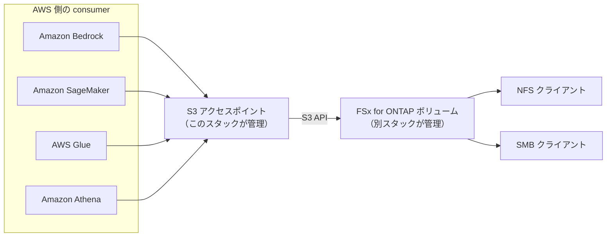
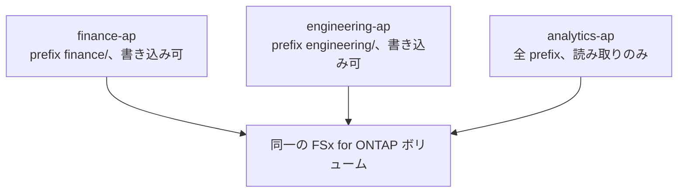

# s3-access-point-attachment — 収集層のアクセスポイントを単独で管理する

> **Status: `functionally-tested`** — 2026-08-26 に ap-northeast-1 / ONTAP 9.18.1P3D1 へデプロイし、
> `Lifecycle=AVAILABLE`、alias に対する PUT / GET / LIST、削除後に取り付けが残らないことを確認した。
> `examples/` の 3 本すべてをデプロイし、`multi-access-points.yaml` ではプレフィックス分離を 8 ケース、
> VPC origin では VPC 外からの拒否とポリシーで名指しした principal の成功を確認した。
> `AttachPolicy=false` では `NoSuchAccessPointPolicy` になり、外部から付与してもドリフトは
> `IN_SYNC` のままだった。同じスタックを[相互運用性の実測](../../../docs/ja/reference/limits/s3ap-interoperability.md)の
> アクセスポイントとして使い、qtree・クォータ・FlexClone（ボリューム単位とファイル単位）・FlexGroup の
> 測定を通した。
> **WINDOWS identity は CIFS サーバの無い SVM では取り付けが完了しない**（`NotStabilized` で
> ロールバック、孤児は残らない）。**確認していないのは** CIFS サーバのある SVM での WINDOWS identity
> である。語彙の定義は[パターンの雛形](../../_template/README.md#状態)。

既存の Amazon FSx for NetApp ONTAP ボリュームに S3 アクセスポイントを 1 つ取り付けるだけの
スタック。ファイルシステム、SVM、ボリュームには一切触らない。

分離している理由は 1 つで、**アクセスポイントは作り直す対象で、ボリュームはそうではない**から。
名前を変える、経路を VPC に絞る、ポリシーを書き換える、識別情報を別のユーザーに変える。いずれも
アクセスポイント側の変更で、そのたびにデータを持つスタックを更新したくない。このスタックを削除
してもボリュームは残る。

## `AWS::FSx::S3AccessPointAttachment` を使う

**CloudFormation にはネイティブリソースがある。** アカウントのレジストリで確認した結果は
`DeprecatedStatus: LIVE`、`ProvisioningType: IMMUTABLE`（2026-08-26 時点）。以前このリポジトリは
「CloudFormation では作れないので CLI で作る」と書いていたが、それは古い。

```yaml
Type: AWS::FSx::S3AccessPointAttachment
Properties:
  Name: my-access-point          # 3-50 字、^[a-z0-9][a-z0-9-]{1,48}[a-z0-9]$、作成後変更不可
  Type: ONTAP                    # ONTAP | OPENZFS。作成後変更不可
  OntapConfiguration:            # OpenZFSConfiguration とは排他（oneOf）
    VolumeId: fsvol-0123456789abcdef0
    FileSystemIdentity:
      Type: UNIX                 # UNIX | WINDOWS
      UnixUser: { Name: root }   # WindowsUser とは排他（oneOf）
  S3AccessPoint:
    VpcConfiguration: { VpcId: vpc-0123456789abcdef0 }   # あれば VPC origin、無ければ internet origin
    Policy: { ... }
```

### ONTAP の識別情報は「名前」で、UID ではない

ここを取り違えると、渡す先が無いパラメータを設計してしまう。

| 対象 | 設定 | 識別情報 |
|---|---|---|
| FSx for ONTAP | `OntapConfiguration` | `Type: UNIX` + `UnixUser.Name`、または `Type: WINDOWS` + `WindowsUser.Name`。**いずれも名前** |
| FSx for OpenZFS | `OpenZFSConfiguration` | `Type: POSIX` + `PosixUser.Uid` / `.Gid` / `.SecondaryGids`。**こちらが数値** |

数値の UID / GID / セカンダリ GID を探して来た場合、それは OpenZFS 側の項目である。ONTAP の
設定に該当するフィールドは存在しない。

名前は**ボリュームを持つ SVM 上で解決できる**必要がある。実測（2026-08-26、ONTAP 9.18.1P3D1）:
`fsxadmin` はクラスタ管理者であって SVM の UNIX ユーザーではないため、
`Failed to lookup the provided user in ONTAP` で失敗する。SVM ローカルの `root` は解決する。
WINDOWS 側は SVM ローカルの SMB ユーザーで動き、ドメインアカウントは必須ではなかった。取り付け
時点でドメインコントローラーに到達できない状態でもデータプレーンは動いた。

### 変更は置き換えになる

レジストリのスキーマが示している事実。

| 項目 | 値 | 何が起きるか |
|---|---|---|
| ハンドラ | create / read / delete / list。**update は無い** | in-place 更新の経路が存在しない |
| `replacementStrategy` | `delete_then_create` | 新しいものを作ってから切り替えるのではなく、削除してから作る |
| create-only プロパティ | `Name` / `Type` / `OntapConfiguration` / **`S3AccessPoint`** | この 4 つのどこを変えても置き換え |
| `primaryIdentifier` | `Name` | 同じ名前で delete → create が走る |
| `tagging.taggable` | `false` | `Tags` は設定できない |

**`S3AccessPoint` 全体が create-only なので、アクセスポイントポリシーを 1 文字変えるだけで
アクセスポイントは削除され、作り直される。** 置き換えの間アクセスポイントは存在せず、alias も
変わる。alias を下流にハードコードしていると、そこで壊れる。

ポリシーを頻繁に変える運用なら、`AttachPolicy=false` でこのスタックにポリシーを持たせず、
`aws s3control put-access-point-policy` で外から管理する選択肢がある。トレードオフは対称に書くと、
外に出せばポリシー変更で置き換えが起きなくなる代わりに、ポリシーが IaC の外に出てレビュー経路から
外れる。どちらが良いかは、ポリシーの変更頻度とレビュー要件のどちらが重いかで決まる。

## 二層の認可

アクセスポイント経由の 1 リクエストは、**両方**が許可しなければ通らない。

| 層 | 何が評価されるか | 誰が管理するか |
|---|---|---|
| AWS 側 | 呼び出し元 IAM プリンシパルのポリシー、アクセスポイントポリシー、Block Public Access | AWS の IAM / S3 |
| ONTAP 側 | `FileSystemIdentity` で指定したユーザーのファイルシステム権限 | ONTAP（UNIX パーミッション、NTFS ACL） |

重要なのは **ONTAP 側で評価されるのは呼び出し元ではなく、取り付け時に固定した 1 ユーザー**である
こと。アクセスポイントを 10 個の IAM ロールに開いても、ONTAP から見ればすべて同じユーザーの操作
になる。したがって、

- **どのファイルに触れるかの境界は、アクセスポイント単位でしか引けない。** IAM ロール単位で
  ファイルレベルの権限を分けたいなら、識別情報の違うアクセスポイントを複数用意する
  （[`examples/multi-access-points.yaml`](examples/multi-access-points.yaml)）
- **読み取り専用を保証したいなら、ポリシーで `PutObject` を書かないだけでは足りない。**
  ボリューム上で書き込み権限を持たないユーザーを識別情報にする。ポリシーは 2 層目

`UNIX` 識別情報と NTFS セキュリティスタイルのボリューム、あるいはその逆の組み合わせでは、
ONTAP のマッピングを経て実効権限が決まる。意図した ACL が評価されるようにしたいなら、
識別情報の型とボリュームのセキュリティスタイルを合わせる。

### 監査に残るもの、残らないもの

実測（2026-08-26、ONTAP 9.18.1P3D1）。設計に効くので、ここに書く。

| 機構 | アクセスポイント経由の操作 |
|---|---|
| ONTAP ネイティブ監査ログ（`vserver audit`） | **記録される。** オブジェクト操作は `Source=HTTP`、LIST は `Source=S3` |
| 同じ監査ログの要求者 | **残らない。** `SubjectUserName` / `SubjectDomainName` は `Not Present`、`SubjectIP` は AWS のサービス側アドレス |
| FPolicy | **通知されない。** `mandatory` 指定の同期ポリシーでも遮断されない |
| ARP（バージョン 5.0） | **検知する。** アクセスポイント経由の高エントロピー書き込みが suspect に載った |

要求元の IAM プリンシパルを知りたい場合は、CloudTrail のデータイベントと時刻で突き合わせる。
FPolicy については NetApp も ONTAP S3 で非対応と記載している（[併用](#ontap-の機能との併用)）。

## ネットワーク origin

`S3AccessPoint.VpcConfiguration` の**有無**で決まる。`NetworkOrigin` というプロパティは無い。
このテンプレートの `NetworkOrigin` パラメータは、その有無を明示的に選ばせるためのものである。

| origin | 到達できる範囲 | 使いどころ |
|---|---|---|
| VPC | 指定した VPC 内から発したリクエストのみ | 本番。到達できる範囲がネットワークで閉じる |
| INTERNET | 認証できる任意のネットワークから | VPC の外から使う consumer、開発時の確認 |

**本番では VPC を推す。** 理由は、認証情報の漏洩が即データ到達にならないこと 1 点である。
INTERNET origin でも Block Public Access は強制されており「公開」にはならないが、資格情報を
持つ者はどこからでも到達できる。VPC origin ならそこにネットワークの層が 1 つ足される。

トレードオフも書く。VPC origin にすると、VPC の外で動く consumer（Snowflake のような外部
サービス、ローカルの開発端末）はそのままでは使えない。**origin は作成後に変更できない**ので、
後から必要になったら別のアクセスポイントを作る。このスタックが単独で存在する理由の 1 つがこれ。

## consumer から使う

alias はバケット名の位置に、ARN はバケット ARN の位置に、そのまま入る。

```bash
ALIAS=$(aws cloudformation describe-stacks --stack-name <stack> \
  --query "Stacks[0].Outputs[?OutputKey=='AccessPointAlias'].OutputValue" --output text)

aws s3api put-object --bucket "$ALIAS" --key hello.txt --body ./hello.txt
aws s3api list-objects-v2 --bucket "$ALIAS"
```

```python
import boto3

s3 = boto3.client("s3")
s3.put_object(Bucket=ALIAS, Key="hello.txt", Body=b"hello")
```

| サービス | 渡し方 | 先に確認すること |
|---|---|---|
| Amazon Bedrock Knowledge Bases | データソースに alias をバケットとして指定 | VPC origin の場合、Bedrock 側がその VPC から呼べる構成になっているか |
| Amazon SageMaker | 学習・処理ジョブの入力に `s3://<alias>/<prefix>` | ジョブの実行ロールがアクセスポイントポリシーの許可対象に入っているか |
| AWS Glue | クローラ・ジョブの対象に alias | クローラのロールに `ListBucket` があるか（プレフィックス条件を付けた場合は範囲も） |
| Amazon Athena | Glue Data Catalog 経由。テーブルの `LOCATION` に alias | 出力先は通常の S3 バケットにする。アクセスポイントは収集経路 |
| Amazon Redshift | Spectrum の外部テーブル、または `COPY` の対象に alias | 同上 |
| 自作アプリ（boto3 等） | `Bucket=<alias>` または `Bucket=<access point ARN>` | `arn:aws:s3:::<alias>` 形式のバケット ARN は**通らない** |

サポートされる S3 API は Amazon S3 の一部である。条件付き書き込み、バージョニング、
S3 Event Notifications、Object Lock、presigned URL などは対象外。全項目は
[上限値](../../../docs/ja/reference/limits/s3-access-point.md)。

## ONTAP の機能との併用

このスタックで取り付けたアクセスポイントを持つボリュームで、ONTAP の機能が使えるかを実測した
（2026-08-26 / 9.18.1P3D1）。詳細と手順は
[相互運用性の実測状況](../../../docs/ja/reference/limits/s3ap-interoperability.md)。

| 機能 | この経路での結果 | 段階 |
|---|---|---|
| Qtree | 作れて、S3 のプレフィックスとして見え、書いたオブジェクトが qtree の中に入る | 検証済み |
| Quota | tree クォータの上限で S3 の PUT が拒否される。応答は HTTP 507 で原因を誤って伝える | 検証済み |
| FlexClone（ボリューム単位） | クローンを作れて S3 で書いたデータも入り、クローン自身にアクセスポイントも取り付けられる。クローンへの書き込みは親に現れない | 検証済み |
| FlexClone（ファイル単位） | S3 経由で書いたファイルをクローンでき、クローンもアクセスポイント経由のオブジェクトとして見える（`StorageClass=FSX_ONTAP`、sha256 一致）。ブロックは共有される。**ただし 202 を返してジョブ記録を残さないため失敗が観測できず、宛先ファイルを見て判定する必要がある** | 検証済み |
| FlexGroup ボリューム | アクセスポイントを取り付けられ、PUT / GET / LIST とマルチパートが通る | 検証済み |
| FlexGroup のクローン | 作れる（アクセスポイントを持つ FlexGroup から） | 検証済み |
| ONTAP ネイティブ監査ログ | 記録される（要求者は残らない） | 検証済み |
| FPolicy | 通知されず、`mandatory` でも遮断されない | 検証済み |
| FlexCache ボリューム | 未測定。なお FlexCache の duality と、ボリュームへの S3 アクセスポイント取り付けは**別の機構**であり、一方の対応状況を他方の根拠にはしない | 未検証 |

NetApp は Qtree・Quota・FlexClone・ONTAP S3 バケットを含む FlexGroup ボリュームのクローンを
**ONTAP S3 サーバについて**非対応と記載しているが
（[ONTAP S3 interoperability](https://docs.netapp.com/us-en/ontap/s3-config/ontap-s3-interoperability-concept.html)）、
この経路では制約として現れなかった。**その表は問いの出どころであって、この経路の結論ではない。**
逆向きも同じで、そこに「対応」と書かれていることをこの経路の根拠にもしない。

**この経路で実際に失敗したのは別のところである。** NTFS セキュリティスタイルのボリュームに
UNIX identity で取り付けると `Lifecycle=AVAILABLE` になったうえで全データ操作が `AccessDenied` に
なる（SVM に CIFS サーバが無く、UNIX → Windows のマッピングが解決できない）。**`AVAILABLE` は
ファイルシステム層の健全性を意味しない。** identity 層で拒否された場合の本文は
`no identity-based policy allows ...` になるので、本文の違いが層の手がかりになる。

## 公式に記載されている制約

[制限事項](https://docs.aws.amazon.com/fsx/latest/ONTAPGuide/access-point-for-fsxn-restrictions-limitations-naming-rules.html)
と[トラブルシューティング](https://docs.aws.amazon.com/fsx/latest/ONTAPGuide/troubleshooting-access-points-for-fsxn.html)より。

- アクセスポイントはボリュームと**同一リージョン**に作る
- ファイルシステムとアクセスポイントは**同一アカウント**が所有する。他アカウントのボリュームには
  取り付けられない
- ONTAP **9.17.1 以降**が必要
- 取り付け先は**マウントされた（junction path を持つ）ボリューム**。DP ボリュームも同様
- **Block Public Access は常に有効で、変更できない**
- **origin は作成後に変更できない**

FlexCache ボリュームを取り付け先にできるかどうかについては、上の表のとおり公開された記載を
見つけられていない。「できない」とは書かない。

## デプロイ

前提: ファイルシステム、SVM、マウント済みボリュームが既にあること。ボリュームの作成は
[`environments/aws-origin/`](../../../environments/) の担当。

```bash
cd patterns/collect/s3-access-point-attachment
cp params.example.json params.json    # params.json は gitignore 対象
# VolumeId / VpcId / AllowedPrincipalArns を実値に置き換える

aws cloudformation deploy \
  --template-file template.yaml \
  --stack-name s3burst-collect-ap \
  --parameter-overrides file://params.json \
  --region ap-northeast-1
```

`aws cloudformation deploy` に IAM の作成は含まれないので `--capabilities` は不要。このスタックは
IAM リソースを作らない。必要な権限は呼び出し側にあり、リソースタイプのハンドラが要求するのは
`fsx:CreateAndAttachS3AccessPoint`、`fsx:DescribeS3AccessPointAttachments`、
`s3:CreateAccessPoint`、`s3:GetAccessPoint`、`s3:PutAccessPointPolicy`、
削除時に `fsx:DetachAndDeleteS3AccessPoint` と `s3:DeleteAccessPoint`。

### 確認

```bash
aws cloudformation describe-stacks --stack-name s3burst-collect-ap \
  --query 'Stacks[0].Outputs' --output table

ALIAS=$(aws cloudformation describe-stacks --stack-name s3burst-collect-ap \
  --query "Stacks[0].Outputs[?OutputKey=='AccessPointAlias'].OutputValue" --output text)

echo hello > /tmp/hello.txt
aws s3api put-object --bucket "$ALIAS" --key hello.txt --body /tmp/hello.txt
aws s3api get-object --bucket "$ALIAS" --key hello.txt /tmp/hello.out && diff /tmp/hello.txt /tmp/hello.out
```

`Lifecycle` が `MISCONFIGURED` の場合、取り付けは存在するが識別情報が SVM 上で解決していない。
**その状態でも削除には detach が必要**で、放置すると残る。

### 削除

```bash
aws cloudformation delete-stack --stack-name s3burst-collect-ap --region ap-northeast-1
aws cloudformation wait stack-delete-complete --stack-name s3burst-collect-ap --region ap-northeast-1
aws fsx describe-s3-access-point-attachments --region ap-northeast-1 \
  --query "S3AccessPointAttachments[?Name=='s3burst-collect-ap']"
```

最後の 1 行は省略しない。スタックが消えたことは、取り付けが消えたことの証拠ではない。

**不可逆な設定はこのスタックに無い。** SnapLock、Object Lock、スナップショットロック、
`PERMANENTLY_DISABLED` に相当するものは一切含まれていない。

## 構成図

Mermaid が描画されない場所、スクリーンリーダー、クローラのために、同じことを表でも書く。



| 経路 | 使うプロトコル | 認可 |
|---|---|---|
| AWS の consumer → アクセスポイント → ボリューム | S3 API | IAM + アクセスポイントポリシー、および取り付け時に固定した ONTAP ユーザーの権限 |
| NFS クライアント → ボリューム | NFS | UNIX パーミッション |
| SMB クライアント → ボリューム | SMB | NTFS ACL |

同じファイルに 3 つの経路が同時に届く。データはボリュームに 1 つだけ存在する。



| 分離されるもの | 分離されないもの |
|---|---|
| 各アクセスポイントを呼べる IAM プリンシパル | ファイルそのもの。識別情報が同じなら、評価される権限も同じ |
| S3 レイヤーで到達できるキーのプレフィックス | NFS / SMB クライアントの視界。S3 レイヤーの境界は見えない |

部署間で互いのファイルに到達できないことが要件なら、ボリュームを分けるか、権限が実際に異なる
ONTAP 識別情報を割り当てる。プレフィックスのポリシーはその上の 2 層目に置く。

## 検証チェックリスト

デプロイ前。

- [ ] `VolumeId` が `fsvol-` + 16 進 17 桁で、そのボリュームがマウントされている
- [ ] `AccessPointName` が 3〜50 字、英小文字・数字・ハイフン、先頭と末尾が英数字
- [ ] `NetworkOrigin=VPC` なら `VpcId` が入っている（`Rules` が弾くが、先に気づくほうが早い）
- [ ] `FileSystemIdentityType` とボリュームのセキュリティスタイルが意図した組み合わせ
- [ ] `UnixUserName` / `WindowsUserName` が SVM 上で解決する。`fsxadmin` は解決しない
- [ ] `AllowedPrincipalArns` に `*` もアカウント ARN も入っていない
- [ ] `AllowedPrefix` を設定した場合、listing の範囲もそれで閉じることを意図している
- [ ] `cfn-lint` が clean、`make test` が通る

デプロイ後。

- [ ] `Lifecycle` が `AVAILABLE`
- [ ] alias に対して PUT と GET が通る
- [ ] 許可していないプリンシパルで呼ぶと `AccessDenied` になる
- [ ] `NetworkOrigin=VPC` の場合、VPC 外から呼ぶと到達しない
- [ ] 削除後に `describe-s3-access-point-attachments` に残っていない

## セキュリティ上の要点

- **`Principal: "*"` を Allow に書かない。** テンプレートのテストが拒否する
- **`s3:*` を Allow に書かない。** 同上
- **バケットレベルとオブジェクトレベルで ARN の形が違う。** オブジェクト操作には `/object/` が
  必要で、`arn:aws:s3:::<alias>` は通らない。デプロイは成功して `AccessDenied` になるので、
  症状からは権限問題と区別できない
- **`ListBucket` にプレフィックス条件を付ける。** オブジェクトをプレフィックスで閉じても、
  listing が開いていればキー名は全部読める
- **転送中の暗号化を明示的に Deny する。** Allow が無いことに頼ると、後から広い Allow が
  足されたときに崩れる。明示的な Deny は後続の Allow で上書きされない
- **本番は VPC origin。** 上のトレードオフを読んだうえで
- **読み取り専用はポリシーではなく識別情報で担保する。** ポリシーは 2 層目

## 今後の拡張

いずれも未着手であり、この段落は設計の提案である。

| 方向 | 内容 |
|---|---|
| AWS CDK | このテンプレートに対応する L3 construct。`Fn::If` を使わずに識別情報の排他を型で表現できる |
| Terraform | `aws_fsx_s3_access_point_attachment` 相当。origin と識別情報の排他は `lifecycle` と variable validation で表現する |
| AWS Service Catalog | 部署ごとのアクセスポイントを、プレフィックスと IAM ロールだけ選ばせて払い出す |
| Control Tower | 組織単位で INTERNET origin を禁止する SCP と、その例外申請の経路 |
| Bedrock Knowledge Bases | alias をデータソースにした構成。alias が再作成で変わる点への対処が要件になる |
| このリポジトリの収集層 | このパターンを [pipelines](../../pipelines/) の収集側に組み込む |

## 関連ドキュメント

| ドキュメント | 内容 |
|---|---|
| [相互運用性の実測状況](../../../docs/ja/reference/limits/s3ap-interoperability.md) | この経路で ONTAP の機能が使えるかの実測と手順 |
| [S3 Access Point の上限値](../../../docs/ja/reference/limits/s3-access-point.md) | 出典と段階つきの制約一覧 |
| [S3 AP 設計ガイド](../../../docs/ja/reference/limits/s3ap-design-guide.md) | 設計時に決めること |
| [構成の形](../../../docs/ja/architecture.md) | 収集層と配布層の全体像 |
| [検証状況](../../../docs/ja/verification-status.md) | 主張の 4 段階と現状 |
| [CONTRIBUTING.md](../../../CONTRIBUTING.md) | 執筆規約とゲート |
